## P1-pytorch环境的配置和安装

无

## P2-py编辑器的选择安装配置

### python编辑器的选择

1，pycharm可以使用python console，在console编写代码后，在右边就能实时看到代码的结果

2，jupyter可以交互式运行，一步步执行

- 代码左边的标号就是 第N步 执行的代码

### python编辑器的安装

#### env中安装jupyter

1，因为anaconda的默认环境base有jupyter没有pytorch，我们新建的pytorch_env base有pytorch但是没有jupyter，解决方案有两个：

- 在base环境安装pytorch
- 在pytorch_env环境安装jupyter
  - 选择这个方案，因为尽量不要影响base环境，而是根据自己的需要新建环境。

2，命令行安装jupyter的过程不记载

- 网友：装不上的朋友们，请把你们的镜像源从清华的改为中科大的即可

3，安装完成后，会自动跳往jupyter网页：

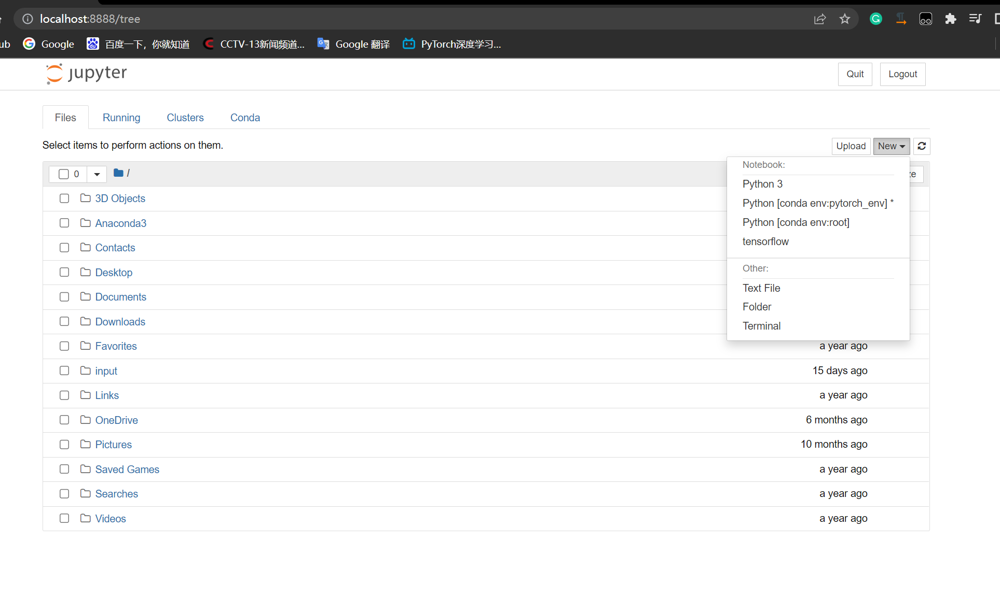

- 如果报错`无法定位程序输入点XXX pythoncom36.dll`,忽略就可以直接跳转，[参考](https://blog.csdn.net/weixin_43425139/article/details/125469191)
- 网友：jupyter没有出现自己创造的环境的UU们，下个ipykernel

4，选择conda的pytorch_env环境，星号表示anaconda的当前环境就是conda的pytorch_env。

## P3

无

## P4-两大法宝函数

### dir函数

1，从torch包往下，不停使用`dir()`，可以最后看到前后双下划綫的样子；前后双下划线是一种规范，表示变量不可改了。

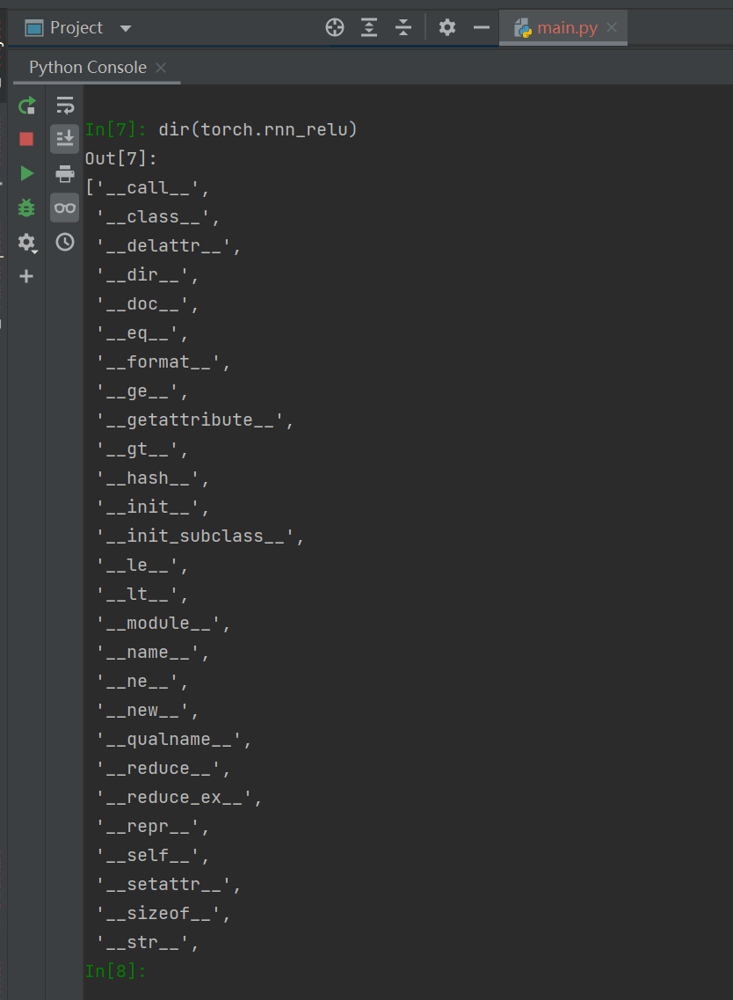

- 网友：分隔区里可能有多个函数，有双下划线的，表示已经是函数不是分隔区

### help函数

1，如上图，可以使用`help()`函数来查看 函数：

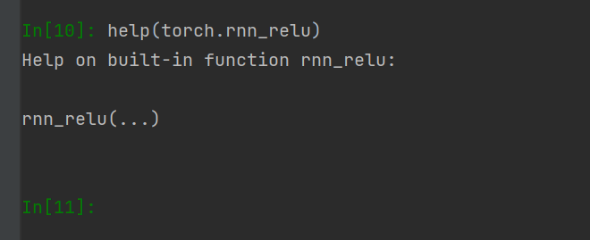

- 网友：python中函数也是对象，help接受一个变量名(也就是函数名)，加上括号就是调用函数了。所以传给help时要去掉括号，不去掉传给help的是里面函数调用的返回值

## P5-pycharm和jupyter的对比

### pycharm写程序-通过新建文件

1，pycharm中可以查看某个环境的各个包的版本：

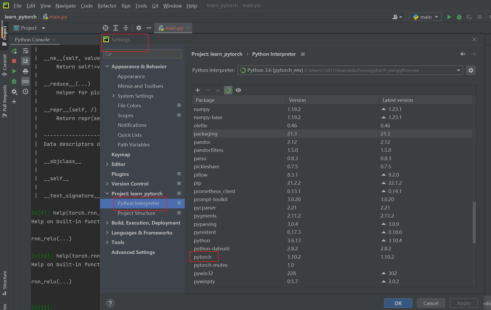

2，针对新建的py文件，设置configuration：

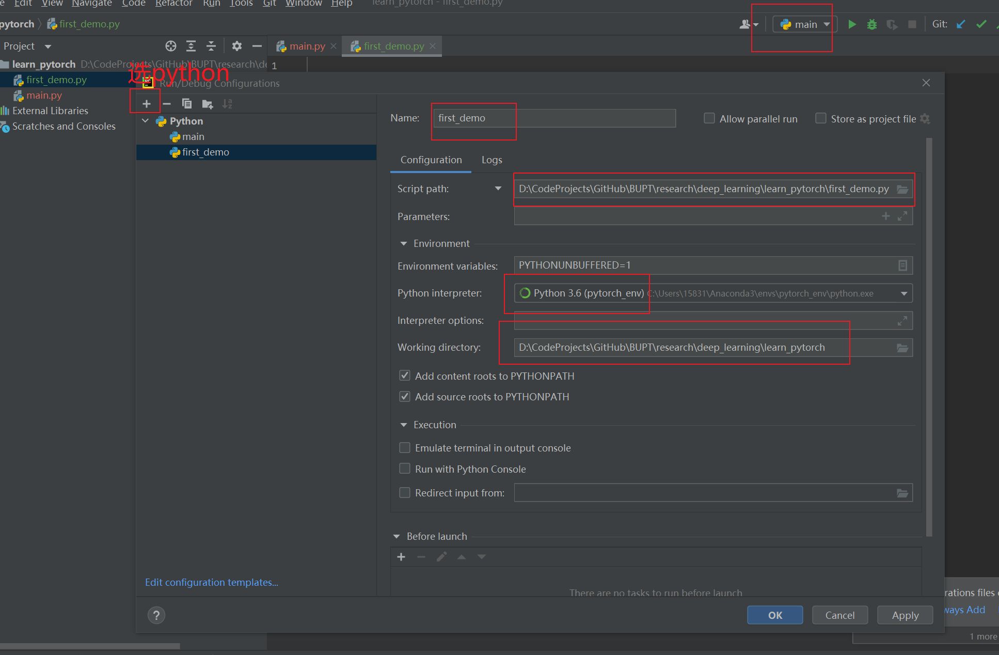

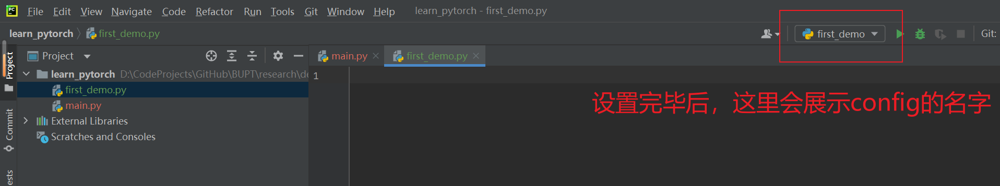

3，设置好configuration后，即可以无main函数且运行python语句；只需要点击运行按钮即可：

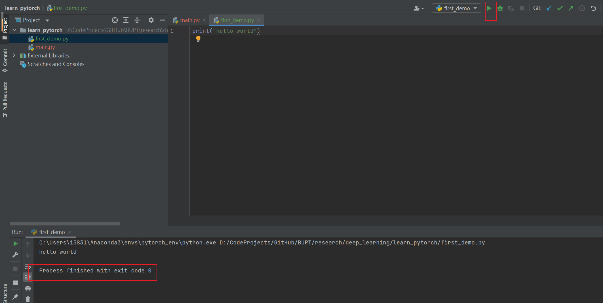

### pycharm写程序-通过python console

1,

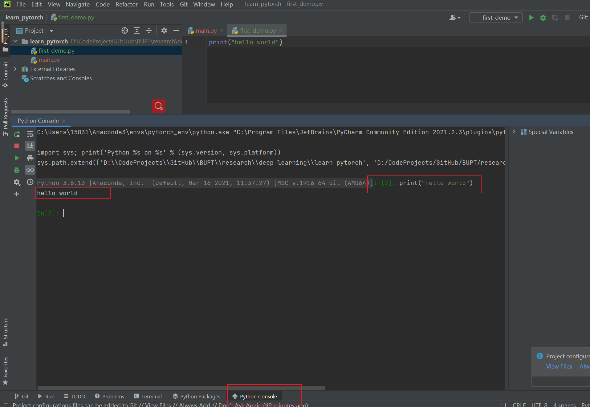

- python console是以每一行来作为控制块执行，每输入一行并回车就会执行一下。

### jupyter创建项目并使用

1，打开anaconda prompt控制台，依次输入如下命令：

```bash
(base) C:\Users\zyk>conda activate pytorch_env

(pytorch_env) C:\Users\zyk>jupyter notebook
```

- jupyterbook默认目录就是C:\Users\zyk，默认环境就是pytorch_env

2，创建目录或进入相应目录，选择conda的pytorch_env环境，这个环境里有pytorch：

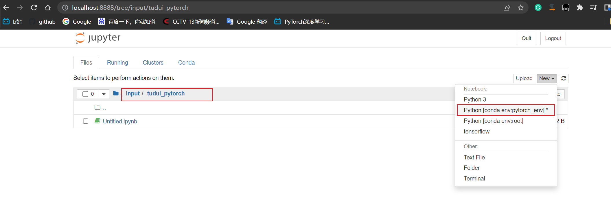

3，在notebook中写一行代码，使用`shift+回车`，就会运行这行代码,同时进入下一行：

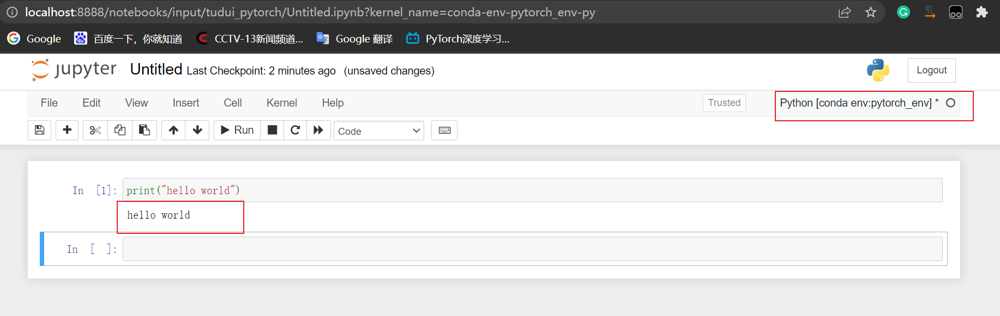

- jupyter中以一个块为一次运行的整体
- `In[*]` 变成 `In[1]` 说明代码运行结束！ 

### 区分pycharm的Python文件，pycharm的pythonconsole、jupyternotebook三者功能侧重点

1，

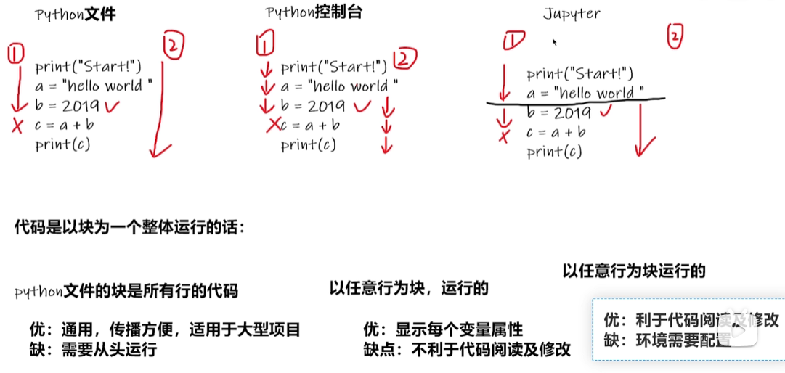

- python文件优点：代码可阅读性好
- python文件缺点：修改代码后，重新运行时会 重新运行python文件中的所有行

- pythonconsloe的优点：以行为单位运行，修改错误后不需要从头开始运行
- pythonconsloe的缺点：运行错误后，代码可阅读性远远不如python文件

- jupyternotebook优点：以块为单位运行一次，可以自己把一个完整程序分成若干块；修改错误不需要从头开始+兼顾代码阅读性（综合了前两者优点）
- jupyternotebook缺点：不是通用的文件，但是python文件是通用的文件

2，总结使用：

- python文件是通用的文件：存储代码信息
- python控制台主要用于调试的使用阶段，好处是可以看到每个变量的属性：进行小区域的调试
  - `shift+f5`可以重新开启pythonconsole
- jupyter的可阅读性比python控制台好：用于完成小项目 或 完成小的调试

## P6-pytorch加载数据初步认识

### 加载数据的基本概念

### Dataset用法

1，图示

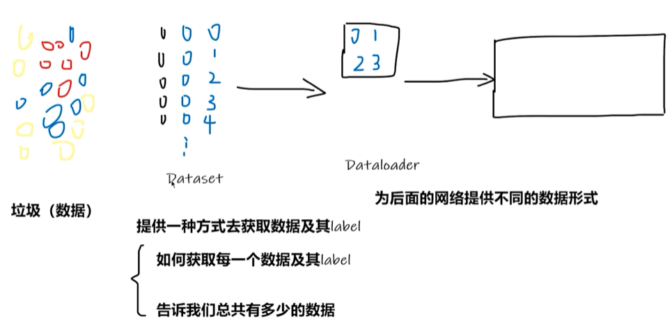

2，使用python解释语句，查看Dataset的用法：


- 有打印大段文字时，常用jupyter展示；因为jupyter分段比较好
- jupyter中有两种方式查询 对象 的用法
  - `help(对象名)`
  - `对象名??`：这个在jupyter中是彩色展示的，更好阅读。

## P7-Dataset类代码实战

1，先在环境中安装opencv

```bash
#conda install opencv-python # 会报错 channel中没有这个包，所以得使用pip安装；一般windows中推荐使用conda下载 linux推荐使用pip下载
pip install opencv-python
```

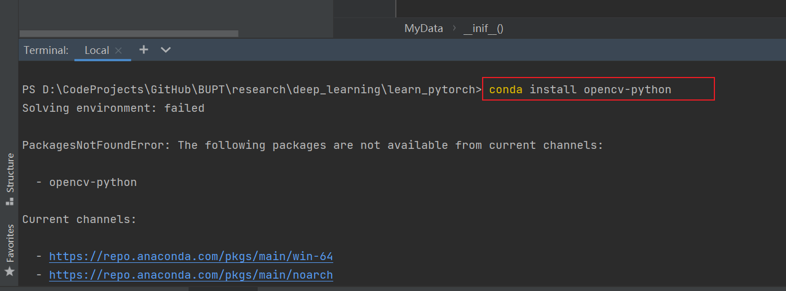

- 我：老师下载opencv太慢了，就使用了PIL来处理图片

2，编写代码，上边的python文件是笔记本，下边的pythonconsole是演草纸

- 使用pythonconsole步进调试是为了：省去了万一上面大量代码写错还要找错，这样可以避免后期出错找不到问题

## P8-tensorboard的使用-add_scalar

1，新建py文件，执行下面的语句，在logs文件夹下就会看到新增一个tensorbaord事件（该事件画了一个图片）

```python
from torch.utils.tensorboard import SummaryWriter

writer = SummaryWriter("logs")

for i in range(100):
    writer.add_scalar("title为y=x", i, i)

writer.close()
```

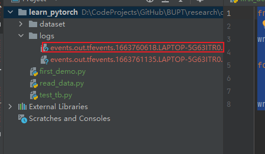

2，因为可能很多人都用一个服务器，所以大家跑程序时可以设置自己专属的端口号，避免大家互相的端口号占用：

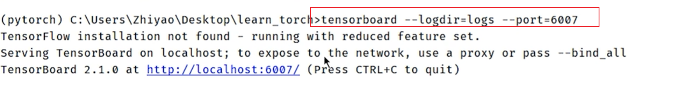

3，展示tensorboard画的图片

```python
tensorboard --logdir=logs
```


- 鼠标放到图片上，还能看到所画图片的详细信息。

4，修改代码，让代码画y=2x的图像：

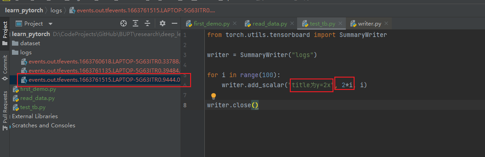

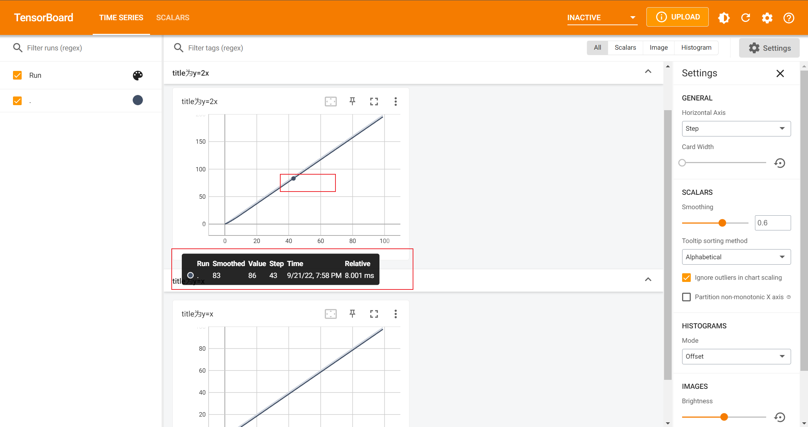

4，我和网友：这里title名字不变的话，后续修改代码重新执行程序会在之前同title作图的基础上作图：

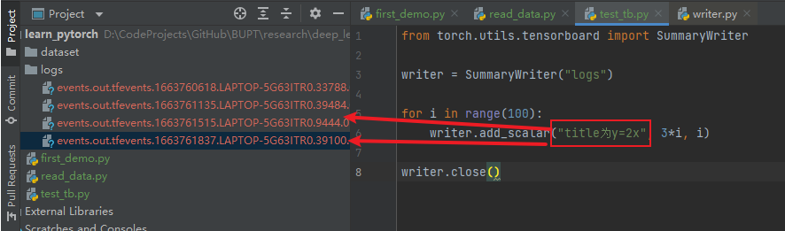

- 这个title的图在两个事件中都用到了，所以第四个展示tb时，就会重合之前的图

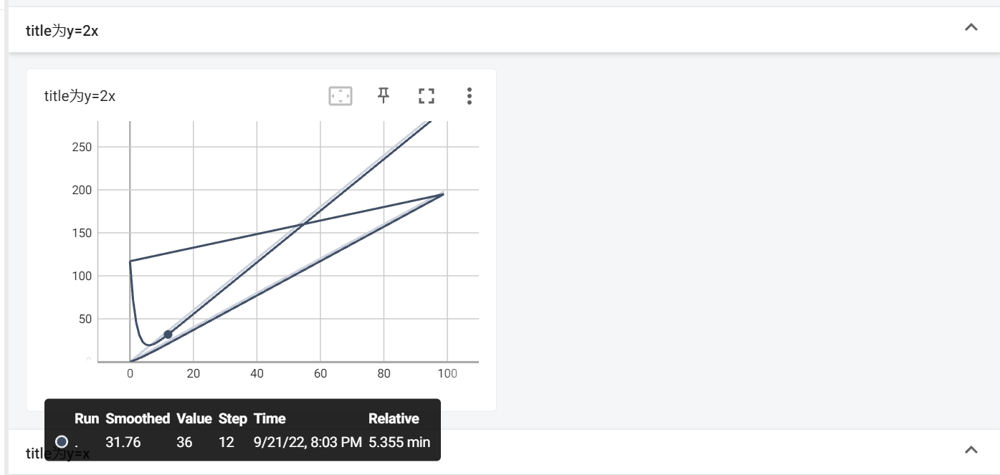

5，如果想避免在原图上继续作图，可以：

1. 删掉SummaryWriter的文件夹下的所有事件
2. `control+c`终止pycharm中的tensorbaord展示
3. 执行程序
4. 重新使用`tensorboard --logdir=logs`展示tensorboard

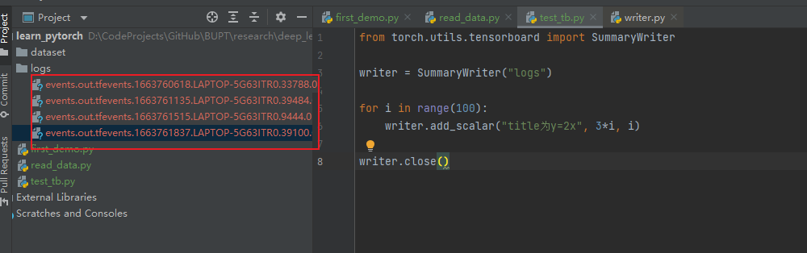

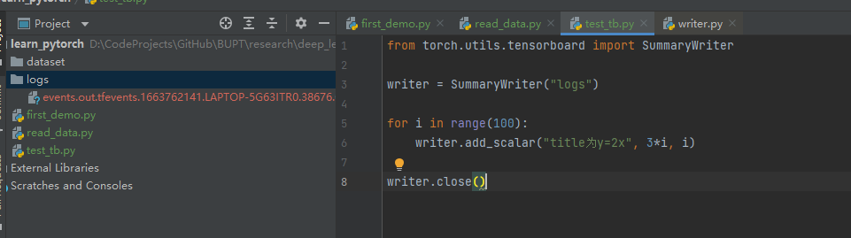

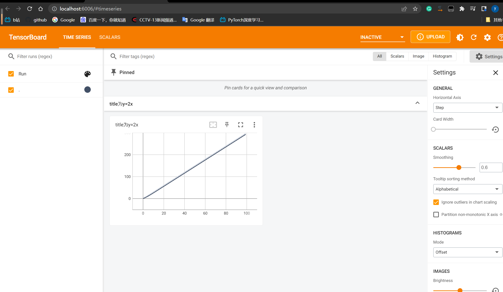

## P9-tensorboard使用-add_image

1, 修改代码为如下，就可以往tensorboard中引入图片：

```python
from torch.utils.tensorboard import SummaryWriter
import numpy as np
from PIL import Image

writer = SummaryWriter("logs")
img_path="dataset/train/ants/5650366_e22b7e1065.jpg";
img_PIL = Image.open(img_path)
# 用opencv拿到的图片格式本身就是numpy格式的；但是如果用PIL的image拿到的图片，就需要转化格式为numpy格式
img_array=np.array(img_PIL)
# 图片 高 宽 channel（一般为3表示RGB）的，如果channel放在最后面，需要设置dataformaytes；这是可以从add_image的源码注释知道的
writer.add_image("test_add_image",img_array,1,dataformats='HWC')
# y=2*x
for i in range(100):
    writer.add_scalar("title为y=2x", 3*i, i)

writer.close()
```

2，刷新tensorboard的页面，可以发现多了一张图片，是被引入的：

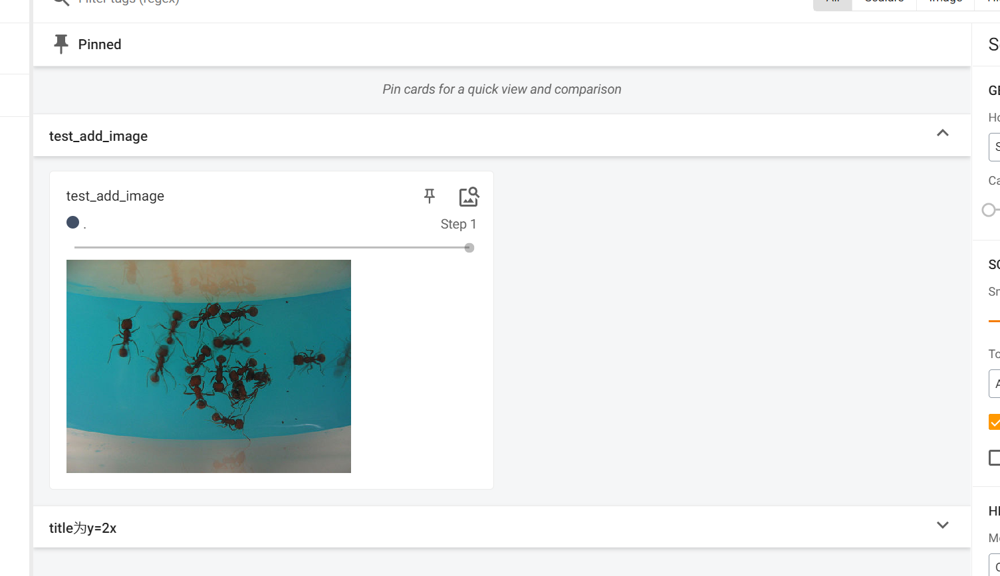

3，还可以设置不同的步数导入不同的图片，只要tag不变，不同的步数对应的图片就会被塞到一个tb图中：

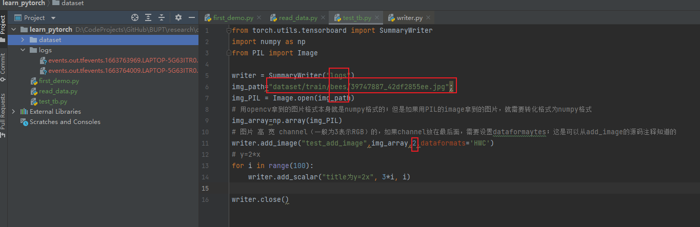

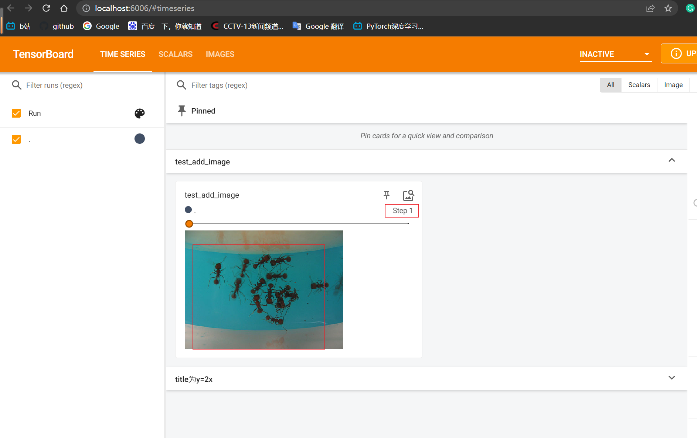

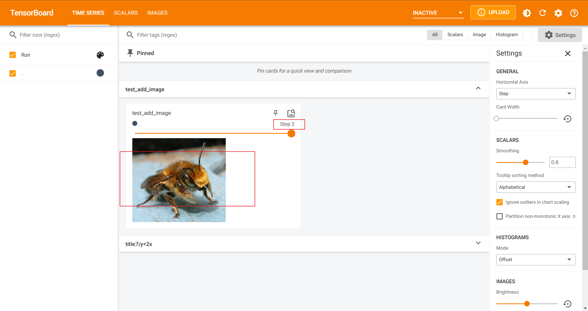

## P10-transform的使用-如何使用

### 图示用法

1，作用图示：

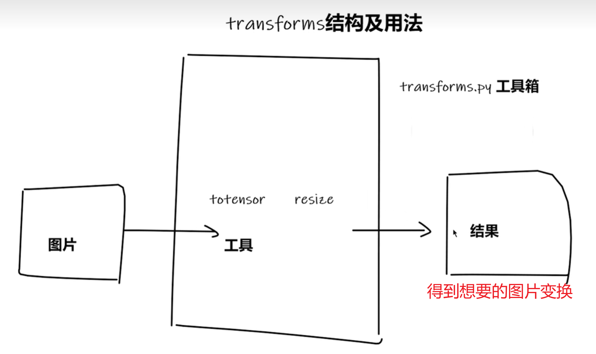

更详细的图是：

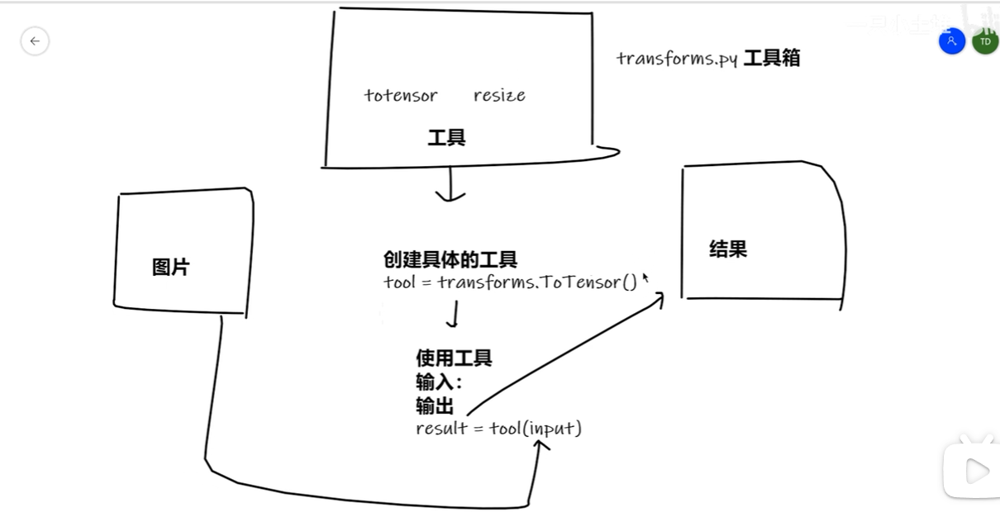

### 如何使用transforms

1，执行如下语句

```python
from PIL import Image
from torchvision import transforms

'''
python的用法->tensor的数据类型

通过transforms.ToTensor去看两个问题
1，transforms该如何使用（python）
2，为什么我们需要Tensor数据类型
'''

'''
针对同一张图片：
绝对路径：D:\CodeProjects\GitHub\BUPT\research\deep_learning\learn_pytorch\dataset\train\ants\0013035.jpg
相对路径：../dataset/train/ants/0013035.jpg
可以看到，windows中绝对路径的反斜杠是特殊字符(即转义符本身)，需要转义符转义，没办法当做很好的字符串了；但是相对路径的的斜杠是不需要转义的。
所以我们尽量使用相对路径
'''
img_path="../dataset/train/ants/0013035.jpg"
img=Image.open(img_path)

# 1，transforms该如何使用（python）
tensor_trans=transforms.ToTensor()
tensor_img=tensor_trans(img)

print(tensor_img)

```

2，结果为：

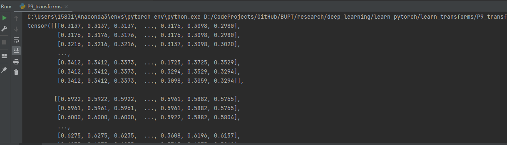

- 可以看到tensor开头，说明图像被转化成了一个tensor

- 网友问：什么叫张量
  - 网友答：张亮就是数组，也成高维数组，【】的嵌套

## P11-Transforms的使用-为何需要Tensor

### 为什么使用

1，Tensor数据类型，包含了神经网络学习所需要的理论基础的参数：

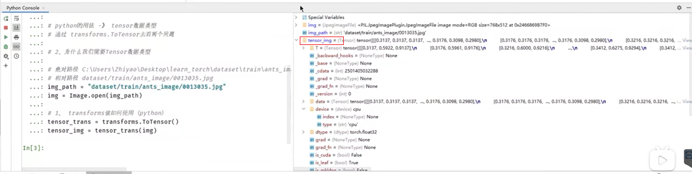

2，常用opencv读取图片！opencv可以把图片读取为numpy多维数组的类型，然后使用ToTensor类就可以把numpy多维数组的类型 转化为 Tensor数据类型：

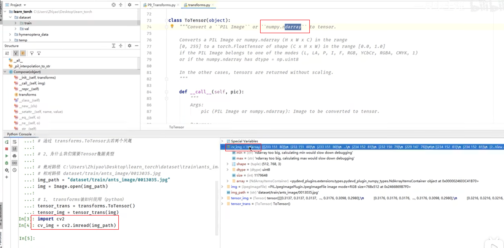

### 往add_image中传入Tensor格式的图片

1，运行代码

```python
from PIL import Image
from torch.utils.tensorboard import SummaryWriter
from torchvision import transforms

'''
python的用法->tensor的数据类型

通过transforms.ToTensor去看两个问题
1，transforms该如何使用（python）
2，为什么我们需要Tensor数据类型
'''

'''
针对同一张图片：
绝对路径：D:\CodeProjects\GitHub\BUPT\research\deep_learning\learn_pytorch\dataset\train\ants\0013035.jpg
相对路径：../dataset/train/ants/0013035.jpg
可以看到，windows中绝对路径的反斜杠是特殊字符(即转义符本身)，需要转义符转义，没办法当做很好的字符串了；但是相对路径的的斜杠是不需要转义的。
所以我们尽量使用相对路径
'''
img_path="../dataset/train/ants/0013035.jpg"
img=Image.open(img_path)

writer=SummaryWriter("logs")

# 1，transforms该如何使用（python）
tensor_trans=transforms.ToTensor()
tensor_img=tensor_trans(img)

writer.add_image("Tensor_img",tensor_img)

# 和java类似，使用输入输出后要及时关闭
writer.close()

```

2，在代码所在的子目录生成了log

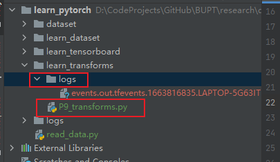

3，在terminal启动tensorboard

```bash
 tensorboard --logdir=learn_transforms/logs
```

- 相对路径是相对根目录的路径，要保证正确

4，点击进tb的网页，就可以看到程序往tb事件中写入了一个图片：

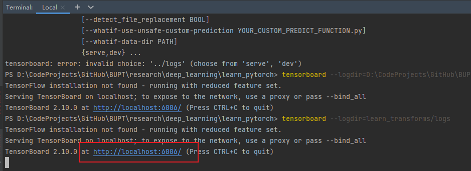

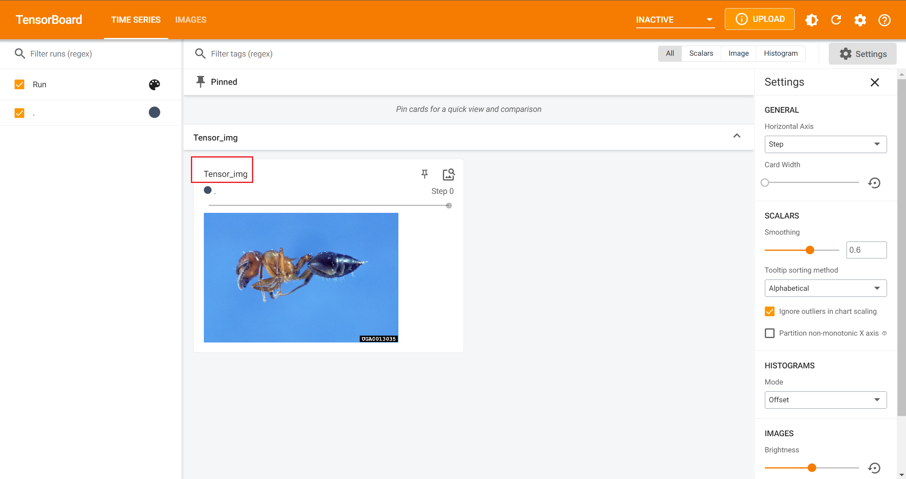

## P12P13-常见的Transforms

1，

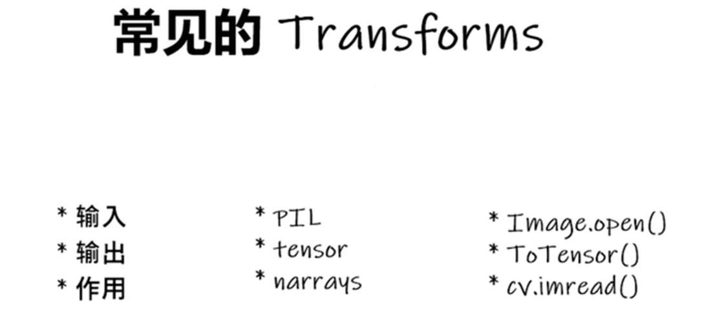

- 网友：转化成tensor向量是为了变为矩阵进行计算，都是为了之后的卷积做准备

### ToTensor

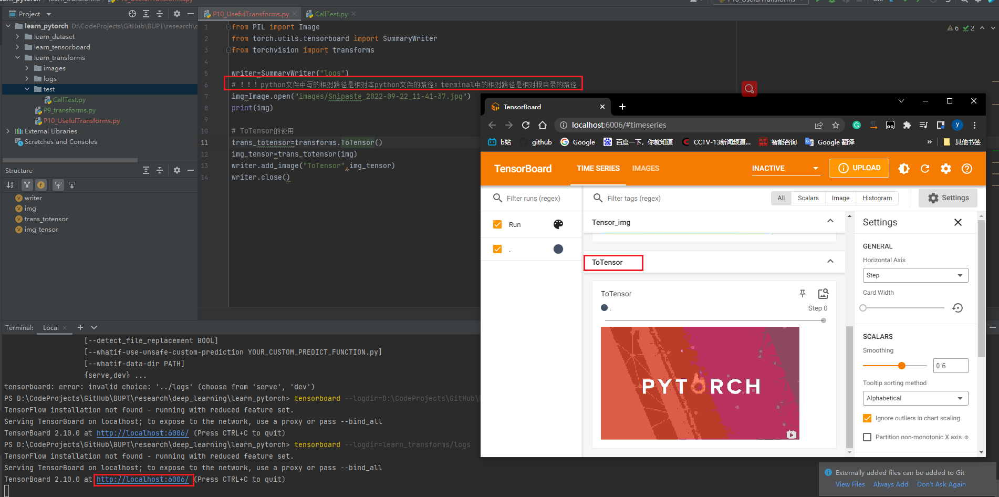

### Normalize

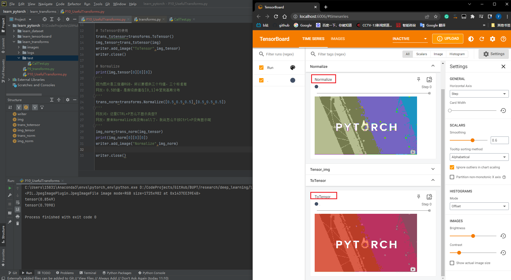

- 我：可以看到归一化后的图片和归一化之前的图片是不一样的


### Resize

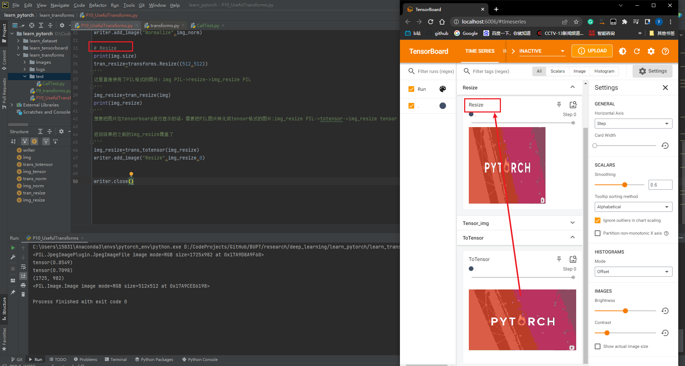

- 可以看到resize后的图片和之前不一样了

### Compose

1，用法

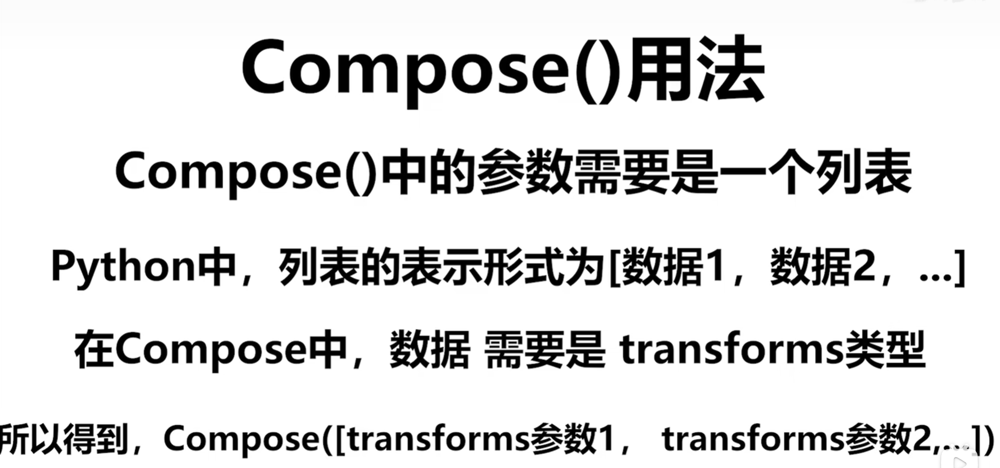

- 我：相当于把不同的transform操作组合成一个compose操作
- 老师：compose的输入==compose的第一个参数的输入

2，这次使用等比例放大的resize，并合成为compose

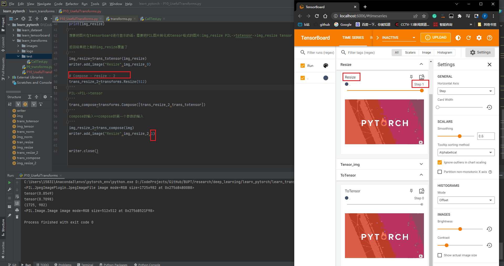

- 可以看到，图形并没有变形；并且这是一个compose同时实现了resize+totensor

### RandomCrop

1，把一张图片随机裁剪

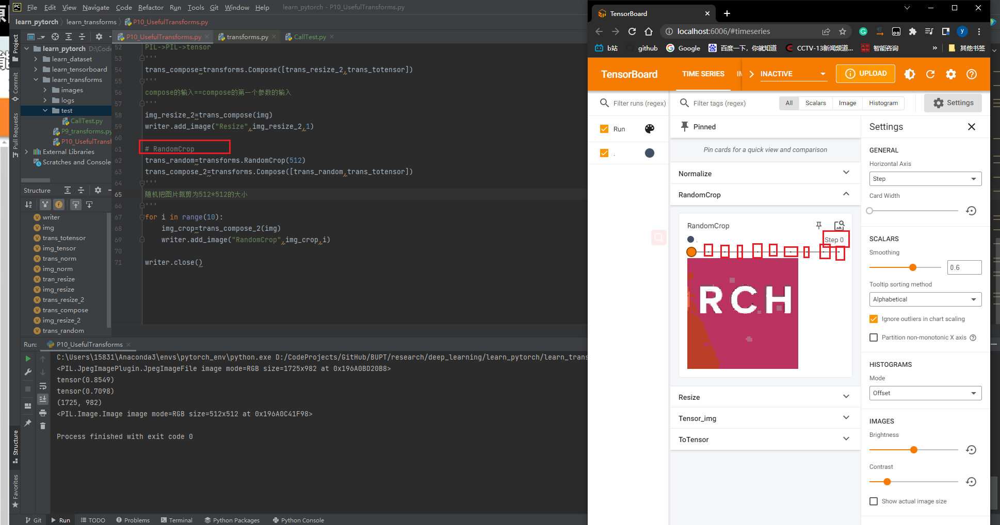

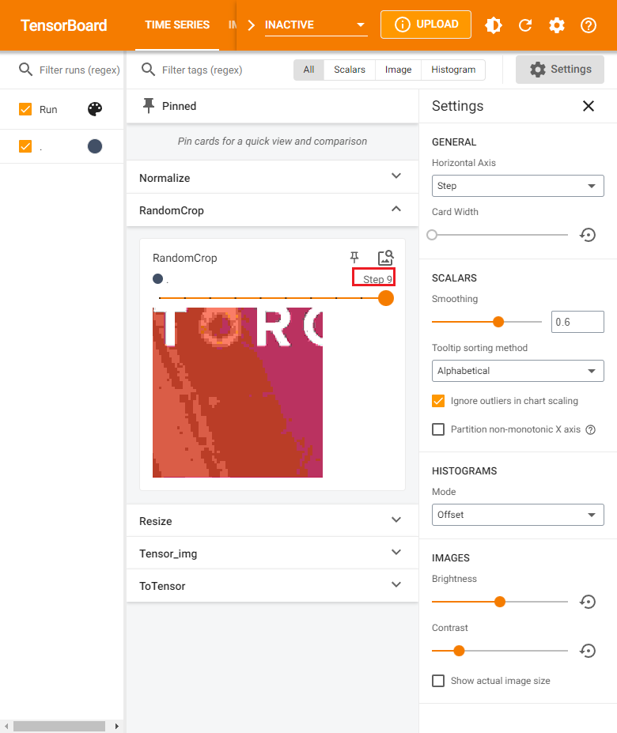

- 网友：这里报错的话，是因为裁剪的大小是按照你给的，512x512，图片没有这么大就报错，改成256就行了

### 一些技巧总结

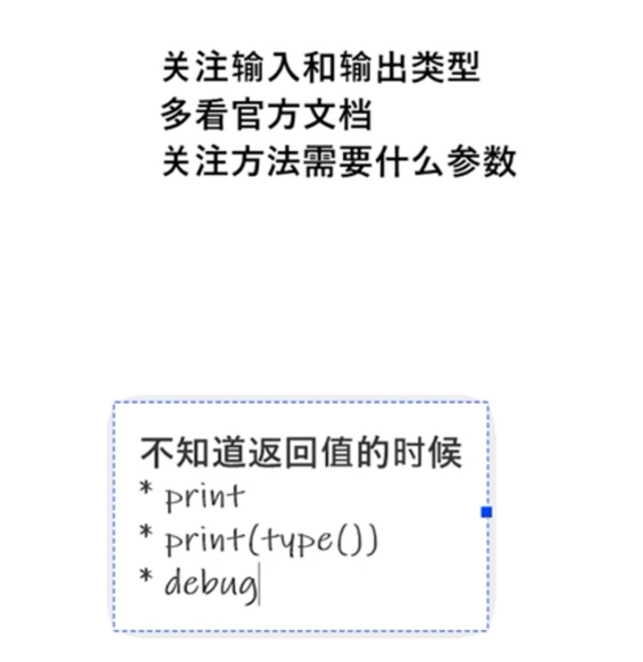

- 网友：一般来说，和图像本身 处理相关的不改变数据格式，数学相关的都是基于Tensor，中间的桥梁是toTensor


## P14-torchvision中数据集使用

1，使用torchvision自带的数据集cifar：

```python
import torchvision
from torch.utils.tensorboard import SummaryWriter

dataset_transform = torchvision.transforms.Compose([
    torchvision.transforms.ToTensor()
])

'''
我们这使用torchvision自带的数据集CIFAR10；因为我们这没有这个数据集，所以要把download设置为true来下载

如果下载太慢了，可以把下载地址拷贝到迅雷中下载；迅雷可能更快一点，因为可能不从源地址下载而又p2p加速

使用这个数据集是因为它比较下，下载方便
'''
train_set = torchvision.datasets.CIFAR10(root="./dataset", train=True, transform=dataset_transform, download=True)
test_set = torchvision.datasets.CIFAR10(root="./dataset", train=False, transform=dataset_transform, download=True)

'''
打印结果中，第一个数据是tensor对象即一张图片，第二个数据是target即图片对应的分类
'''
print(test_set[0])
# print(test_set.classes)
#
# img, target = test_set[0]
# print(img)
# print(target)
# print(test_set.classes[target])
# img.show()
#
# print(test_set[0])

'''
logs和p10是你创建的保存文件的文件夹，这里程序叫p10所以用p10
'''
writer = SummaryWriter("p10")
for i in range(10):
    img, target = test_set[i]
    writer.add_image("test_set", img, i)

writer.close()
```

2，最后展示效果：

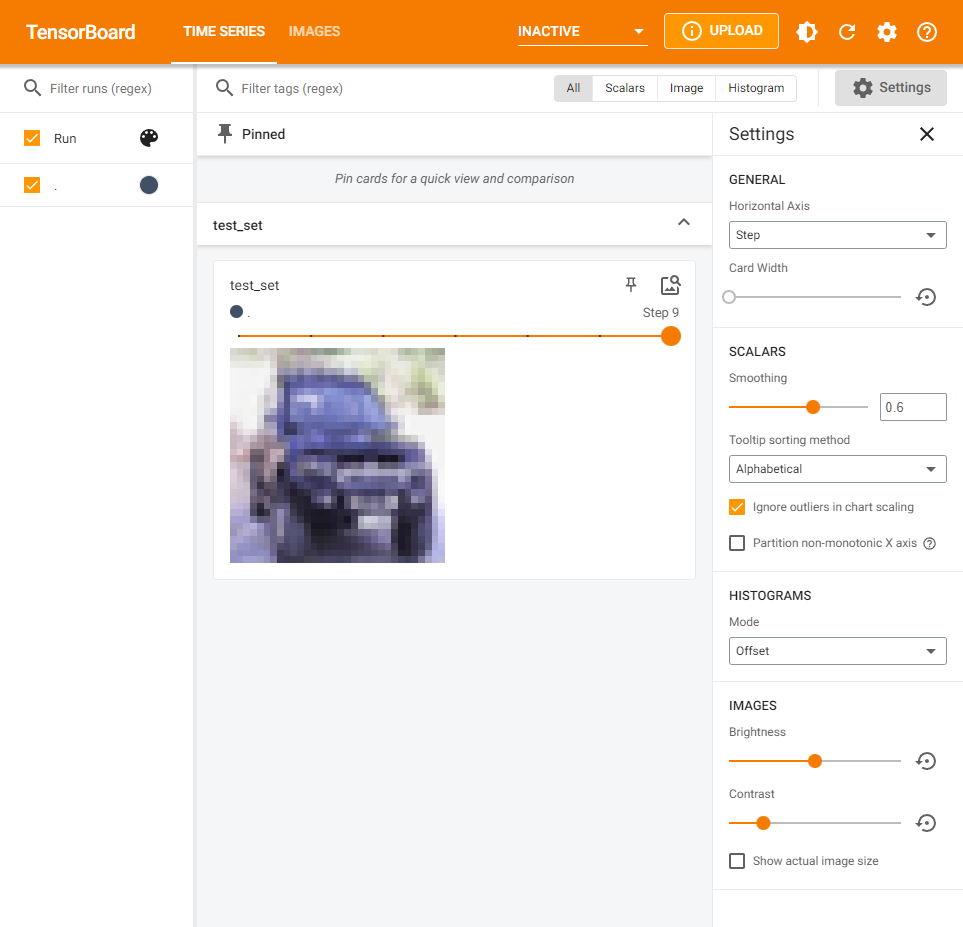

- 问答问：我和很多网友奇怪的是，图片不全，从step4瞬间调到step8？这是为什么
  - 我：可能和这个报错有关`PS D:\CodeProjects\GitHub\BUPT\research\deep_learning\learn_pytorch> tensorboard --logdir=learn_dataloader/dataloader
    TensorFlow installation not found - running with reduced feature set.
    Serving TensorBoard on localhost; to expose to the network, use a proxy or pass --bind_all
    TensorBoard 2.10.0 at http://localhost:6006/ (Press CTRL+C to quit)`。
    - 解决方案：[参考](https://blog.csdn.net/sinat_41840241/article/details/112730404)，这是tensorboard为了加速，没有展示所有图片的原因。使用命令`tensorboard --logdir=learn_dataloader/dataloader --samples_per_plugin=images=1000000000000000`


## P15-DataLoader的使用

### 基本概念

 1，从牌组中拿取若干张牌到手中的 过程，可以比喻DataLoader的作用

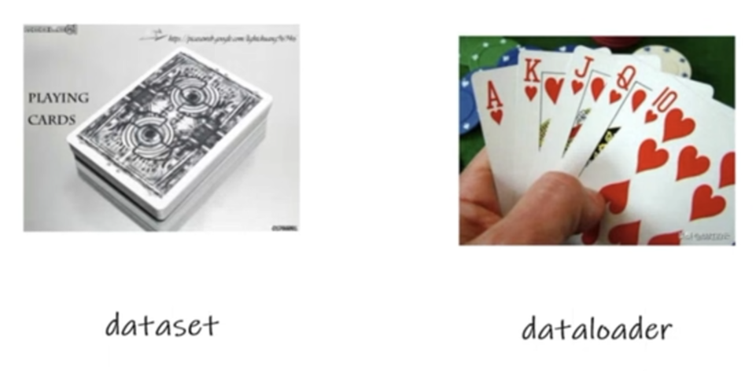

2，

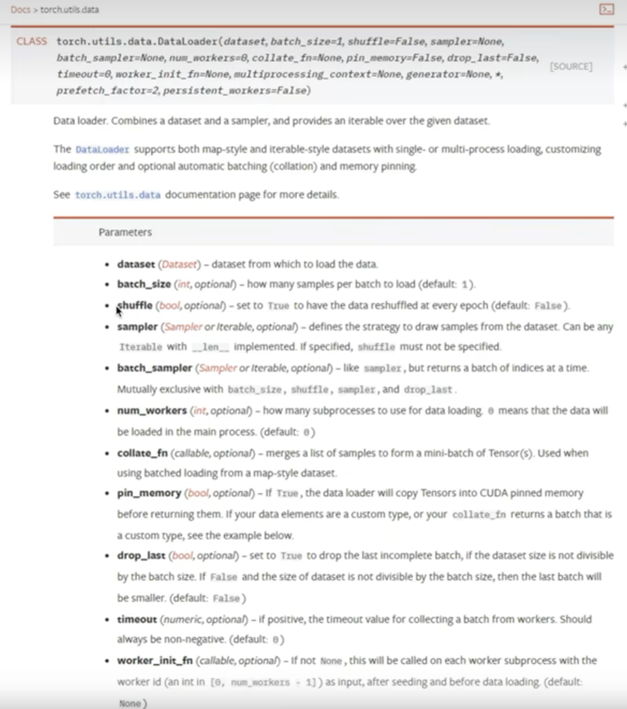

- dataset：前一集讲的数据集
- batchsize：相当于抽牌时一次抽两张
  - 网友：电脑性能不足时，batch_size要调低
- shuffle：是否要洗牌；默认设置为false，但是一般喜欢设置为true。

- sampler：后续
- batchsampler：后续
- numworks：设置加载数据的进程数；windows下numworks不为0的话可能有错误。

- droplist：设置是否舍弃最后的不完整的batch

### 代码实战

```python
import torchvision.datasets

from torch.utils.data import DataLoader

# 准备的测试数据集
from torch.utils.tensorboard import SummaryWriter

'''
我们选择拿测试集，因为测试集样本少，拿到结果比较快

CIFAR10之前在learn_torchvision_dataset已经下载，把root设置为已经下载好的数据集，就可以避免重新下载；注意这里的路径写的是相对本python文件的相对路径

因为我们加载的是测试集，所以train为false

因为CIFAR本身是PILimage，所以transform需要用totensor转化为tensor数据类型

准备好测试数据集后，就可以学习dataloader了
'''
test_data=torchvision.datasets.CIFAR10("../learn_torchvision_dataset/dataset",train=False,transform=torchvision.transforms.ToTensor())

test_loader=DataLoader(dataset=test_data,batch_size=4,shuffle=True,num_workers=0,drop_last=False)

# 测试数据集中第一张图片及target
'''
可以看到图片大小是三channel的图片，target即分类标签为3。输出如下：
torch.Size([3, 32, 32])
3
'''
img,target=test_data[0]
print(img.shape)
print(target)

# 使用dataloader来以batch为大小加载数据
'''
输出如下：
torch.Size([4, 3, 32, 32])
tensor([3, 2, 4, 1])
torch.Size([4, 3, 32, 32])
tensor([7, 4, 1, 9])
torch.Size([4, 3, 32, 32])
tensor([9, 1, 2, 1])
torch.Size([4, 3, 32, 32])
tensor([5, 3, 9, 2])
torch.Size([4, 3, 32, 32])
tensor([2, 4, 4, 9])
torch.Size([4, 3, 32, 32])
tensor([3, 7, 3, 6])
。。。

可以看到：
1. dataset中第一张图片分类是3，但是dataloader加载的一个图片的分类不是3，说明shuffule起作用了
2. 可以看到a_batch_data中，有四张三通道的32*32的图片，分别对应四个标签
'''
for a_batch_data in test_loader:
    imgs,targets=a_batch_data
    print(imgs.shape)
    print(targets)

# 使用dataloader把数据加载到tensorboard中
writer = SummaryWriter("dataloader")
step=0
for a_batch_data in test_loader:
    imgs,targets=a_batch_data
    writer.add_images("test_data",imgs,step)
    step=step+1

# 可以在testloader外面加一层epoch，这样可以就是真实情况下投喂神经网络
for epoch in range(2):
    step = 0
    for a_batch_data in test_loader:
        imgs, targets = a_batch_data
        writer.add_images("Epoch:{}".format(epoch), imgs, step)
        step = step + 1

writer.close()
```


## P16-神经网络的基本骨架-nn.Module的使用

### 官网

1，官网介绍

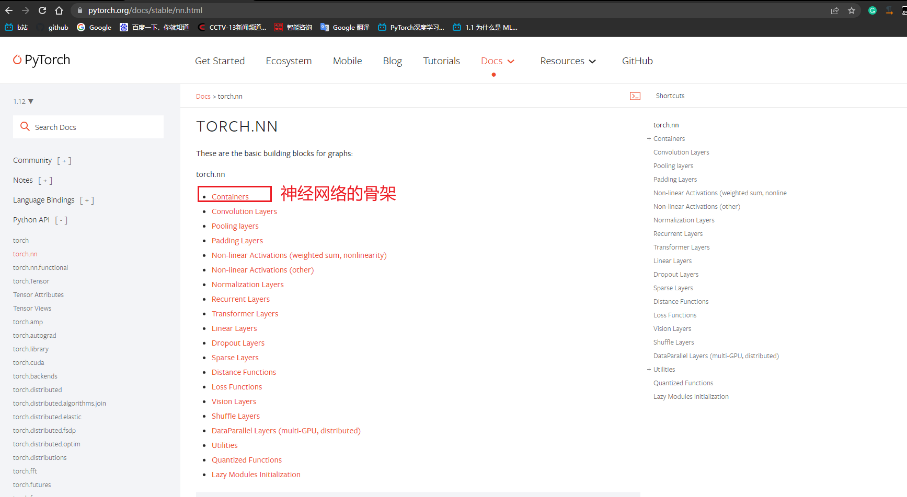

- 有了骨架后，可以往骨架中加入各个模块，比如下面看到的 卷积层 池化层 等等

2，神经网络forward，可以把输如前向传播为输出；还有反向传播用来更新权重：

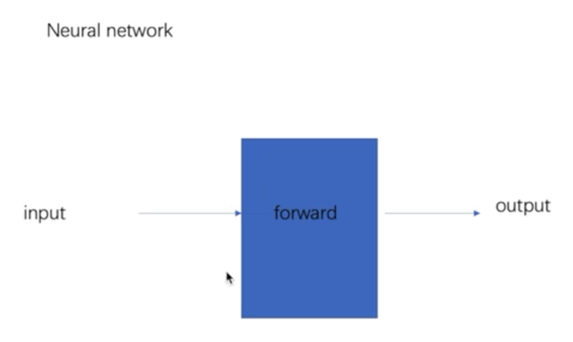

### 实战

1，运行代码：

```python
import torch
from torch import nn

class Zhangyun(nn.Module):
    def __init__(self):
        super().__init__()

    '''
    本神经网络把输入加一后输出
    '''
    def forward(self,input):
        output=input+1
        return output

'''
使用神经网络模板Zhangyun() 创建 出神经网络 zhangyun
'''
zhangyun = Zhangyun()
x=torch.tensor(1.0)
'''
网友问：为啥tudui(x)，的x可以直接传入forward方法里面？？？？？？不是要调用方法才行吗？？？？
    网友答：因为继承的nn.Module中forword方法是__call__()方法的实现，可调用对象会调用__call__()方法
    网友答：因为__call__()方法的实现_call_impl()中调用了forward()方法
'''
output=zhangyun(x)
print(output)
```

2，结果为：

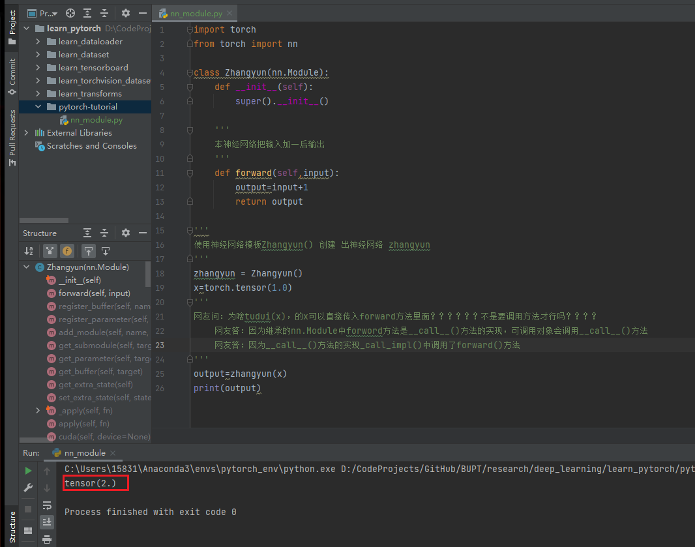

3，这里讲了nnmodule的简单使用，后续会讲其他模块

## P17-土堆说卷积操作（可选看）

### 基础概念

1，只要会torch.nn就行，torch.nn.function属于比较底层的就不需要了解了，但是这里还是会讲一下

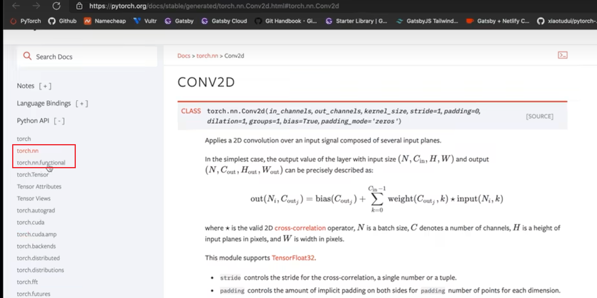

2，矩阵卷积的概念

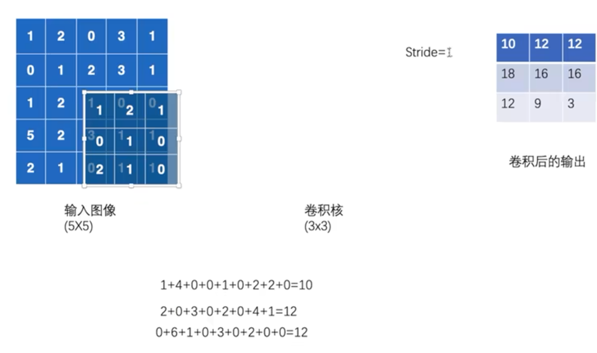

- 老师：卷积核就是上图中的小方块
- 老师：stride就是决定做完一次卷积后，要把卷积核移动多远
- 网友：卷积核就是滤波器

3，padding的概念：

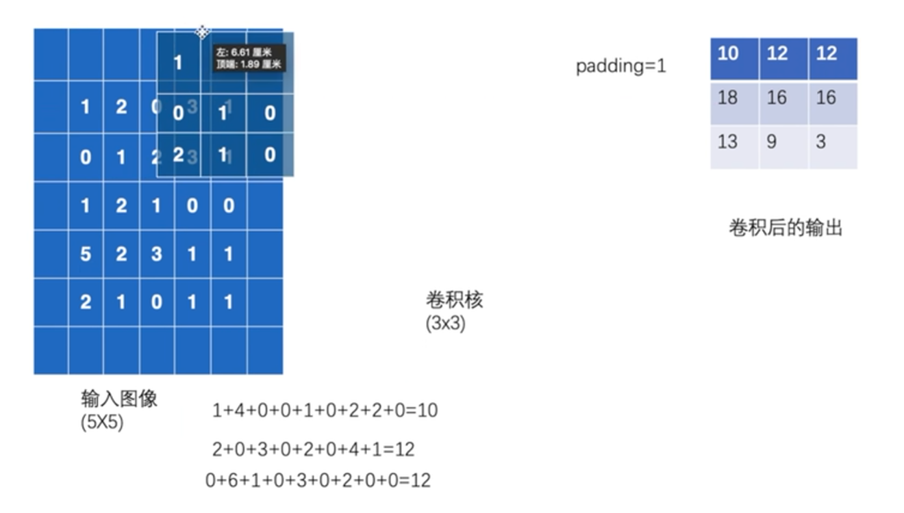

- 老师：一般padding量都设置为0；如果padding量不为0，那么padding中存储的值也常常设置为0

### 实战

1，执行代码

```python
# -*- coding: utf-8 -*-

import torch
import torch.nn.functional as F

'''
网友问：和transform中的totensor有什么区别
    网友答：这个数数据类型转换，Totensor是把图片类型转换成tensor
高赞网友：卷积核的大小是自己设置的，卷积核上每个位置相当于一个权重w，比如一个3*3的卷积核，就是9个w，训练网络的目的就是学习这9个权值
'''
input = torch.tensor([[1, 2, 0, 3, 1],
                      [0, 1, 2, 3, 1],
                      [1, 2, 1, 0, 0],
                      [5, 2, 3, 1, 1],
                      [2, 1, 0, 1, 1]])

kernel = torch.tensor([[1, 2, 1],
                       [0, 1, 0],
                       [2, 1, 0]])

'''
因为是5*5像素矩阵的图片，所以channel是1；因为只有一张图片，所以batchsize设置为1；宽高仍设置为5*5

网友：batchsize是指这批数据的数据个数，这里就一个矩阵，可以看成是只有一张5*5的灰度图像
'''
input = torch.reshape(input, (1, 1, 5, 5))
kernel = torch.reshape(kernel, (1, 1, 3, 3))

print(input.shape)
print(kernel.shape)

output = F.conv2d(input, kernel, stride=1)
print(output)

'''
因为stride为2比1打，相当于做卷积的次数变少了，卷积得到的结果output2的大小也就变小了

网友问：为什么变成四维张量了？
    网友答：因为reshap后就是四为张量了，输入的就是一个四维，输出的自然也是四维的

高赞网友：输出的维数与输入维数有公式的，一般输出=输入-卷积核大小/stride +1

高赞网友：3*3的卷积后基本就将周围八个像素点聚集成了一个中心像素点
'''
output2 = F.conv2d(input, kernel, stride=2)
print(output2)

'''
不padding时是3*3的输出，padding后是5*5的输出；这是因为3*3的上下左右都padding了一排像素，所以输出结果也可以上下左右各增加一排
'''
output3 = F.conv2d(input, kernel, stride=1, padding=1)
print(output3)
```

- 老师：torch.tensor中的数据常表示为浮点数，比如`3.`，或者给torch.tensor加一个参数`dtype=torch.float32`，这样有时候可以解决数据类型不匹配的问题。

2，结果为：

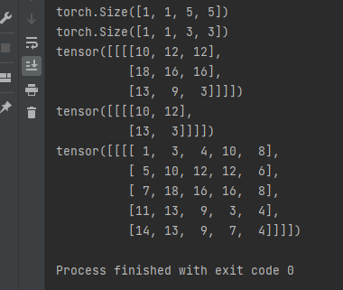

## P18-神经网络卷积层

### 理论

1，主要讲conv2d的使用，因为图像一般都是2d的：

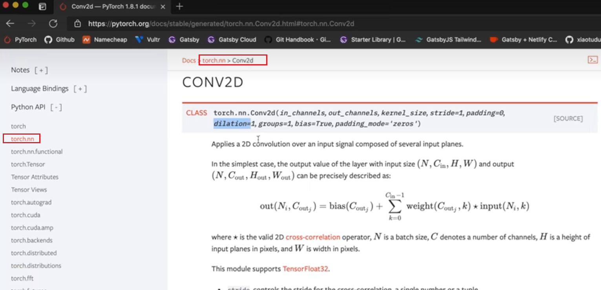

- 注意：这里只需要掌握使用torch.nn即可，不需要了解torch.nn.functional的底层。

2，2d多核卷积示意图如下；只要有多个核，输出就有对应的多个channel：

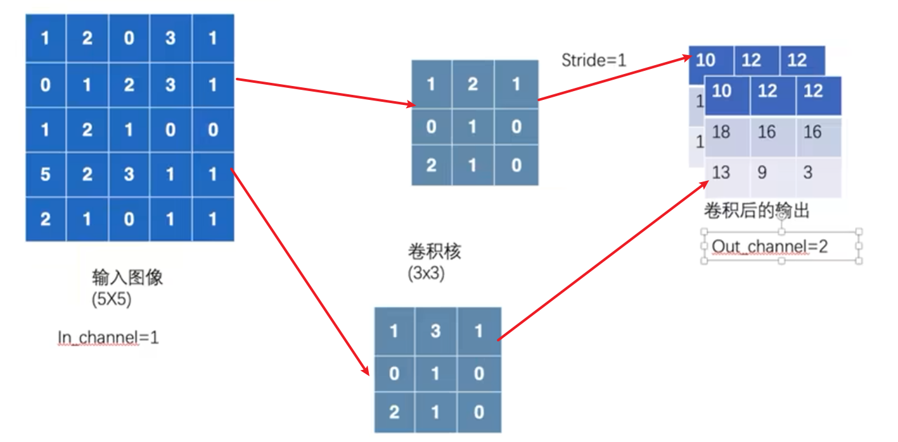

- 老师：看很多算法时就会发现，有时算法就是在不断增加channel数
- 高赞网友：其实训练时调整的就是卷积核，相当于神经网络中的权重

### 实战

1，执行代码：

```python
# -*- coding: utf-8 -*-
import torch
import torchvision
from torch import nn
from torch.nn import Conv2d
from torch.utils.data import DataLoader
from torch.utils.tensorboard import SummaryWriter

'''
我们这里取测试数据集，因为训练数据集太大了，所以train设置为false
'''
dataset = torchvision.datasets.CIFAR10("./data", train=False, transform=torchvision.transforms.ToTensor(),
                                       download=True)
dataloader = DataLoader(dataset, batch_size=64)

class Tudui(nn.Module):
    def __init__(self):
        super(Tudui, self).__init__()# 完成父类的初始化
        '''
        要记得使用self，这样self后面的变量在其他函数中也可以使用到
        
        因为是彩色图像，所以inchannel设置为3；outchannel设置为6层试试看；stride和padding按照默认值也显式设置一下
        '''
        self.conv1 = Conv2d(in_channels=3, out_channels=6, kernel_size=3, stride=1, padding=0)

    '''
    输入经过卷积后输出
    '''
    def forward(self, x):
        x = self.conv1(x)
        return x

# 初始化网络
tudui = Tudui()

writer = SummaryWriter("./logs")

# 把每个batch处理一下
step = 0
for data in dataloader:
    imgs, targets = data
    output = tudui(imgs)

    '''
    卷积前 torch.Size([64, 3, 32, 32])
    卷积后 torch.Size([64, 6, 30, 30])
    因为卷积的作用，所以从32*32变成30*30，channel也变成了Conv2d中outchannel设置好的6
    '''
    print(imgs.shape)
    print(output.shape)
    # shape为 torch.Size([64, 3, 30, 30])
    writer.add_images("input", imgs, step)
    '''
    shape转变 torch.Size([64, 6, 30, 30])  -> [xxx, 3, 30, 30]；因为tensorboard不支持展示6channel的图片，所以要把它转化为3channel。
    
    老师：batchsize填-1，这样子就会自动根据 3 30 30平铺后的结果计算batchsize
    网友：相当于平铺了.
    '''
    output = torch.reshape(output, (-1, 3, 30, 30))
    writer.add_images("output", output, step)

    step = step + 1

writer.close()

```

- 网友：-1表示模糊形状，由torch计算

2，可以看到 output的一个batch的图片数是input的两倍，这是因为output做了reshape把6channel平铺为3channel，这样导致每个batch的图片数变为原来两倍：

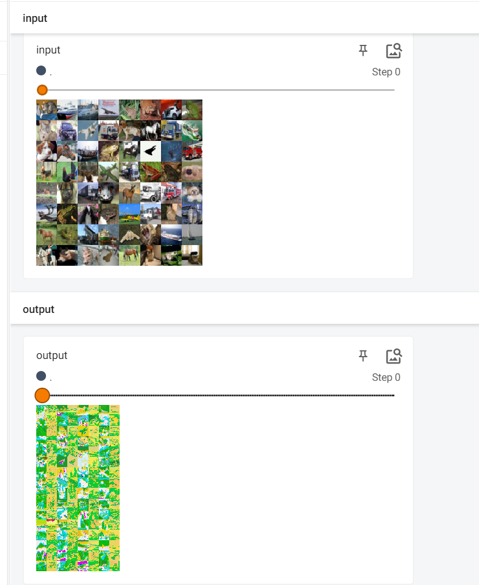

- 我：卷积层提取的特征可以隐约看出原图轮廓，这些像素信息会被用于最后的ai判断。

### 推导

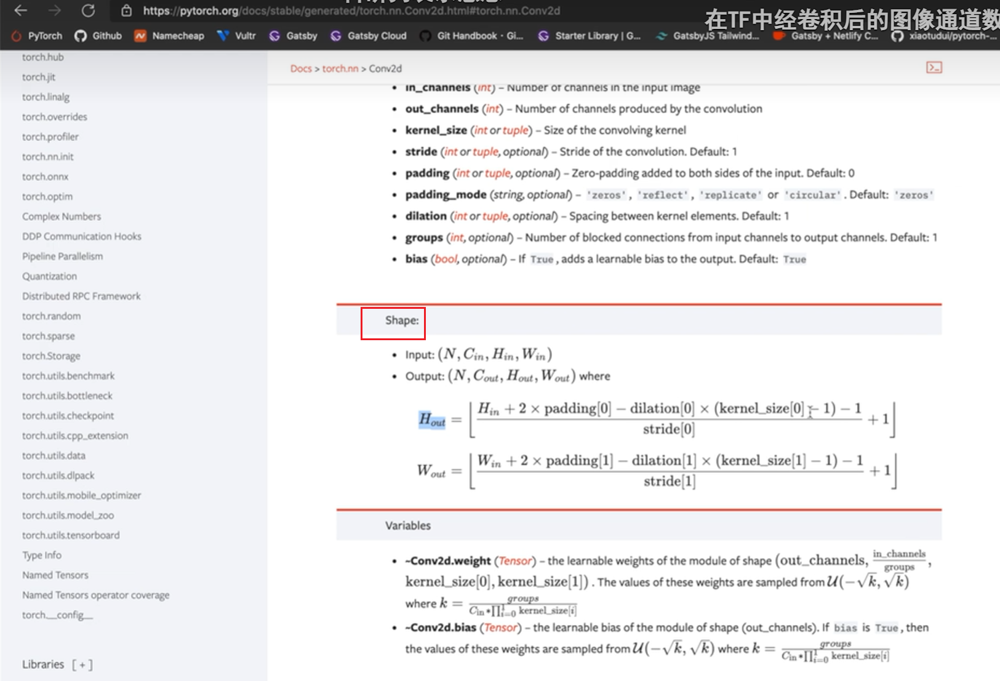

- 如果论文没有给 input 和output的详细情况，需要用本式子推导；本式子说明了在给定channel情况下，每张图片的大小是如何变化的；所以原图可能需要做padding才能得到 固定channel 固定大小的 output图片。

## P19-最大池化的使用

### 理论

1，还是看官方文档；池化层有很多种类，最常用的还是maxpool2d：

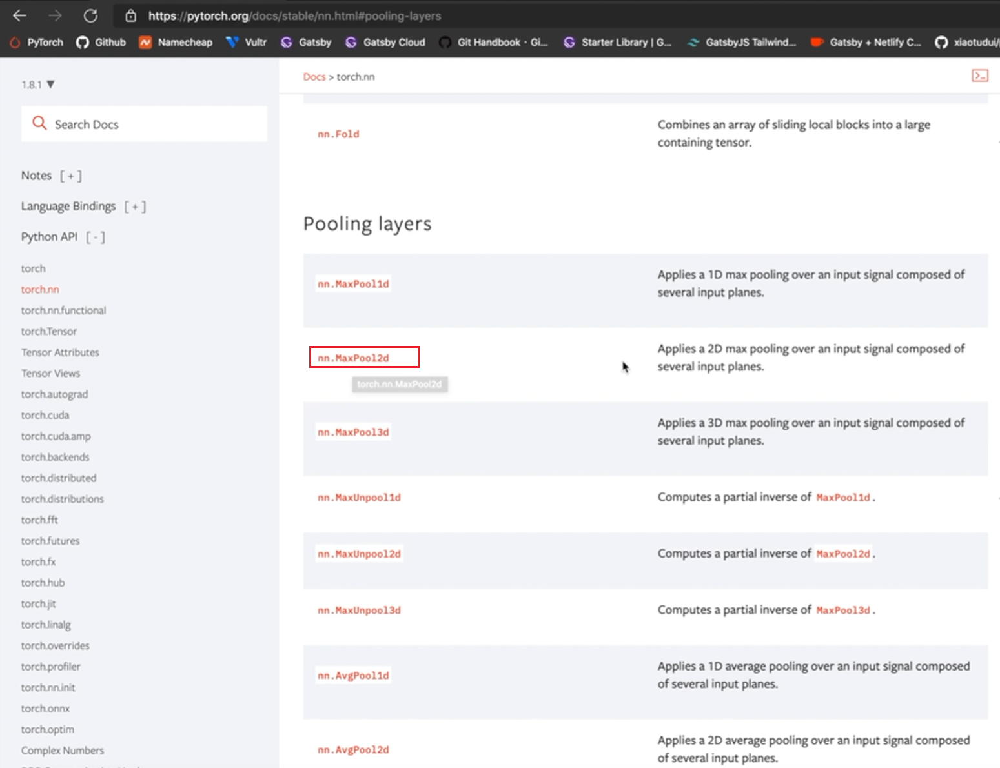

- 网友：上采样是插值，下采样是抽样，可通俗理解为逆运算

- 网友：ceil向上取整，floor向下取整

2，最大池化概念图示：

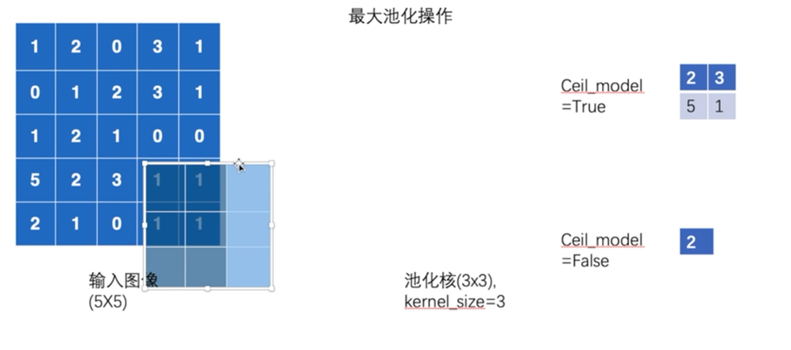

- ceilmode决定kernal没有完全落在池子里时，到底要不要抛弃这种情况

- 网友：这是池化，不是卷积，默认的步长不一样

3，为什么要使用最大池化？

- 网友：最大池化的作用保留数据特征，减少数据量
- 老师：做个比喻，原始视频输入就是1080p的，最大池化这个视频后，视频变为760p，让视频可以以760p的清晰度播放；池化后在保留视频的关键信息的同时，视频的大小会大大缩小（对应图片的尺寸也即大大缩小）。

- 高赞网友：像素本来就低依然要池化啊，池化一般跟在卷积层后，卷积层是用来提取特征的，一般有相应特征的位置是比较大的数字，最大池化可以提出来这一部分有相应特征的信息

4，关于计算机中，目录的回顾：

- ./是当前目录 2、../是父级目录 3、/是根目录 根目录指逻辑驱动器的最上一级目录

### 实践

1，运行代码：

```python
# -*- coding: utf-8 -*-

import torch
import torchvision
from torch import nn
from torch.nn import MaxPool2d
from torch.utils.data import DataLoader
from torch.utils.tensorboard import SummaryWriter

dataset = torchvision.datasets.CIFAR10("./data", train=False, download=True,
                                       transform=torchvision.transforms.ToTensor())

dataloader = DataLoader(dataset, batch_size=64)

class Tudui(nn.Module):
    def __init__(self):
        super(Tudui, self).__init__()
        self.maxpool1 = MaxPool2d(kernel_size=3, ceil_mode=False)

    def forward(self, input):
        output = self.maxpool1(input)
        return output

tudui = Tudui()

writer = SummaryWriter("./logs_maxpool")
step = 0

for data in dataloader:
    imgs, targets = data
    writer.add_images("input", imgs, step)# 池化前的图片
    output = tudui(imgs)
    writer.add_images("output", output, step) # 池化后的图片
    step = step + 1

writer.close()
```

2，最大池化后图片更加模糊了，但是尽量保留了输入图像的关键信息；最大池化是神经网络中不可缺少的，因为池化后神经网络中训练的数据量会大大减小，所以可以加快我们的训练；所以大家经常可以看到这个顺序的处理`卷积->池化->非线性激活`

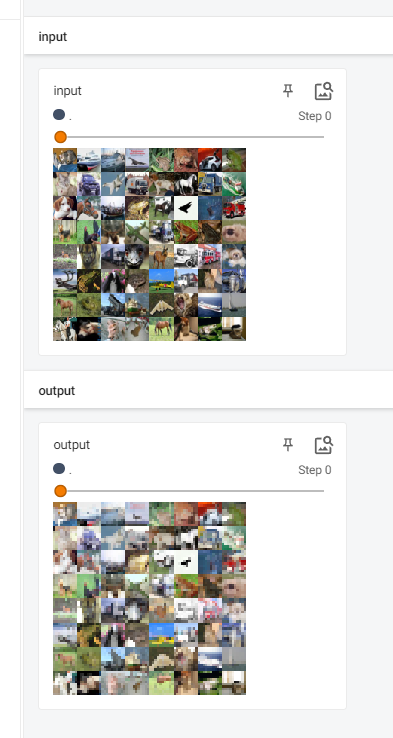


## P20-非线性激活

### 理论

1，有多种激活函数：

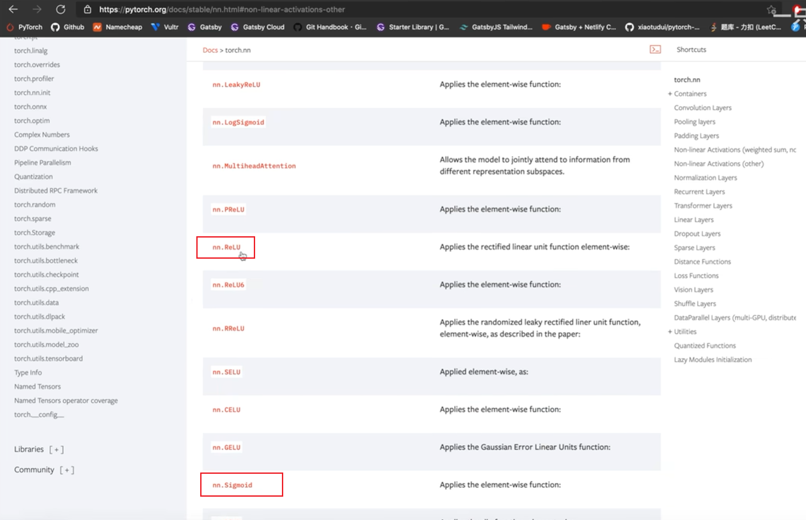

2，Relu的 implace参数，表示是否原地操作的意思：

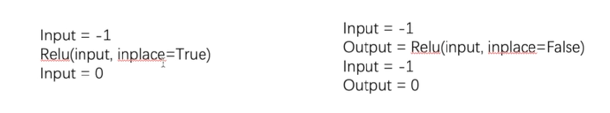

### 实战

1，运行代码：

```python
# -*- coding: utf-8 -*-

import torch
import torchvision
from torch import nn
from torch.nn import ReLU, Sigmoid
from torch.utils.data import DataLoader
from torch.utils.tensorboard import SummaryWriter

input = torch.tensor([[1, -0.5],
                      [-1, 3]])

'''
网友问：relu函数也没有对输入维度有要求啊，为什么要变成个四维的矩阵？
    网友答：第一个维度是batch size第二个是channels输入必须有四个维度
    网友答：1.10版本不需要指定batch_size 了
    高赞网友：只要让四个参数的积等于input元素数就行，通道数-1可以帮你自动算好
'''
input = torch.reshape(input, (-1, 1, 2, 2))
print(input.shape)

dataset = torchvision.datasets.CIFAR10("./data", train=False, download=True,
                                       transform=torchvision.transforms.ToTensor())

dataloader = DataLoader(dataset, batch_size=64)

class Tudui(nn.Module):
    def __init__(self):
        super(Tudui, self).__init__()
        self.relu1 = ReLU()
        self.sigmoid1 = Sigmoid()

    def forward(self, input):
        '''
        relu对图像的处理作用不明显，因为relu在x正半轴上是x=y，相当于直接输出输入值；所以我们使用sigmoid函数来查看激活函数对图片的影响
        高赞网友：ReLU激活函数的功能就是这个，小于0的数返回0，不小于0的数返回原值
        网友：激活函数，是将神经网络的线性模型变换成非线性的；说了非线性激活作用是提高泛化能力
        '''
        output = self.sigmoid1(input)
        return output

tudui = Tudui()

writer = SummaryWriter("./logs_relu")
step = 0
for data in dataloader:
    imgs, targets = data
    '''
    网友问：一直都不太懂，这是以step的方式逐个读取target图片进行处理吗，为什么非要用循环
        网友答：使用循环可以让step每次数据改变，这样在board中显示就可以都显示出来，只不过在不同的step中，如果不改变step那么可能会覆盖，只显示一版数据这样
    '''
    writer.add_images("input", imgs, global_step=step)
    output = tudui(imgs)
    writer.add_images("output", output, step)
    step += 1

writer.close()
```

2，结果展示了对图片做sigmid激活后会有什么效果：

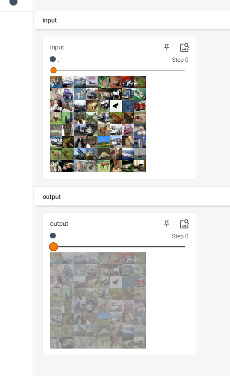

- 我的不成熟的解读：因为sigmid把实数区间的像素（具体图片深度取决于图片质量，一般是0-255）压缩到0-1，所以图片整体变灰，颜色变暗。


## P21-神经网络-线性层和其它层介绍

### 多个层概论

1，Norm（归一化）层官方文档：

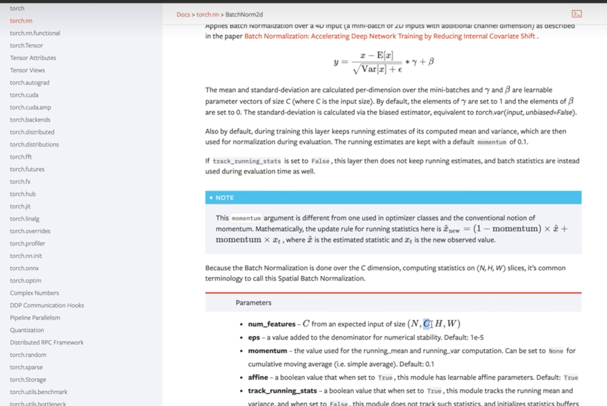


2，线性化层官网文档

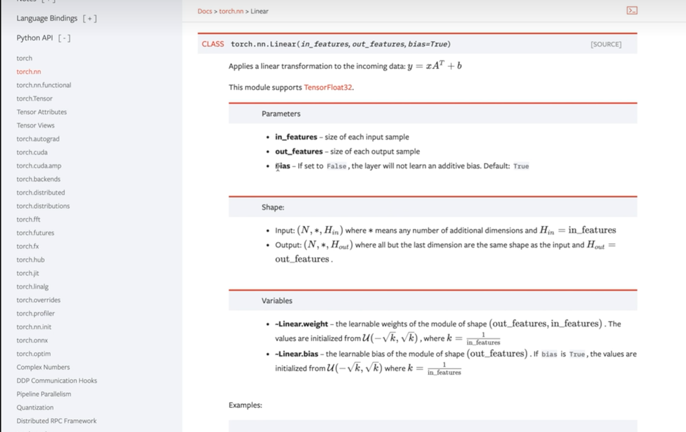

3，Dropout层官方文档

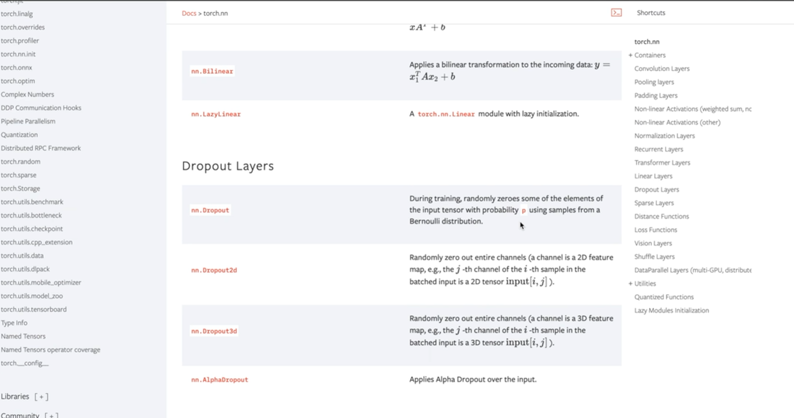

- 网友：dropout可以防止过拟合；意思就是针对训练集与测试集的拟合效果都很棒，但投入实际却发现模型效果一般的现象

- 网友：过拟合就是一套试卷刷了几百遍，次次满分，换张试卷就分数很差了

4，重要的层一览：

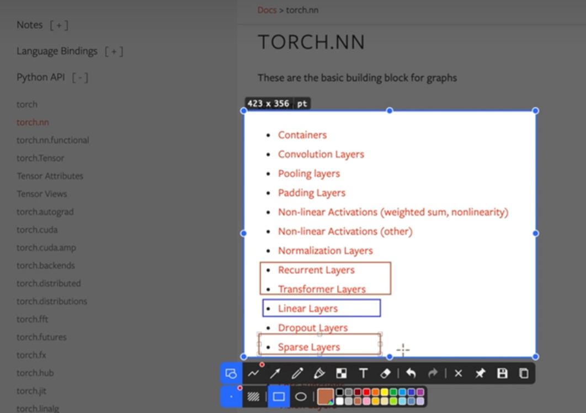

- 棕色框：特定网络才使用
- 线性层：比较常用

### 线性层理论

 1，图示：

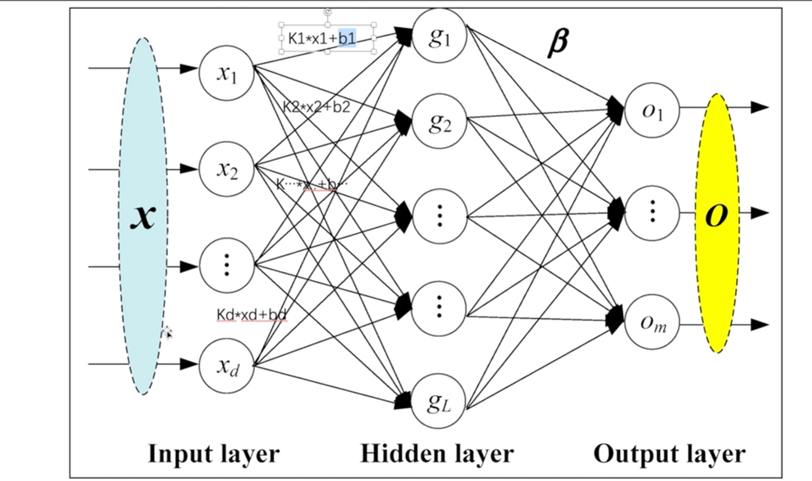

- 网友问：全连接层？
  - 网友答：就是全连接层
  - 网友：和全连接还差一点吧，全连接还包括非线性激活那一步
  - 我：综合网上的资料，线性层应该就是全连接层，[参考](https://zhidao.baidu.com/question/1955275066857218468.html)

2，

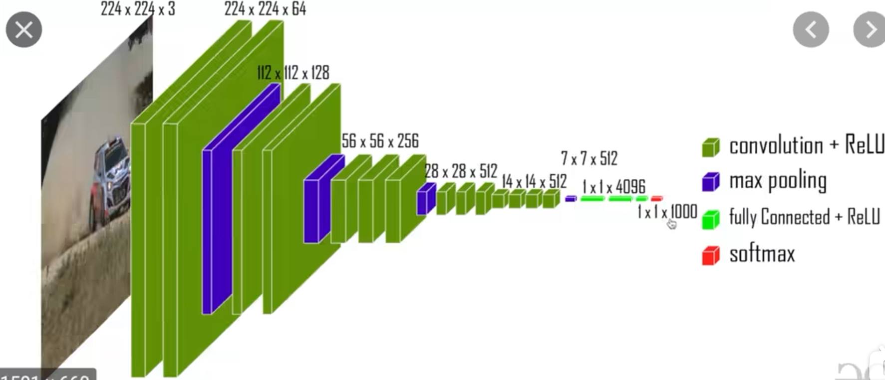

- 如上图的线性化层，inputfeature是4096，outputfeature是1000，

- 网友：限行层实质上是矩阵相乘，不舍弃最后数据时候不满足矩阵运算法则

### 线形层实战

1，运行代码：

```python
import torch
import torchvision
from torch import nn
from torch.nn import Linear
from torch.utils.data import DataLoader

dataset = torchvision.datasets.CIFAR10("./data", train=False, transform=torchvision.transforms.ToTensor(),
                                       download=True)

dataloader = DataLoader(dataset, batch_size=64, drop_last=True)

class Tudui(nn.Module):
    def __init__(self):
        super(Tudui, self).__init__()
        '''
        把inputfeature转化为outputfeature
        '''
        self.linear1 = Linear(196608, 10)

    def forward(self, input):
        output = self.linear1(input)
        return output

tudui = Tudui()

for data in dataloader:
    imgs, targets = data
    print(imgs.shape)
    '''
    torch.reshape(img,(1,1,1,-1)) 会把torch.size([64,3,32,32])转化成一个batch里一张图片 一个channel 长为1 宽为x（torch自己计算 为 64*3*32*32）
        我：我觉得实际上训练图片是不可能这么转化，这样子相当于把64张图片整合为1张图片，但是我们实际是要针对每张图片做处理；这里这么操作估计是只是为了讲解线性层
    
    flatten也是为了把图片铺平。但是输出的是torch.Size([196608])，而不是reshapoe后输出的torch.Size([1,1,1,196608])；相当于flatten在reshape的基础上还有降维的功能（去除掉无用的嵌套括号）
    
    reshape功能更强大，可以指定尺寸进行变换；flatten的话只是把它变成一行
    '''
    output = torch.flatten(imgs)
    print(output.shape)# 打印196608
    output = tudui(output)
    print(output.shape)# 打印10；我理解：相当于把feature融合了
```

2，

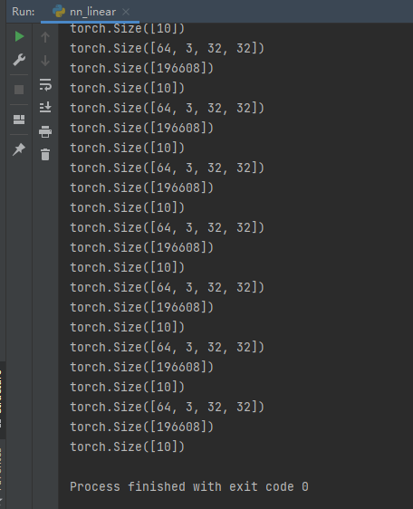

- 可以 看到，196608的feature的输入，在经过线性层后变成 10feature的输出

### 使用torch自带的模型

1，图像方面可以直接使用的模型：

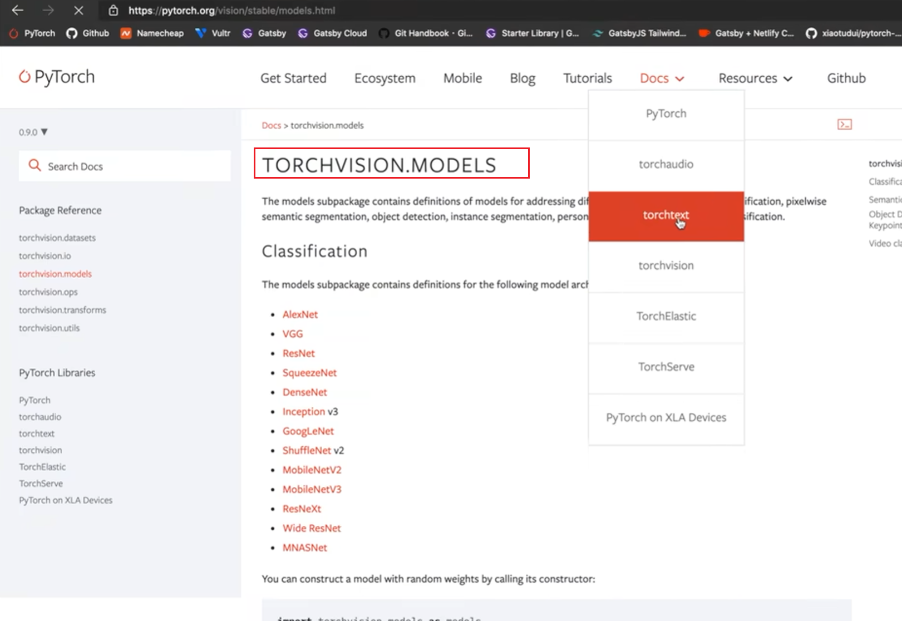

2，文字方面可以直接使用的模型：

- 略

3，语音上可以直接使用的model：

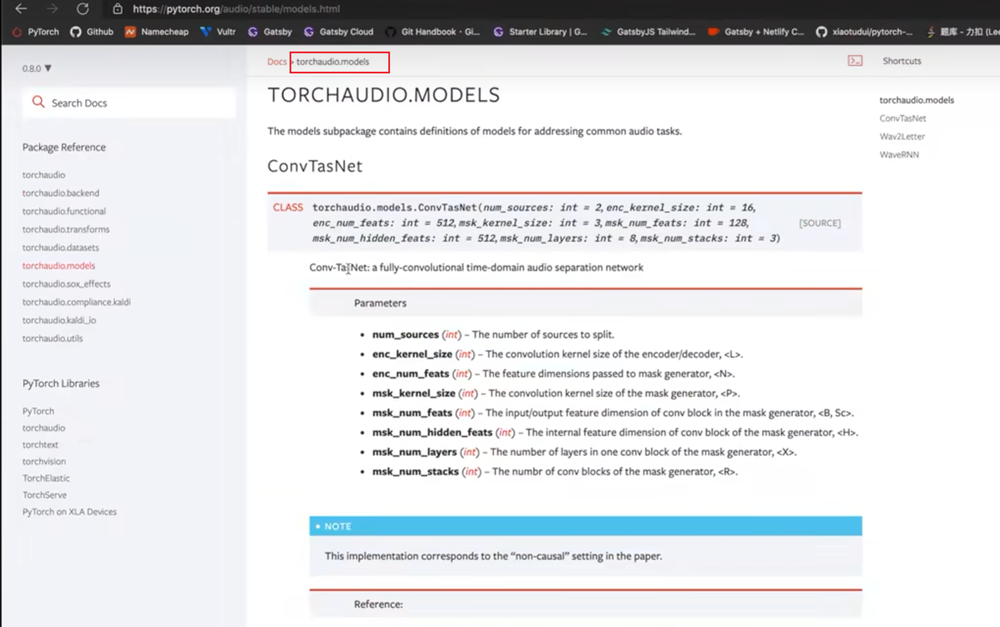

## P22-神经网络-搭建小实战和sequantial的使用

### sequantial引入

1，sequantial的好处：代码写起来简洁，并且易懂，代码更容易管理。

- 网友：看完这个课就算不会写，但是至少能看懂别人的代码，并有可能改改吧？

### cifar10数据集讲解

1，

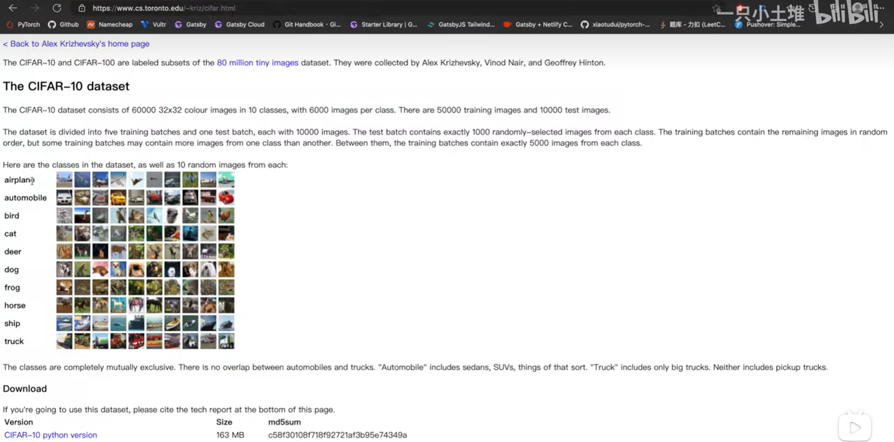

- 网友问：自己的数据集怎么输入呢
  - 网友答：自己的数据集第一节课有讲

### seq实战

1， 一个cifar10的简单网络结构：

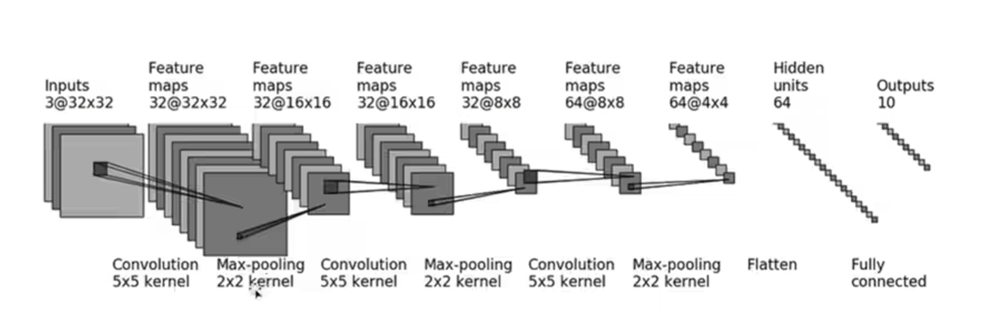

- 网友：有多个卷积核，所以通道数增加
- 网友：首先加了几圈padding 然后卷积了32次 我的理解是这样的

- 网友：就是32个`3*5*5`的卷积核，然后input对其一个个卷积得到32个`1*32*32`！！！！！

- 网友：kenerl的内容是不一样的可以理解为不同的特征抓取，因此一个核会产生一个channel

- 网友：通道改变是因为卷积核不止一个

- 老师：最大池化不会改变channel数，但是会让图片尺寸变小

- 网友：在模型不退化的情况下，层数越深越能提取高级特征

- 网友：cnn的原理，网络就是提取图片特征，不懂cnn的可以看看吴恩达 或者 鲁鹏 或者 李飞飞
- 网友问：3通道怎么变成32通道？不应该是3的倍数么
  - 网友答：卷积层中卷积核个数就是输出特征图的通道数

2，根据网络图片，计算求解conv2d卷积层中的stride和padding：

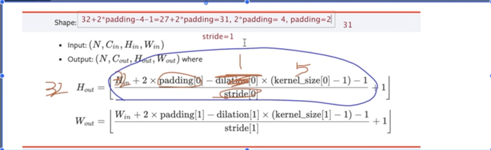

- 因为stride为1的话，上面的padding就不需要太大；如果stride为2的话，上面的padding就太大了不合适了。
- 网友：其实不用这么算吧,因为第一次卷积后大小不变,直接设置padding="same"就好了啊

3，运行如下代码：

```python
import torch
from torch import nn
from torch.nn import Conv2d, MaxPool2d, Flatten, Linear, Sequential
from torch.utils.tensorboard import SummaryWriter


class Tudui(nn.Module):
    def __init__(self):
        super(Tudui, self).__init__()
        self.model1 = Sequential(
            Conv2d(3, 32, 5, padding=2),
            MaxPool2d(2),
            Conv2d(32, 32, 5, padding=2),
            MaxPool2d(2),
            Conv2d(32, 64, 5, padding=2),
            MaxPool2d(2),
            Flatten(),
            Linear(1024, 64),
            Linear(64, 10)
        )

    def forward(self, x):
        x = self.model1(x)
        return x

tudui = Tudui()
print(tudui)
input = torch.ones((64, 3, 32, 32))
output = tudui(input)
print(output.shape)

writer = SummaryWriter("./logs_seq")
'''
这里的graph是类似关系图的感觉，和图片image不一样
'''
writer.add_graph(tudui, input)
writer.close()
```

- 网友问：什么时候要加激活层，中间这么多层为啥没有激活层？

  - 网友答：因为这里是init方法，relu在forward里面加就好了啊

  - 网友反驳：不是所有的模型都需要激活层的
    - 网友反驳：吴恩达老师讲的这里卷积完也经过非线性函数
    - 网友：要加ReLu引入非线性，这个图片里没加而已

- 我和网友：sequantial有点像compose

- 网友：你想知道中间某一层的输出，可以把sequential拆分成多个Sequential

- 网友：模型的网络部分有了，还需要进行训练，梯度计算，反向传播，参数更新，最后再用训练完的模型预测

4，控制台打印和tensorboard中输出如下：

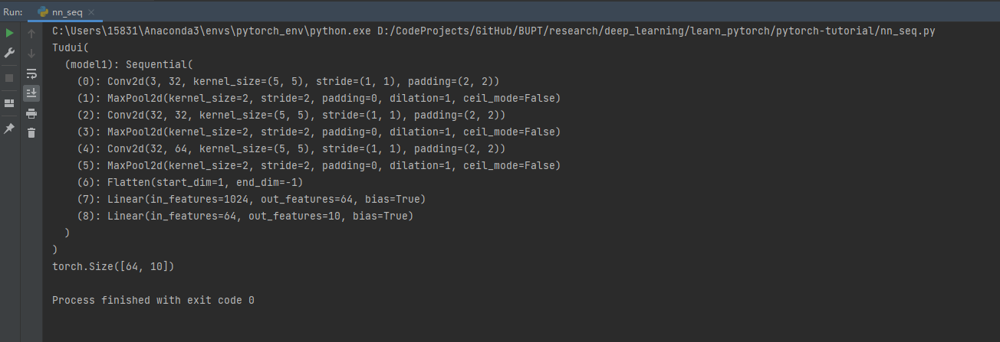

双击节点可以放大：

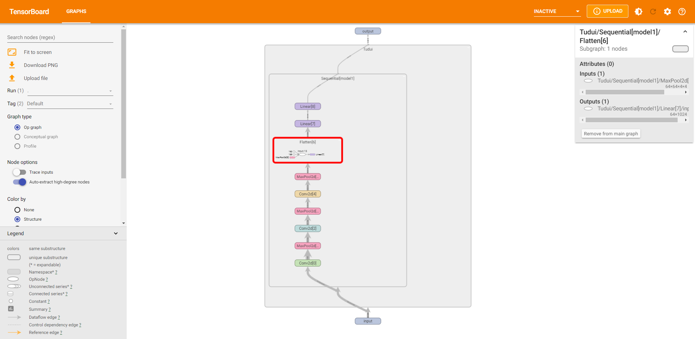

甚至可以看到输入输出的维度：

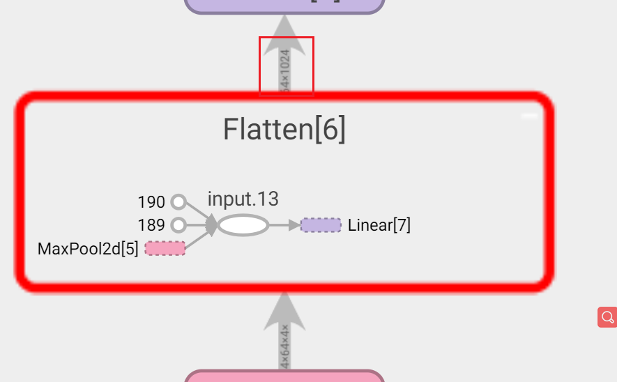


## 暂停-去学cnn先

看完p22，发现自己对这里的各个层的作用不是很懂。之前只懂经典神经网络的结构（层 节点），而不是这里的卷积层；所以先去 吴恩达 or 鲁鹏 or李飞飞那补课cv领域的cnn再回来实战pytorch。

- 我20221026：补课完毕了，把吴恩达的深度学习都看完了，现在回来继续看torch

## P23-损失函数与反向传播

### 基本概念

1，loss一般是越小越好的，训练的依据可以从loss中得到：

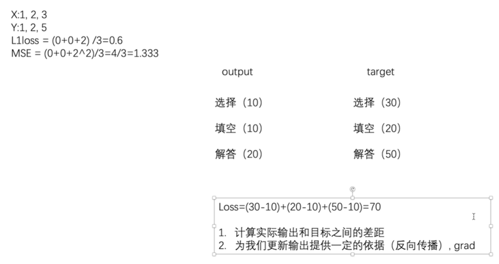

- 网友：科普：反向传播意思就是，尝试如何调整网络过程中的参数才会导致最终的loss变小（因为是从loss开始推导参数，和网络的计算顺序相反，所以叫反向传播），以及梯度的理解可以直接当成“斜率”

### 介绍各个损失函数

1， 代码

```python
# -*- coding: utf-8 -*-
# 本类单纯介绍各个损失函数
import torch
from torch.nn import L1Loss
from torch import nn

inputs = torch.tensor([1, 2, 3], dtype=torch.float32)
targets = torch.tensor([1, 2, 5], dtype=torch.float32)

'''
更改后的size为：1batch 1channel 1行 3列
'''
inputs = torch.reshape(inputs, (1, 1, 1, 3))
targets = torch.reshape(targets, (1, 1, 1, 3))

'''
针对L1loss：

设置reduction为sum后，loss=（1-1）+（2-2）+（5-3）=2

这些参数都可以在官网上看到
'''
loss = L1Loss(reduction='sum')
result = loss(inputs, targets)
print(result)

'''
针对mseloss

网友：均方差是RMSE

'''
loss_mse = nn.MSELoss()
result_mse = loss_mse(inputs, targets)
print(result_mse)

'''
针对交叉熵作为loss：

当训练一个分类问题时常用

1. 网友：交叉熵是逻辑回归的损失函数
2. 高赞网友：交叉熵从最大思然估计角度很好理解
3. 网友：三分类应该是：猫，狗，都不是
4. 网友：个人观点：理论上确实相加为一，但实际算法中不同的类别都是分开计算的，一般肯定不为一
5. 网友：要先进行softmax计算才能加起来等于1。直接计算出来的logits， 是一个数， 通过softmax以后才是和为1 的概率。
6. 网友：这个公式是把softmax函数和多分类交叉熵的式子叠加在一起写成这样子了 有不明白的可以分别搜下softmax 和交叉熵各自的公式
7. 高赞网友：这个output相当于网络最终输出logits，然后输入到softmax，得到score，3个类别的score之和为1
8. 高赞网友：交叉熵这个内置函数先将x经过softmax处理之后，再计算误差的

'''
x = torch.tensor([0.1, 0.2, 0.3])
y = torch.tensor([1])
'''
改形状为：1batchsize 3类别
'''
x = torch.reshape(x, (1, 3))
loss_cross = nn.CrossEntropyLoss()
result_cross = loss_cross(x, y)
print(result_cross)
```

2，运行结果：

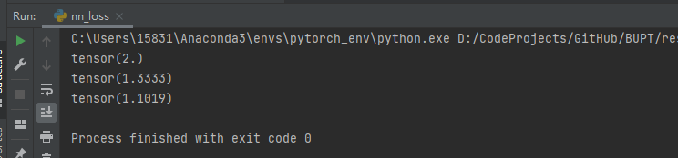

### 在神经网络中应用损失函数

1，运行代码：

```python
# -*- coding: utf-8 -*-
# 在神经网络中应用损失函数
import torchvision
from torch import nn
from torch.nn import Sequential, Conv2d, MaxPool2d, Flatten, Linear
from torch.utils.data import DataLoader

'''
网友：做自己的数据集需要先去网上下载图片，然后利用工具自己手动标注
网友：我也想问自己的数据集怎么导入，这个cifar10它已经给你处理好了都

我：下载到../data的话，所有模块就能共用cifar数据集
'''
dataset = torchvision.datasets.CIFAR10("../data", train=False, transform=torchvision.transforms.ToTensor(),
                                       download=True)

dataloader = DataLoader(dataset, batch_size=1)

class Tudui(nn.Module):
    def __init__(self):
        super(Tudui, self).__init__()
        self.model1 = Sequential(
            Conv2d(3, 32, 5, padding=2),
            MaxPool2d(2),
            Conv2d(32, 32, 5, padding=2),
            MaxPool2d(2),
            Conv2d(32, 64, 5, padding=2),
            MaxPool2d(2),
            Flatten(),
            Linear(1024, 64),
            Linear(64, 10)
        )

    def forward(self, x):
        x = self.model1(x)
        return x


loss = nn.CrossEntropyLoss()
tudui = Tudui()
for data in dataloader:
    '''
    这里可以打印imgs和targets看看数据长什么样子，进而可以准确使用损失函数。
    '''
    imgs, targets = data
    outputs = tudui(imgs)
    result_loss = loss(outputs, targets)
    '''
    使用反向传播，这样在debug的时候，参数栏的weight下面就能看到grad不为空
    '''
    result_loss.backward()
    print("ok")
```

2，代码debug后的结果：

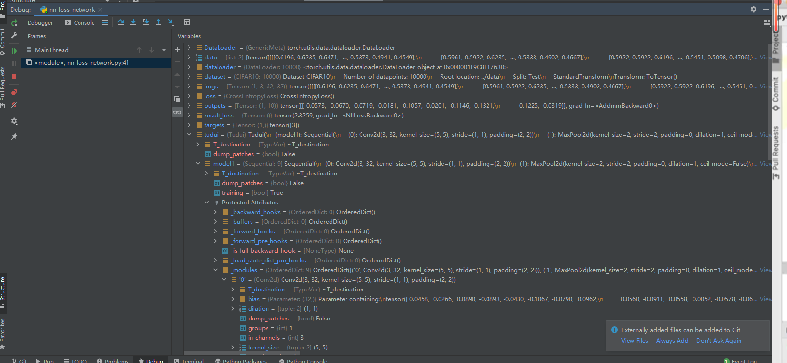

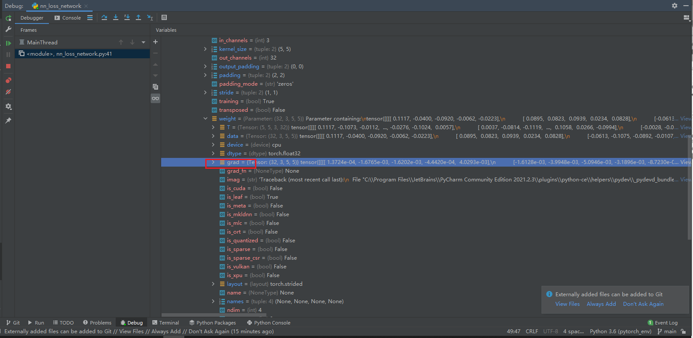


## P24-优化器

### 前言

#### 随便聊聊

1，我：函数前向传播，输出和真实值之间有误差loss；然后借助反向传播可以修改参数，以便在下一次正向传播的时候可以有更小的loss。

2，我：优化器主要是用在梯度下降中的，比如adam就是梯度下降中的一个常用优化器。

3，土堆：

1. 使用损失函数时，可以调用损失函数额的backwards，然后就可以得到损失函数的一个反向传播。
2. 反向传播的话就可以求出我们每个需要调节的参数所对应的梯度。
3. 有了梯度，我们就可以使用优化器利用梯度来对参数进行调整，来实现误差降低的目的。

#### 官方文档

1，优化器在pytorch官网的 otrch.optim中

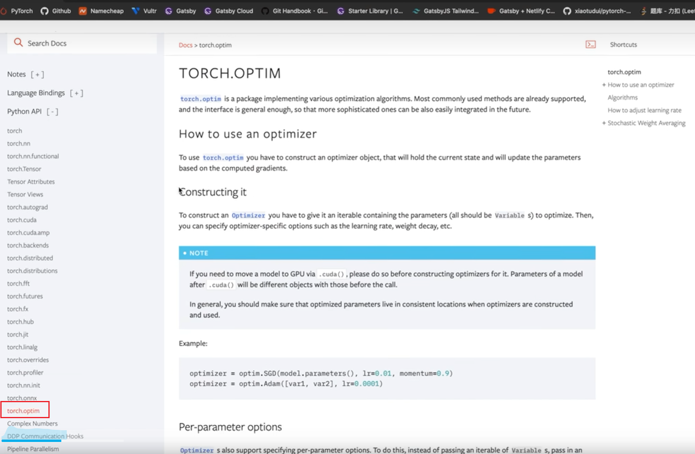

- 网友问：如何定义了多个模型多个损失函数，优化器是怎么知道对哪个进行优化的？

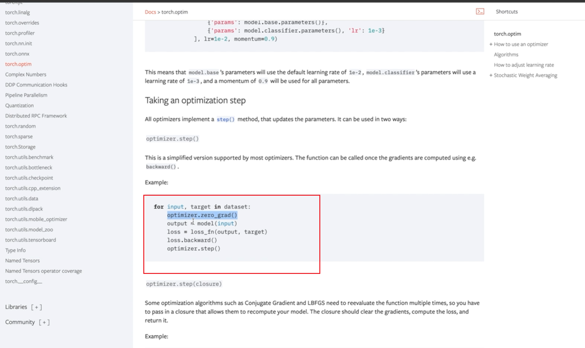

- 网友：第四行：反向传播，得到每个要更新参数对应的梯度 ；第五行：每个参数会根据上一步得到的梯度进行优化
- 网友：第一行不清零 叠加 weight直接起飞；不清零的话，梯度每次计算都会累积，会越来越大！

2，每个优化器除了 param lr 参数是一样都有的，后面其他的参数往往是不一样的。

### 实战

```python
# -*- coding: utf-8 -*-
# 神经网络中使用优化器来下降梯度
import torch
import torchvision
from torch import nn
from torch.nn import Sequential, Conv2d, MaxPool2d, Flatten, Linear
from torch.optim.lr_scheduler import StepLR
from torch.utils.data import DataLoader

'''
这里设置transfrom来把数据集转化成tensor数据类型
'''
dataset = torchvision.datasets.CIFAR10("../data", train=False, transform=torchvision.transforms.ToTensor(),
                                       download=True)

dataloader = DataLoader(dataset, batch_size=1)

class Tudui(nn.Module):
    def __init__(self):
        super(Tudui, self).__init__()
        self.model1 = Sequential(
            Conv2d(3, 32, 5, padding=2),
            MaxPool2d(2),
            Conv2d(32, 32, 5, padding=2),
            MaxPool2d(2),
            Conv2d(32, 64, 5, padding=2),
            MaxPool2d(2),
            Flatten(),
            Linear(1024, 64),
            Linear(64, 10)
        )

    def forward(self, x):
        x = self.model1(x)
        return x


loss = nn.CrossEntropyLoss()
tudui = Tudui()
'''
使用随机梯度下降做优化器：
1. lr学习速率一般开始用比较大的，后面用比较小的，学习率衰减
'''
# 这里定义了优化器
optim = torch.optim.SGD(tudui.parameters(), lr=0.01)
for epoch in range(20):
    running_loss = 0.0
    for data in dataloader:
        imgs, targets = data
        outputs = tudui(imgs)
        # 先得到loss，准备
        result_loss = loss(outputs, targets)
        # 优化器把历史保存的梯度清零
        optim.zero_grad()
        # 根据loss，得到了每个可调节参数对应的梯度
        result_loss.backward()
        # 根据每个参数对应的梯度对每个参数进行调优
        optim.step()
        running_loss = running_loss + result_loss
    # 网友：学习率太高了的话loss就会往上走了，所以要使用梯度衰减
    print(running_loss)
```

- 网友：网上查了一下，loss越来越大应该是达到了局部最优，可以把学习率调成0.001

## P25-现有网络模型的使用及修改

### 前言

1，网友：pytorch的官方文档有中文版

### VGG

#### 前言

1，VGG最常用的就是VGG16和VGG19：

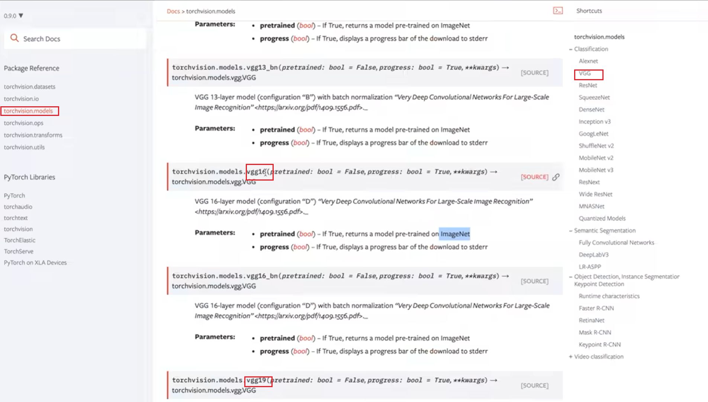

- 我：*ImageNet*项目是一个用于视觉对象识别软件研究的大型可视化数据库。很多torch的模型已经在这个数据库上预训练了，可以使用pretrained参数来控制是否想要预训练得到的参数。

2，pycharm中，terminal使用`pip list`可以看到下载了哪些包：

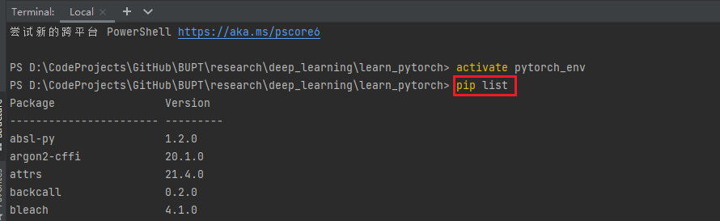

#### 安装scipy

1，因为使用imagenet需要scipy包，所以我得手动安装一下。[参考文章](http://t.csdn.cn/j7jjx)

2，下载对应的包，放在pycharm的项目目录下：

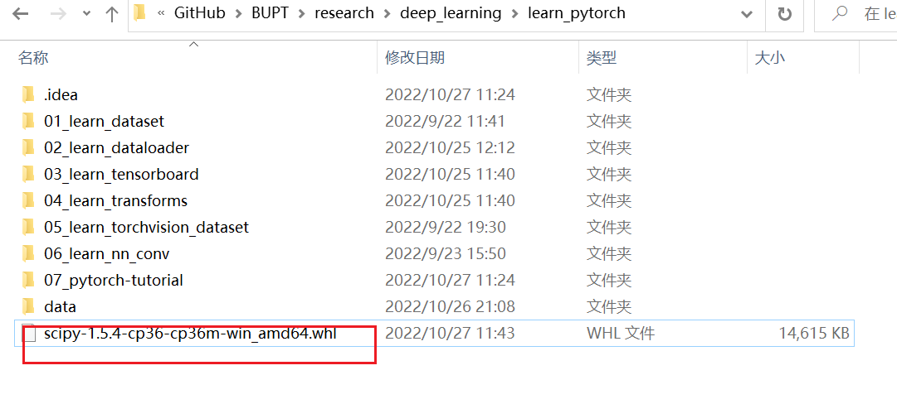

3，控制台使用pip安装已下载的whl包：

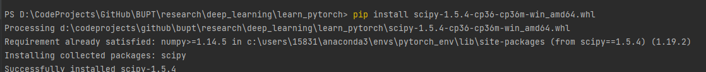

4：重新执行piplist 发现已安装：


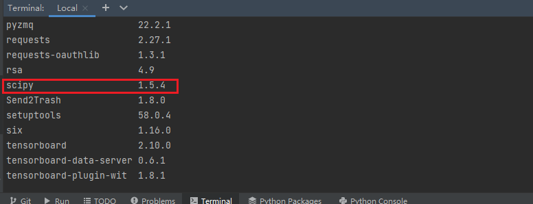

5，版本很重要！要选对对应的Python版本和cpu类型

6，土堆：如果不想先下载再安装，那么可以直接`pip install scipy`在线安装，但是还是推荐使用whl安装：


#### 代码

1，如下：

```python
# -*- coding: utf-8 -*-
import torchvision

'''
网友：模型你可以理解为参数训练好的网络
土堆：在填函数的输入的时候， ctrl+p 就可以给提示让设置下一个参数。
土堆：这个数据集现在不能公开下载，得去网上自己找资源；而且这个数据集太大了，有100多个g，要慢慢下载。因为数据集太大，没办法通过这个模型验证vgg的pretrained参数
'''
# train_data = torchvision.datasets.ImageNet("../data_image_net", split='train', download=True,
#                                            transform=torchvision.transforms.ToTensor())
from torch import nn

'''
网友：VGG系列应该是最大的模型了
土堆：pretrained=True时需要进行下载训练好的权重
网友：pretrained为false的 应该是随机初始化之后的，而一般随机初始化不能设置为0,0附近就行，吴恩达深度学习讲过
'''
vgg16_false = torchvision.models.vgg16(pretrained=False)
vgg16_true = torchvision.models.vgg16(pretrained=True)

'''
这里可以看到vgg16的结构，可以看到输出的维度是1000，所以可以分类出1000个物体。
'''
print(vgg16_true)

'''
vgg的输出是1000维度，想应用于10维度分类的cifar，有很多种方案：
1. 把vgg的输出层从1000维度，改成10维度
2. 在1000维度的线性输出层下面再加一层，让它的输入是1000，输出是10

土堆：一般用vgg16作为前置的网络使用，来提取一些特征
    - 网友：高情商的说法叫迁移学习
    - 网友：只有在分类相近的情况下才比较有用，不能乱迁移
    - 网友：这种做法只适合前后部分的修改，想要跳层或者跨层连接的话，就只能自己写
'''
train_data = torchvision.datasets.CIFAR10('../data', train=True, transform=torchvision.transforms.ToTensor(),
                                          download=True)

'''
这里采用的是第二种方式，给模型添加module，把1000维度的输出映射为10维度的输出：
- 在分类器sequantial的后面加上模型可以用：vgg16_true.add_module('add_linear', nn.Linear(1000, 10))
- 如果想在sequantial内部的后方加上模型，可以用下面的写法，指定sequantial的名字即classifier，这样就在sequantial中加了一个module

网友问：加了一层后是不是需要再训练？
'''
vgg16_true.classifier.add_module('add_linear', nn.Linear(1000, 10))
print(vgg16_true)

'''
这里采用的是第一种方式，给模型替换module，把4096->1000维度的输出映射为4096->10维度的输出：
如下可以把指定sequantial的指定module替换为新的module
'''
print(vgg16_false)
vgg16_false.classifier[6] = nn.Linear(4096, 10)
print(vgg16_false)
```

2，代码的运行结果如下：

```
Downloading: "https://download.pytorch.org/models/vgg16-397923af.pth" to C:\Users\15831/.cache\torch\hub\checkpoints\vgg16-397923af.pth
100.0%
VGG(
  (features): Sequential(
    (0): Conv2d(3, 64, kernel_size=(3, 3), stride=(1, 1), padding=(1, 1))
    (1): ReLU(inplace=True)
    (2): Conv2d(64, 64, kernel_size=(3, 3), stride=(1, 1), padding=(1, 1))
    (3): ReLU(inplace=True)
    (4): MaxPool2d(kernel_size=2, stride=2, padding=0, dilation=1, ceil_mode=False)
    (5): Conv2d(64, 128, kernel_size=(3, 3), stride=(1, 1), padding=(1, 1))
    (6): ReLU(inplace=True)
    (7): Conv2d(128, 128, kernel_size=(3, 3), stride=(1, 1), padding=(1, 1))
    (8): ReLU(inplace=True)
    (9): MaxPool2d(kernel_size=2, stride=2, padding=0, dilation=1, ceil_mode=False)
    (10): Conv2d(128, 256, kernel_size=(3, 3), stride=(1, 1), padding=(1, 1))
    (11): ReLU(inplace=True)
    (12): Conv2d(256, 256, kernel_size=(3, 3), stride=(1, 1), padding=(1, 1))
    (13): ReLU(inplace=True)
    (14): Conv2d(256, 256, kernel_size=(3, 3), stride=(1, 1), padding=(1, 1))
    (15): ReLU(inplace=True)
    (16): MaxPool2d(kernel_size=2, stride=2, padding=0, dilation=1, ceil_mode=False)
    (17): Conv2d(256, 512, kernel_size=(3, 3), stride=(1, 1), padding=(1, 1))
    (18): ReLU(inplace=True)
    (19): Conv2d(512, 512, kernel_size=(3, 3), stride=(1, 1), padding=(1, 1))
    (20): ReLU(inplace=True)
    (21): Conv2d(512, 512, kernel_size=(3, 3), stride=(1, 1), padding=(1, 1))
    (22): ReLU(inplace=True)
    (23): MaxPool2d(kernel_size=2, stride=2, padding=0, dilation=1, ceil_mode=False)
    (24): Conv2d(512, 512, kernel_size=(3, 3), stride=(1, 1), padding=(1, 1))
    (25): ReLU(inplace=True)
    (26): Conv2d(512, 512, kernel_size=(3, 3), stride=(1, 1), padding=(1, 1))
    (27): ReLU(inplace=True)
    (28): Conv2d(512, 512, kernel_size=(3, 3), stride=(1, 1), padding=(1, 1))
    (29): ReLU(inplace=True)
    (30): MaxPool2d(kernel_size=2, stride=2, padding=0, dilation=1, ceil_mode=False)
  )
  (avgpool): AdaptiveAvgPool2d(output_size=(7, 7))
  (classifier): Sequential(
    (0): Linear(in_features=25088, out_features=4096, bias=True)
    (1): ReLU(inplace=True)
    (2): Dropout(p=0.5, inplace=False)
    (3): Linear(in_features=4096, out_features=4096, bias=True)
    (4): ReLU(inplace=True)
    (5): Dropout(p=0.5, inplace=False)
    (6): Linear(in_features=4096, out_features=1000, bias=True)
  )
)
Files already downloaded and verified
VGG(
  (features): Sequential(
    (0): Conv2d(3, 64, kernel_size=(3, 3), stride=(1, 1), padding=(1, 1))
    (1): ReLU(inplace=True)
    (2): Conv2d(64, 64, kernel_size=(3, 3), stride=(1, 1), padding=(1, 1))
    (3): ReLU(inplace=True)
    (4): MaxPool2d(kernel_size=2, stride=2, padding=0, dilation=1, ceil_mode=False)
    (5): Conv2d(64, 128, kernel_size=(3, 3), stride=(1, 1), padding=(1, 1))
    (6): ReLU(inplace=True)
    (7): Conv2d(128, 128, kernel_size=(3, 3), stride=(1, 1), padding=(1, 1))
    (8): ReLU(inplace=True)
    (9): MaxPool2d(kernel_size=2, stride=2, padding=0, dilation=1, ceil_mode=False)
    (10): Conv2d(128, 256, kernel_size=(3, 3), stride=(1, 1), padding=(1, 1))
    (11): ReLU(inplace=True)
    (12): Conv2d(256, 256, kernel_size=(3, 3), stride=(1, 1), padding=(1, 1))
    (13): ReLU(inplace=True)
    (14): Conv2d(256, 256, kernel_size=(3, 3), stride=(1, 1), padding=(1, 1))
    (15): ReLU(inplace=True)
    (16): MaxPool2d(kernel_size=2, stride=2, padding=0, dilation=1, ceil_mode=False)
    (17): Conv2d(256, 512, kernel_size=(3, 3), stride=(1, 1), padding=(1, 1))
    (18): ReLU(inplace=True)
    (19): Conv2d(512, 512, kernel_size=(3, 3), stride=(1, 1), padding=(1, 1))
    (20): ReLU(inplace=True)
    (21): Conv2d(512, 512, kernel_size=(3, 3), stride=(1, 1), padding=(1, 1))
    (22): ReLU(inplace=True)
    (23): MaxPool2d(kernel_size=2, stride=2, padding=0, dilation=1, ceil_mode=False)
    (24): Conv2d(512, 512, kernel_size=(3, 3), stride=(1, 1), padding=(1, 1))
    (25): ReLU(inplace=True)
    (26): Conv2d(512, 512, kernel_size=(3, 3), stride=(1, 1), padding=(1, 1))
    (27): ReLU(inplace=True)
    (28): Conv2d(512, 512, kernel_size=(3, 3), stride=(1, 1), padding=(1, 1))
    (29): ReLU(inplace=True)
    (30): MaxPool2d(kernel_size=2, stride=2, padding=0, dilation=1, ceil_mode=False)
  )
  (avgpool): AdaptiveAvgPool2d(output_size=(7, 7))
  (classifier): Sequential(
    (0): Linear(in_features=25088, out_features=4096, bias=True)
    (1): ReLU(inplace=True)
    (2): Dropout(p=0.5, inplace=False)
    (3): Linear(in_features=4096, out_features=4096, bias=True)
    (4): ReLU(inplace=True)
    (5): Dropout(p=0.5, inplace=False)
    (6): Linear(in_features=4096, out_features=1000, bias=True)
    (add_linear): Linear(in_features=1000, out_features=10, bias=True)
  )
)
VGG(
  (features): Sequential(
    (0): Conv2d(3, 64, kernel_size=(3, 3), stride=(1, 1), padding=(1, 1))
    (1): ReLU(inplace=True)
    (2): Conv2d(64, 64, kernel_size=(3, 3), stride=(1, 1), padding=(1, 1))
    (3): ReLU(inplace=True)
    (4): MaxPool2d(kernel_size=2, stride=2, padding=0, dilation=1, ceil_mode=False)
    (5): Conv2d(64, 128, kernel_size=(3, 3), stride=(1, 1), padding=(1, 1))
    (6): ReLU(inplace=True)
    (7): Conv2d(128, 128, kernel_size=(3, 3), stride=(1, 1), padding=(1, 1))
    (8): ReLU(inplace=True)
    (9): MaxPool2d(kernel_size=2, stride=2, padding=0, dilation=1, ceil_mode=False)
    (10): Conv2d(128, 256, kernel_size=(3, 3), stride=(1, 1), padding=(1, 1))
    (11): ReLU(inplace=True)
    (12): Conv2d(256, 256, kernel_size=(3, 3), stride=(1, 1), padding=(1, 1))
    (13): ReLU(inplace=True)
    (14): Conv2d(256, 256, kernel_size=(3, 3), stride=(1, 1), padding=(1, 1))
    (15): ReLU(inplace=True)
    (16): MaxPool2d(kernel_size=2, stride=2, padding=0, dilation=1, ceil_mode=False)
    (17): Conv2d(256, 512, kernel_size=(3, 3), stride=(1, 1), padding=(1, 1))
    (18): ReLU(inplace=True)
    (19): Conv2d(512, 512, kernel_size=(3, 3), stride=(1, 1), padding=(1, 1))
    (20): ReLU(inplace=True)
    (21): Conv2d(512, 512, kernel_size=(3, 3), stride=(1, 1), padding=(1, 1))
    (22): ReLU(inplace=True)
    (23): MaxPool2d(kernel_size=2, stride=2, padding=0, dilation=1, ceil_mode=False)
    (24): Conv2d(512, 512, kernel_size=(3, 3), stride=(1, 1), padding=(1, 1))
    (25): ReLU(inplace=True)
    (26): Conv2d(512, 512, kernel_size=(3, 3), stride=(1, 1), padding=(1, 1))
    (27): ReLU(inplace=True)
    (28): Conv2d(512, 512, kernel_size=(3, 3), stride=(1, 1), padding=(1, 1))
    (29): ReLU(inplace=True)
    (30): MaxPool2d(kernel_size=2, stride=2, padding=0, dilation=1, ceil_mode=False)
  )
  (avgpool): AdaptiveAvgPool2d(output_size=(7, 7))
  (classifier): Sequential(
    (0): Linear(in_features=25088, out_features=4096, bias=True)
    (1): ReLU(inplace=True)
    (2): Dropout(p=0.5, inplace=False)
    (3): Linear(in_features=4096, out_features=4096, bias=True)
    (4): ReLU(inplace=True)
    (5): Dropout(p=0.5, inplace=False)
    (6): Linear(in_features=4096, out_features=1000, bias=True)
  )
)
VGG(
  (features): Sequential(
    (0): Conv2d(3, 64, kernel_size=(3, 3), stride=(1, 1), padding=(1, 1))
    (1): ReLU(inplace=True)
    (2): Conv2d(64, 64, kernel_size=(3, 3), stride=(1, 1), padding=(1, 1))
    (3): ReLU(inplace=True)
    (4): MaxPool2d(kernel_size=2, stride=2, padding=0, dilation=1, ceil_mode=False)
    (5): Conv2d(64, 128, kernel_size=(3, 3), stride=(1, 1), padding=(1, 1))
    (6): ReLU(inplace=True)
    (7): Conv2d(128, 128, kernel_size=(3, 3), stride=(1, 1), padding=(1, 1))
    (8): ReLU(inplace=True)
    (9): MaxPool2d(kernel_size=2, stride=2, padding=0, dilation=1, ceil_mode=False)
    (10): Conv2d(128, 256, kernel_size=(3, 3), stride=(1, 1), padding=(1, 1))
    (11): ReLU(inplace=True)
    (12): Conv2d(256, 256, kernel_size=(3, 3), stride=(1, 1), padding=(1, 1))
    (13): ReLU(inplace=True)
    (14): Conv2d(256, 256, kernel_size=(3, 3), stride=(1, 1), padding=(1, 1))
    (15): ReLU(inplace=True)
    (16): MaxPool2d(kernel_size=2, stride=2, padding=0, dilation=1, ceil_mode=False)
    (17): Conv2d(256, 512, kernel_size=(3, 3), stride=(1, 1), padding=(1, 1))
    (18): ReLU(inplace=True)
    (19): Conv2d(512, 512, kernel_size=(3, 3), stride=(1, 1), padding=(1, 1))
    (20): ReLU(inplace=True)
    (21): Conv2d(512, 512, kernel_size=(3, 3), stride=(1, 1), padding=(1, 1))
    (22): ReLU(inplace=True)
    (23): MaxPool2d(kernel_size=2, stride=2, padding=0, dilation=1, ceil_mode=False)
    (24): Conv2d(512, 512, kernel_size=(3, 3), stride=(1, 1), padding=(1, 1))
    (25): ReLU(inplace=True)
    (26): Conv2d(512, 512, kernel_size=(3, 3), stride=(1, 1), padding=(1, 1))
    (27): ReLU(inplace=True)
    (28): Conv2d(512, 512, kernel_size=(3, 3), stride=(1, 1), padding=(1, 1))
    (29): ReLU(inplace=True)
    (30): MaxPool2d(kernel_size=2, stride=2, padding=0, dilation=1, ceil_mode=False)
  )
  (avgpool): AdaptiveAvgPool2d(output_size=(7, 7))
  (classifier): Sequential(
    (0): Linear(in_features=25088, out_features=4096, bias=True)
    (1): ReLU(inplace=True)
    (2): Dropout(p=0.5, inplace=False)
    (3): Linear(in_features=4096, out_features=4096, bias=True)
    (4): ReLU(inplace=True)
    (5): Dropout(p=0.5, inplace=False)
    (6): Linear(in_features=4096, out_features=10, bias=True)
  )
)

Process finished with exit code 0

```

## P26-网络模型的报错和读取

### 前言

1，接下来要学的内容：

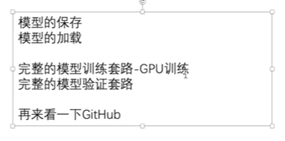

- 网友：5555我自己研究了半年， 看up主视频两天大彻大悟

### 模型的保存（含陷阱）

```python
# -*- coding: utf-8 -*-
import torch
import torchvision
from torch import nn

# 这里pretrained设置为false，说明使用的模型的参数是没有训练的，是仅仅初始化过的。
vgg16 = torchvision.models.vgg16(pretrained=False)
'''
保存方式1,模型结构+模型参数:
1. 模型的后缀随便写什么都可以，推荐写pth作为后缀。
2. 这种方式把模型的结构和参数都保存下来了。
'''
torch.save(vgg16, "vgg16_method1.pth")

'''
# 保存方式2，模型参数（官方推荐）
1, 相当于把vgg的参数保存为字典，现在就没有保存vgg的结构了
2，对于比较大的模型，这种保存方式需要的数据空间更小
'''
torch.save(vgg16.state_dict(), "vgg16_method2.pth")

# 陷阱
class Tudui(nn.Module):
    def __init__(self):
        super(Tudui, self).__init__()
        self.conv1 = nn.Conv2d(3, 64, kernel_size=3)

    def forward(self, x):
        x = self.conv1(x)
        return x

tudui = Tudui()
torch.save(tudui, "tudui_method1.pth")
```

### 模型的加载（含陷阱）

```python
# -*- coding: utf-8 -*-
import torch
'''
这一步就是引入所有自己建立的模型，避免到处复制模型结构
'''
from model_save import *
import torchvision
from torch import nn

# 方式1-》保存方式1，加载模型
'''
网友：没有预训练的模型不是没有参数，而是参数是初始化的状态
'''
model = torch.load("vgg16_method1.pth")
# print(model)

# 方式2，加载模型
vgg16 = torchvision.models.vgg16(pretrained=False)# 先把裸模型加载出来
vgg16.load_state_dict(torch.load("vgg16_method2.pth"))# 在把保存的参数赋值给裸模型
# model = torch.load("vgg16_method2.pth") # 把model打印出来就可以看到第二种方式保存的模型只有模型的参数
# print(vgg16)

# 陷阱1
'''
load自定义的模型的时候，要把Tudui类也放进执行load的类中
- 网友：从别的文件import过来就可以了
    - 网友问：import 的话训练好的模型的随机参数或者其他什么参数会改变的妈？
    - 网友：1.12已经不用引入了
    - 土堆：是的，真实写项目的时候不会把模型导出复制，而是直接在一个文件里写好模型，然后在需要的文件中import一下
'''
# class Tudui(nn.Module):
#     def __init__(self):
#         super(Tudui, self).__init__()
#         self.conv1 = nn.Conv2d(3, 64, kernel_size=3)
#
#     def forward(self, x):
#         x = self.conv1(x)
#         return x

model = torch.load('tudui_method1.pth')
print(model)
```

## P27-P29完整地模型训练套路

### 前言

1，会针对cifar10数据集完成一个分类问题

- 高赞网友：这个学完了去学网络模型然后坐图像分类，熟悉了可以进阶目标检测
- 网友：进阶就是复现论文

2，pycharm中有草稿本的功能：

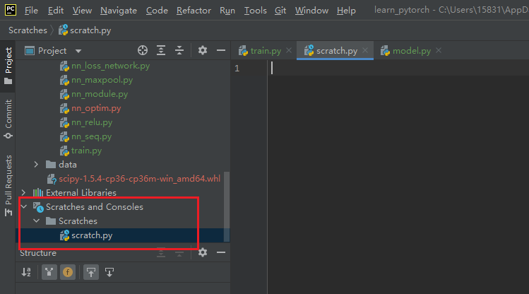

- 我：除了可以用pythonconsole做草稿本，还可以用这里的scratches做草稿本。

3，模型输出的概率的和不为1：


- 网友：需要经过SoftMax后加起来才能等于1
- 网友：这个输出就是卷积之后的数值，并不算是真正意义上的概率，甚至可能有负值
- 网友：需要进一步计算才算是概率
- 土堆：argmax可以求出数组中最大的项是第几个

4，Module.eval()和Module.train()只对一部分模型起作用：

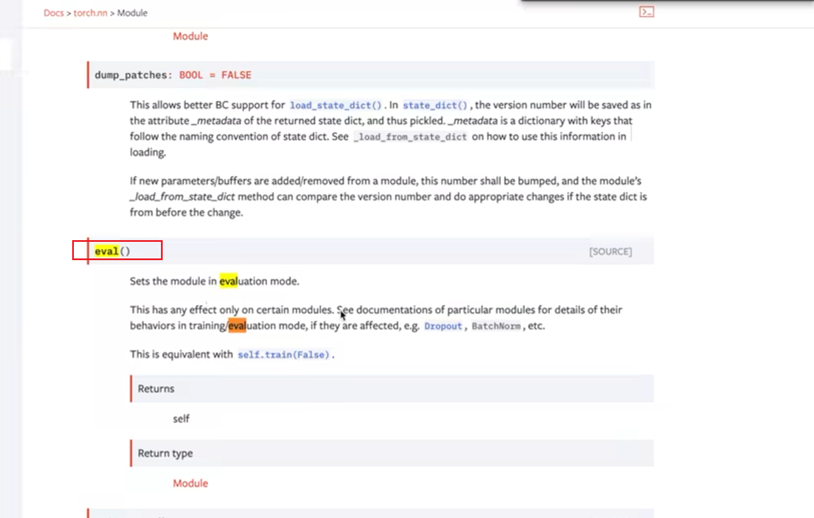

- 这里可以看到，当模型中有dropout等模块，才会有作用。
- 网友：你自定义层中涉及训练和测试不一条线的，都需要这个

### 实操

1，首先明确针对cifar10数据集的模型的结构如下：

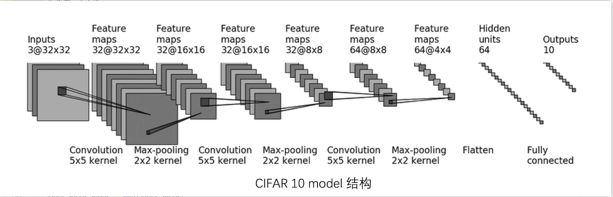

2，编写模型骨架的代码：

```python
import torch
from torch import nn

class Zhangyun(nn.Module):# 自己写的定义模型的结构的类 需要继承nn.module
    def __init__(self):
        super(Zhangyun,self).__init__()# 自定义类的初始化，直接调用父类的nn.Module来初始化
        # 把网络定义放到一个sequantial中，这样避免在forward中写的很麻烦
        self.model=nn.Sequential(
            # 卷积层：ctrl+p可以看到参数；参数分别是 inputchannel outputchannel kernalsize stride用默认的1 padding设置为2保证卷积后尺寸不变（可以计算出来的）
            nn.Conv2d(3,32,5,1,2),
            # 最大池化层：kernalsize设置为2，其他的像stride和padding就用默认的就可以，因为正好符合
            nn.MaxPool2d(2),
            # 卷积层
            nn.Conv2d(32, 32, 5, 1, 2),
            # 最大池化
            nn.MaxPool2d(2),
            # 卷积层
            nn.Conv2d(32,64,5,1,2),
            # 最大池化
            nn.MaxPool2d(2),
            # 展平的同时实现一个线性层：
            # 展平：展平后的大小应该是64*4*4的大小，因为本层把这么大的图像像素展平了。
            # 线性层：参数分别是inputfeature outputfeature
            nn.Flatten(),
            nn.Linear(64*4*4,64),
            # 线性层：通过这个线性层后，就可以得到10分类的输出。注意线性层就是全连接层就是经典的神经网络！
            nn.Linear(64,10)
        )
    def forward(self,x):
        x=self.model(x)
        return x

'''
很多人喜欢在这写个main 并测试网络的正确性
https://www.bilibili.com/video/BV1hE411t7RN/?p=27&spm_id_from=pageDriver&vd_source=8be62db2c8e19174231a64770292e191
14.39
'''
if __name__ == '__main__': # pycharm中右键run，或者这里界面点击左边的绿色三角都能run（常用）
    # 创造出网络模型
    zhangyun=Zhangyun()
    # 为了考察网络的正确性，给一个输入的尺寸，看输出的尺寸是否正确
    input=torch.ones((64,3,32,32))
    output=zhangyun(input)
    '''
    输出为：
    torch.Size([64, 10])
    这体现每个有64个图片，每个图片都有一个10维度的onehot来表征预测结果
    '''
    print(output.shape)
```

3，编写模型训练的完整代码：

```python
# -*- coding: utf-8 -*-

import torchvision
from torch.utils.tensorboard import SummaryWriter
# 注意model.python和train.python要在一个文件夹底下，这样才能正确引入
from model import *
from torch import nn
from torch.utils.data import DataLoader

'''
准备数据集
'''
train_data = torchvision.datasets.CIFAR10(root="../data", train=True, transform=torchvision.transforms.ToTensor(),
                                          download=True)
test_data = torchvision.datasets.CIFAR10(root="../data", train=False, transform=torchvision.transforms.ToTensor(),
                                         download=True)

# 获得数据集的长度。len==length 长度。
train_data_size = len(train_data)
test_data_size = len(test_data)
# 如果train_data_size=10, 训练数据集的长度为：10
'''
网友：Python3.6 新增了一种 f-字符串格式化，也可以写成print(f"训练数据集的长度为:{train_data_size}")
土堆：.format可以把自身包含的内容替换掉{}中的内容。还有更多打印方式，细节可以了解一下python的字符串部分的内容。
网友：print("训练集的长度为：%s" % (train_data_size)) 
'''
print("训练数据集的长度为：{}".format(train_data_size))
print("测试数据集的长度为：{}".format(test_data_size))


# 利用 DataLoader 来加载数据集
train_dataloader = DataLoader(train_data, batch_size=64)
test_dataloader = DataLoader(test_data, batch_size=64)

# 创建网络模型
'''
网友：问back_grand和loss的，自己去看model的写法，根本不写在这，别隔着抖聪明了
网友：还没开始训练就后向传播交叉熵了是吧
'''
zhangyun = Zhangyun() # 类Zhangyun所代表的模型被放在 model.python文件中，本文件之前已经引入了model.pyrhon文件的全部内容，自然也就引入了类Zhangyun

# 损失函数
'''
因为当前问题是分类问题，所以损失函数可以用交叉熵。
参数使用默认的，不额外显式设置。
'''
loss_fn = nn.CrossEntropyLoss()

# 优化器
'''
1. 这里使用了随机梯度下降作为优化器来根据梯度优化参数。
'''
# learning_rate = 0.01
# 0.01的写法还有这种：1e-2=1 x (10)^(-2) = 1 /100 = 0.01。这样想写0.000000001的话，吧-2改成-10就可以了。
learning_rate = 1e-2
optimizer = torch.optim.SGD(zhangyun.parameters(), lr=learning_rate)

# 设置训练网络的一些参数
# 记录训练的次数
total_train_step = 0
# 记录测试的次数
total_test_step = 0
# 训练的轮数
epoch = 10

# 添加tensorboard
writer = SummaryWriter("../logs_train")

for i in range(epoch):
    print("-------第 {} 轮训练开始-------".format(i+1))

    # 训练步骤开始
    zhangyun.train()# 这个步骤可以不写，因为这步的作用比较小
    for data in train_dataloader:
        imgs, targets = data
        outputs = zhangyun(imgs)
        loss = loss_fn(outputs, targets)

        # 优化器优化模型
        optimizer.zero_grad()# 先要优化器梯度清零
        loss.backward() # 反向传播得到各个参数的梯度
        optimizer.step()# 根据各个参数的梯度，对参数进行优化

        '''
        网友问：不用RELU吗？
        - 网友：这里的交叉商包括了soft max
        - 网友：然后再对softmax值取对数，再使用nllloss进行计算,nllloss会将target转为onehot编码形式
        '''

        total_train_step = total_train_step + 1
        # 让训练集每训练100次做一次打印，避免控制台被训练集的打印刷屏 而导致其他关键打印无法被轻易找到
        if total_train_step % 100 == 0:
            # 这里的 loss.item() 是正规的写法，如果直接写 loss 其实也可以；不过有时候像 变量.item 可以把像tensor变量转化成数字
            print("训练次数：{}, Loss: {}".format(total_train_step, loss.item()))
            writer.add_scalar("train_loss", loss.item(), total_train_step)

    '''
    每次训练完一个epoch后，都会在测试集上跑一遍，看看训练的效果
    '''
    # 测试步骤开始
    zhangyun.eval()# 这个步骤可以不写，因为这步的作用比较小
    total_test_loss = 0
    total_accuracy = 0
    '''
    with torch.no_grad():表示梯度没有了，保证不会在测试过程中对模型进行调优
    '''
    with torch.no_grad():
        for data in test_dataloader:
            imgs, targets = data
            outputs = zhangyun(imgs)
            loss = loss_fn(outputs, targets)
            # loss是一个batch的损失；total_test_loss是整个数据集的总损失！
            total_test_loss = total_test_loss + loss.item()
            accuracy = (outputs.argmax(1) == targets).sum()
            total_accuracy = total_accuracy + accuracy

    '''
    每训练完一个epoch会做如下打印
    - 网友：这个很棒，可以一边训练一边看
    '''
    print("整体测试集上的Loss: {}".format(total_test_loss))
    print("整体测试集上的正确率: {}".format(total_accuracy/test_data_size))
    writer.add_scalar("test_loss", total_test_loss, total_test_step)
    writer.add_scalar("test_accuracy", total_accuracy/test_data_size, total_test_step)
    total_test_step = total_test_step + 1

    '''
    1，土堆：一般每一轮都会保存一下训练结果，使用i来区分不同轮的模型，避免模型之间相互覆盖
    - 网友：每一轮都保存会不会太多了
    - 我：可能是为了结合loss曲线，这样保存所有模型就可以拿到loss最小的模型
    2，网友：验证集的本质就是选择超参数，如果这里当做训练集就是违背了训练集仅仅用于模型评价的准则
    '''
    torch.save(zhangyun, "zhangyun_{}.pth".format(i))
    print("模型已保存")

writer.close()
```

4，高赞网友总结步骤：准备数据，加载数据，准备模型，设置损失函数，设置优化器，开始训练，最后验证，结果聚合展示

## P30-利用GPU训练-（cuda方式）

### 前言

1， 有两种方式可以实现gpu训练，只需要在cpu代码的基础上做一些修改就行。找到以下三种变量，然后调用`.cuda`就可以：

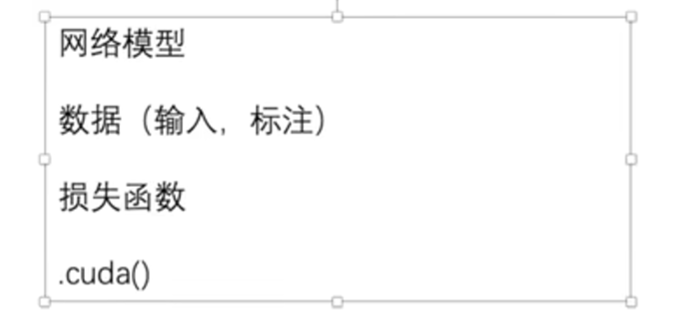

2，注意点：总是使用`if torch.cuda.is_available():`，这样可以兼容不支持cuda的电脑（比如没有独立显卡的电脑）

3，谷歌的colab可以免费每周使用30小时的gpu来运行代码！白嫖谷歌的算力。

4，colab上想执行terminal命令，那么可以在语言前面加上感叹号：

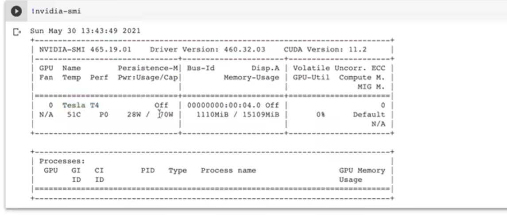

5，我：这种方式应该就是在本机上执行代码

### 代码

```python
# -*- coding: utf-8 -*-

import torch
import torchvision
from torch.utils.tensorboard import SummaryWriter

# from model import *
# 准备数据集
from torch import nn
from torch.utils.data import DataLoader

train_data = torchvision.datasets.CIFAR10(root="../data", train=True, transform=torchvision.transforms.ToTensor(),
                                          download=True)
test_data = torchvision.datasets.CIFAR10(root="../data", train=False, transform=torchvision.transforms.ToTensor(),
                                         download=True)

# length 长度
train_data_size = len(train_data)
test_data_size = len(test_data)
# 如果train_data_size=10, 训练数据集的长度为：10
print("训练数据集的长度为：{}".format(train_data_size))
print("测试数据集的长度为：{}".format(test_data_size))


# 利用 DataLoader 来加载数据集
train_dataloader = DataLoader(train_data, batch_size=64)
test_dataloader = DataLoader(test_data, batch_size=64)

'''
为了在后面演示比较方便，这里直接把模型拷贝过来，而不是通过import的方式
'''
# 创建网络模型
class Tudui(nn.Module):
    def __init__(self):
        super(Tudui, self).__init__()
        self.model = nn.Sequential(
            nn.Conv2d(3, 32, 5, 1, 2),
            nn.MaxPool2d(2),
            nn.Conv2d(32, 32, 5, 1, 2),
            nn.MaxPool2d(2),
            nn.Conv2d(32, 64, 5, 1, 2),
            nn.MaxPool2d(2),
            nn.Flatten(),
            nn.Linear(64*4*4, 64),
            nn.Linear(64, 10)
        )

    def forward(self, x):
        x = self.model(x)
        return x
tudui = Tudui()
if torch.cuda.is_available():
    '''
    1. 网络模型调用cuda！！！
    能调用cuda的变量，在pycharm中，会自动提示出cuda方法；如果pycharm不提示cuda方法，那么说明本变量不能调用cuda
    '''
    tudui = tudui.cuda()

# 损失函数
loss_fn = nn.CrossEntropyLoss()
if torch.cuda.is_available():
    '''
    3. 损失函数调用cuda！！！ 
    注意：调用cuda后一定要返回。
    '''
    loss_fn = loss_fn.cuda()
# 优化器
# learning_rate = 0.01
# 1e-2=1 x (10)^(-2) = 1 /100 = 0.01
learning_rate = 1e-2
optimizer = torch.optim.SGD(tudui.parameters(), lr=learning_rate)

# 设置训练网络的一些参数
# 记录训练的次数
total_train_step = 0
# 记录测试的次数
total_test_step = 0
# 训练的轮数
epoch = 10

# 添加tensorboard
'''
网友：将writer的操作全部注释掉可以提高很多速度
'''
writer = SummaryWriter("../logs_train")

for i in range(epoch):
    print("-------第 {} 轮训练开始-------".format(i+1))

    # 训练步骤开始
    tudui.train()
    for data in train_dataloader:
        '''
        2. 训练or测试用的数据调用cuda！！！
        训练过程中会有数据
        '''
        imgs, targets = data
        if torch.cuda.is_available():
            imgs = imgs.cuda()
            targets = targets.cuda()
        outputs = tudui(imgs)
        loss = loss_fn(outputs, targets)

        # 优化器优化模型
        optimizer.zero_grad()
        loss.backward()
        optimizer.step()

        total_train_step = total_train_step + 1
        if total_train_step % 100 == 0:
            print("训练次数：{}, Loss: {}".format(total_train_step, loss.item()))
            writer.add_scalar("train_loss", loss.item(), total_train_step)

    # 测试步骤开始
    tudui.eval()
    total_test_loss = 0
    total_accuracy = 0
    with torch.no_grad():
        for data in test_dataloader:
            imgs, targets = data
            if torch.cuda.is_available():
                '''
                2. 训练or测试用的数据调用cuda！！！
                '''
                imgs = imgs.cuda()
                targets = targets.cuda()
            outputs = tudui(imgs)
            loss = loss_fn(outputs, targets)
            total_test_loss = total_test_loss + loss.item()
            accuracy = (outputs.argmax(1) == targets).sum()
            total_accuracy = total_accuracy + accuracy

    print("整体测试集上的Loss: {}".format(total_test_loss))
    print("整体测试集上的正确率: {}".format(total_accuracy/test_data_size))
    writer.add_scalar("test_loss", total_test_loss, total_test_step)
    writer.add_scalar("test_accuracy", total_accuracy/test_data_size, total_test_step)
    total_test_step = total_test_step + 1

    torch.save(tudui, "tudui_{}.pth".format(i))
    print("模型已保存")

writer.close()
```

- 网友：用土堆的模型可以到65%左右 然后我在网上拔了下别人的模型正确率可以到80%

## P31-利用GPU训练-（to(device)方式）

### 前言

1，使用这种方式可以指定使用本机的不同设备来运行代码：

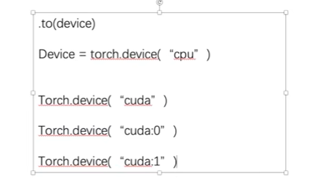

- 网友：一般来说 实验室 的机器会配备多个显卡，这样大家可以各用各的。

- 网友：反而麻烦
  - 网友：傻孩子 以后修改cpu gpu就在device修改就行了
  - 网友：这个可以代码复用，比刚刚那个要好很多
  - 网友：有的，方便更改，如果用原来的方法一改一大片
    - 我：可能之前用gpu1，现在想用cpu或者gpu2就只需要改一行代码。

2，高赞网友：刚常用的是：`device=torch.device("cuda:0" if torch.cuda.is_available() else "cpu")`

3，对于单显卡来说，下面两种写法是没区别的：

```
device=torch.device("cuda")
device=torch.device("cuda:0")
```

4，很多人喜欢这么写：

```
device=torch.device("cuda:0" if torch.cuda.is_available() else "cpu")
```

- 这就是一个语法糖，即一种简写！
- 我：之前网友也提到过这种写法

### 代码

```python
# -*- coding: utf-8 -*-

import torch
import torchvision
from torch.utils.tensorboard import SummaryWriter

# from model import *
# 准备数据集
from torch import nn
from torch.utils.data import DataLoader

# 定义训练的设备
device = torch.device("cuda")

train_data = torchvision.datasets.CIFAR10(root="../data", train=True, transform=torchvision.transforms.ToTensor(),
                                          download=True)
test_data = torchvision.datasets.CIFAR10(root="../data", train=False, transform=torchvision.transforms.ToTensor(),
                                         download=True)

# length 长度
train_data_size = len(train_data)
test_data_size = len(test_data)
# 如果train_data_size=10, 训练数据集的长度为：10
print("训练数据集的长度为：{}".format(train_data_size))
print("测试数据集的长度为：{}".format(test_data_size))


# 利用 DataLoader 来加载数据集
train_dataloader = DataLoader(train_data, batch_size=64)
test_dataloader = DataLoader(test_data, batch_size=64)

# 创建网络模型
class Tudui(nn.Module):
    def __init__(self):
        super(Tudui, self).__init__()
        self.model = nn.Sequential(
            nn.Conv2d(3, 32, 5, 1, 2),
            nn.MaxPool2d(2),
            nn.Conv2d(32, 32, 5, 1, 2),
            nn.MaxPool2d(2),
            nn.Conv2d(32, 64, 5, 1, 2),
            nn.MaxPool2d(2),
            nn.Flatten(),
            nn.Linear(64*4*4, 64),
            nn.Linear(64, 10)
        )

    def forward(self, x):
        x = self.model(x)
        return x
tudui = Tudui()
'''
使用to()，让名为device的cuda设备来执行计算操作

！！！细节：这种to的方式可以不赋值，直接使用tudui.to(device)即可，但是数据还是要赋值；不过为了方便记忆，我们就每次都也赋值就完事了！
'''
tudui = tudui.to(device)

# 损失函数
loss_fn = nn.CrossEntropyLoss()
'''
使用to()，让名为device的cuda设备来执行计算操作
'''
loss_fn = loss_fn.to(device)
# 优化器
# learning_rate = 0.01
# 1e-2=1 x (10)^(-2) = 1 /100 = 0.01
learning_rate = 1e-2
optimizer = torch.optim.SGD(tudui.parameters(), lr=learning_rate)

# 设置训练网络的一些参数
# 记录训练的次数
total_train_step = 0
# 记录测试的次数
total_test_step = 0
# 训练的轮数
epoch = 10

# 添加tensorboard
writer = SummaryWriter("../logs_train")

for i in range(epoch):
    print("-------第 {} 轮训练开始-------".format(i+1))

    # 训练步骤开始
    tudui.train()
    for data in train_dataloader:
        imgs, targets = data
        '''
        使用to()，让名为device的cuda设备来执行计算操作
        '''
        imgs = imgs.to(device)
        targets = targets.to(device)
        outputs = tudui(imgs)
        loss = loss_fn(outputs, targets)

        # 优化器优化模型
        optimizer.zero_grad()
        loss.backward()
        optimizer.step()

        total_train_step = total_train_step + 1
        if total_train_step % 100 == 0:
            print("训练次数：{}, Loss: {}".format(total_train_step, loss.item()))
            writer.add_scalar("train_loss", loss.item(), total_train_step)

    # 测试步骤开始
    tudui.eval()
    total_test_loss = 0
    total_accuracy = 0
    with torch.no_grad():
        for data in test_dataloader:
            imgs, targets = data
            imgs = imgs.to(device)
            targets = targets.to(device)
            outputs = tudui(imgs)
            loss = loss_fn(outputs, targets)
            total_test_loss = total_test_loss + loss.item()
            accuracy = (outputs.argmax(1) == targets).sum()
            total_accuracy = total_accuracy + accuracy

    print("整体测试集上的Loss: {}".format(total_test_loss))
    print("整体测试集上的正确率: {}".format(total_accuracy/test_data_size))
    writer.add_scalar("test_loss", total_test_loss, total_test_step)
    writer.add_scalar("test_accuracy", total_accuracy/test_data_size, total_test_step)
    total_test_step = total_test_step + 1

    torch.save(tudui, "tudui_{}.pth".format(i))
    print("模型已保存")

writer.close()
```

- 网友吐槽：100次循环，准确率训练到63.9%左右就提升不上去了！

## P32-完整地模型验证套路

### 前言

1，学到这了：

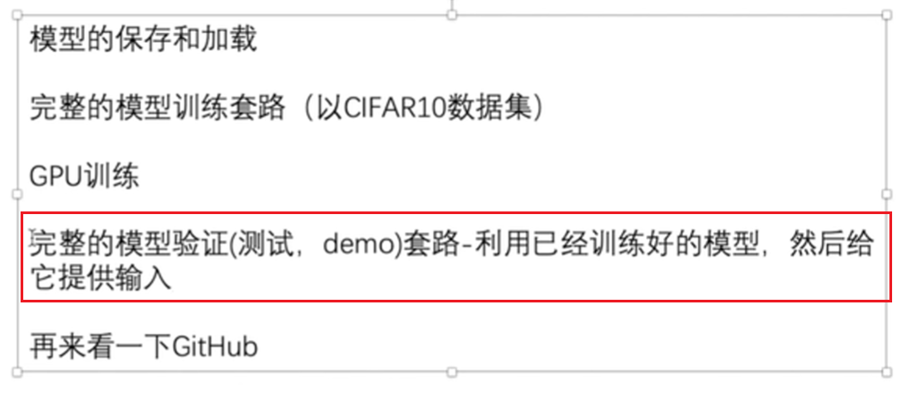

- 就是利用已经训练好的模型，测试模型的效果！

2，处理png格式的图片时，注意png的通道数是4，所以要做如下处理：

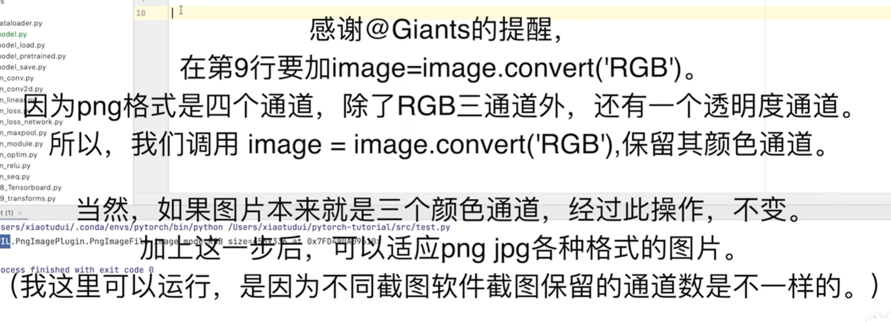

### 实战

1，代码：

```python
# -*- coding: utf-8 -*-
# 从test.py文件找到imgs/dog/jpg文件，这考察的是相对路径的概念，大家一定要熟悉
import torch
import torchvision
from PIL import Image
from torch import nn

# image_path = "./imgs/dog.jpg"
image_path = "./imgs/airplane.jpg"
# 这里使用了pil来读取图片
image = Image.open(image_path)
print(image)
'''
resize的话，输入是pil或tensor格式，输出格式与输入保持一致；所以输入了pil格式，想得到输出为tensor的话，可以使用totensor

因为输入的测试用的图片的尺寸不是32*32，但是训练得到的模型只接收32*32尺寸的图片，所以要把输入图片转化为32*32的样式

image.convert('RGB') 是因为png的通道数是4，所以转化为RGB只保留图片的颜色通道，这样才和模型期待的输入图片的通道数相符；如果图片本来就是jpg格式，那么本操作不改变图片。
'''
image = image.convert('RGB')
transform = torchvision.transforms.Compose([torchvision.transforms.Resize((32, 32)),
                                            torchvision.transforms.ToTensor()])

image = transform(image)
print(image.shape)

'''
网友：实测，不用在复制粘贴神经网络，也可以用！！！！！！
- 网友反驳：粘贴的是参数，你需要把参数放入到网络模型中去，没有模型你只放参数是不可能运行的
- 网友：这加载的是训练过的参数吧
- 高赞网友：将神经网络的代码赋值过来是为了告诉解释器这个神经网络的组成部分，与加载参数无关
- 网友：使用方法一加载自己创建的网络结构时，光写这句会报错，需要把自己创建的网络也copy过来,或者把save文件中的都导入
'''
class Zhangyun(nn.Module):
    def __init__(self):
        super(Zhangyun, self).__init__()
        self.model = nn.Sequential(
            nn.Conv2d(3, 32, 5, 1, 2),
            nn.MaxPool2d(2),
            nn.Conv2d(32, 32, 5, 1, 2),
            nn.MaxPool2d(2),
            nn.Conv2d(32, 64, 5, 1, 2),
            nn.MaxPool2d(2),
            nn.Flatten(),
            nn.Linear(64*4*4, 64),
            nn.Linear(64, 10)
        )

    def forward(self, x):
        x = self.model(x)
        return x

# 如果使用GPU训练的模型，要在cpu上使用的话，需要maplocation来映射一下
model = torch.load("zhangyun_9.pth", map_location=torch.device('cpu'))
print(model)

'''
土堆：因为图片没有指定batchsize，所以这里要reshape来增加一个维度
网友：mat1和mat2相乘报错的同学可以检查下是不是reshape时没赋值
'''
image = torch.reshape(image, (1, 3, 32, 32))
'''
下面两行不要忘了，养成良好的代码习惯！
'''
model.eval()
with torch.no_grad():
    output = model(image)
print(output)

'''
针对dog的图片，预测结果是7，比5大一点，错误，但是5是dog为正确预测，这是因为模型的训练轮数很小；但其实也能看出模型也认为本图很像狗
- 网友：主要是这个模型神经层数太少了吧
- 网友：我训练了50次，准确率只在60不动了
    - 网友：因为梯度消失啊，后面你会发现梯度迟迟难以变化
    - 网友：我把每步的数据集都改成随机选取顺便把dropout开了，每步曲线稳定了不少
    - 网友：加上relu函数，20次准确率69
- 土堆：可以使用gpu版本训练的更长时间的模型，这样预测的准确度会更高
- 网友：识别正确率低的原因：我估计是池化和卷积的时候，损失了很多信息，其次本身训练集只有32*32，太模糊了，数据量小
    - 网友：主要原因没加relu层，其实整个模型就是个线性的

针对 airplane的图片，预测结果是0，正确！
- 我：应该是因为飞机的特征比较明显，不像狗和马可能还有相似点，飞机和其他物体都长得不太像。

注意：使用argmax可以把输出转化为利于解读的样式
'''
print(output.argmax(1))
```


## P33-看看开源项目

1，github搜pytorch，找star多的：

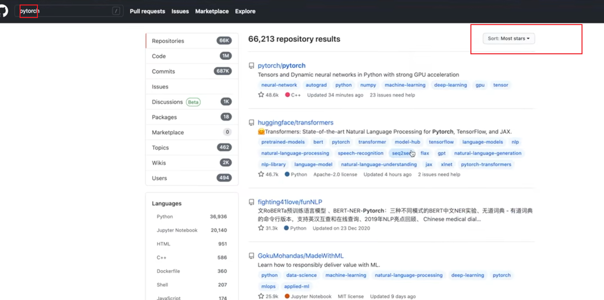

2，找到cyclegan

- 看一个项目的时候先读readme：怎么安装，怎么使用

3，先看train.py的main函数中，关于参数设置的代码：

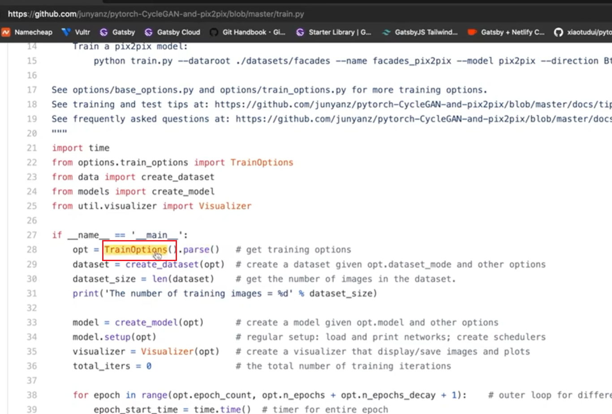

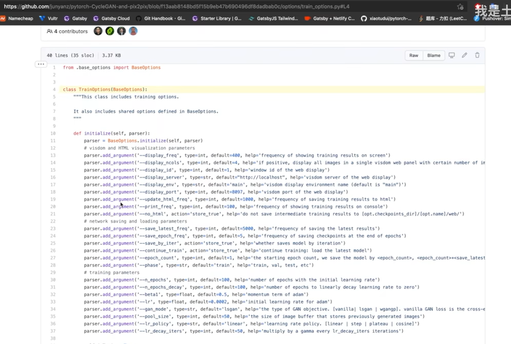

4，看到readme，执行python文件的时候可以用sh语句：

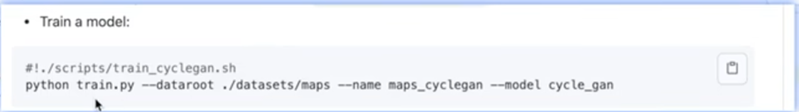

- sh语句中，`--`引导的是参数名，参数名后接的是参数的值。
- 参数设置的代码，就是为了设置不同参数：defaultvalue，是否必填，help信息 等等
  - 我：如果有defaultvalue 并且使 非必填的，那么使用sh执行python的时候，就可以不显式设置这个参数从而使用defaultvalue。
