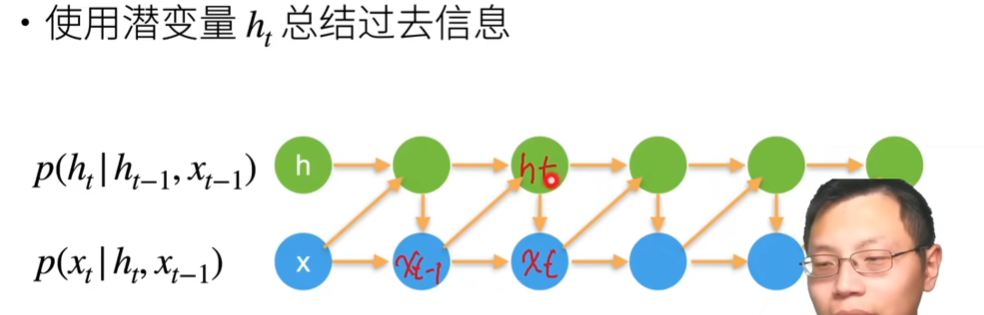
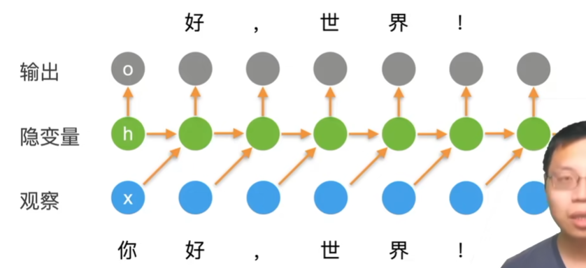
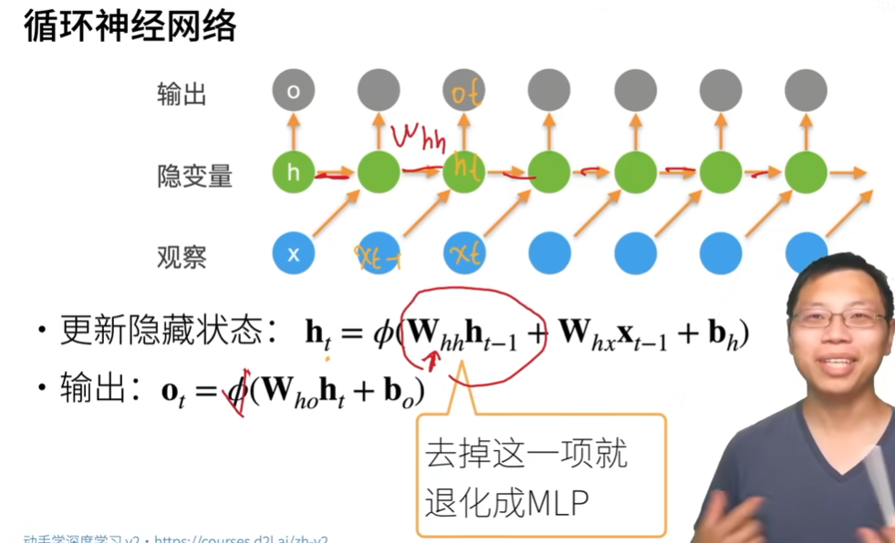
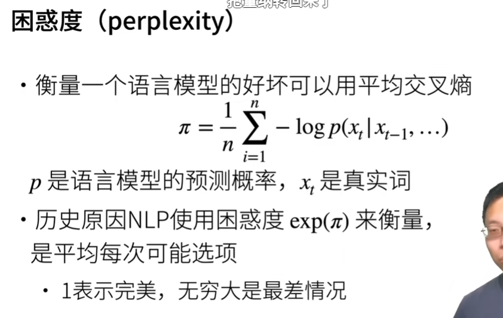
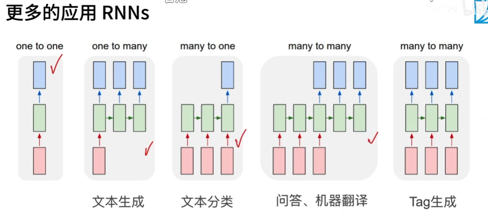
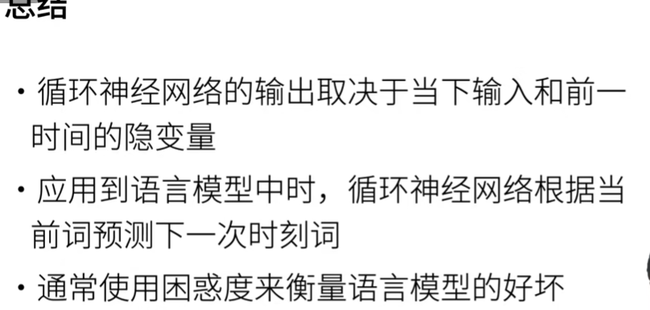

# 微调

## QA

1，微调的学习率选取没有什么技巧，用比较小的就行，微调对学习率不敏感。

2，迁移学习里，固定模型的层不动；至于到底哪些层固定，这个不确定，可以自己调；因为固定层相当于正则化，让模型复杂度变小。

- 但是这块我可以不涉及。实验对比时，固定相同的层就行，反正我研究的是别的部件。

# 文本预处理

## 代码

1，这里预处理，做的vocab，字符和index的互相转化，还是蛮经典的可以参考；类似LSTM项目里做的。

2，网友：如果在类中定义了__getitem__()方法，那么他的实例对象（假设为P）就可以这样P[key]取值。当实例对象做P[key]运算时，就会调用类中的__getitem__()方法

# RNN

## 知识

1，使用潜变量总结过去的信息，当前信息由“过去信息和上一时刻信息”共同决定：

2，由潜变量转化为RNN：

- 网友：n元语法模型是自回归模型，而RNN是隐变量自回归模型，序列模型那节都讲了
- 我：感觉RNN输出的就是隐变量
- 网友：他画成这样错位的原因是，序列模型自回归的输出会比输入慢一个时序
- 老师：输入是“你”，更新隐变量ht，要预测出“好”；接下来模型观察到“好”，再去更新隐变量，预测输出下一个“，”
- 老师：输出Ot理想是要match到输入Xt，但是输出Ot的时候不能看到Xt；就是当前时刻的输出是要预测当前时刻的观察，但是输出发生在观察之前。
  - 网友：当前时刻输出预测当前时刻观察，输出发生在当前观察之前

- 老师：计算损失时，比较Ot和Xt
- 老师：Whx就是mlp里隐藏层的weight（就是w）；Xt-1是输入。之前ht=φ（WX），都没有下标，现在都加上下标了。输出还是隐藏状态ht乘以Who，加上bias得到输出

- 我和网友：训练的时候是一个真实序列当做输入训练，训练完了预测的时候每个时间点都是用上个时间点RNN自己输出的当做输入来预测。

3，困惑度：

- 老师：语言模型可以看做是一个分类模型，假设字典大小是m，那么每次预测下一个词是什么就是一个m类分类问题；
  - 分类问题可以用交叉熵来完成
  - 做n次预测（即做n次分类），那么衡量语言模型好坏就是做一个n的平均得到π

- 老师：历史原因，nlp用的是困惑度做loss，但是困惑度其实就是交叉熵加上exp
- 老师：困惑度的好处：
  - 交叉熵改进0.01，不好看，但是用困惑度来表示就是改进了2，看数字好看一点
  - 给一个序列，做预测时，如果困惑度是1表示很确信下一个词是什么；困惑度无穷大表示完全不知道下一个词是什么。

4，梯度剪裁：

- 老师：梯度剪裁可能导致梯度消失或者梯度爆炸；梯度消失只是训练的慢，梯度爆炸更需要预防；这里梯度剪裁就是预防梯度爆炸。

5，更多应用的RNN：

- 第一个：就是mlp，没有时序信息
- 网友：NER就是第五个。

6，总结：

## QA

1，视频和语音，现在可以用transformer统一，做多模态。