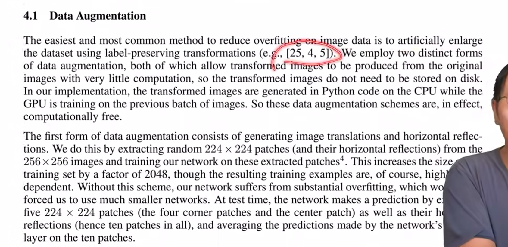
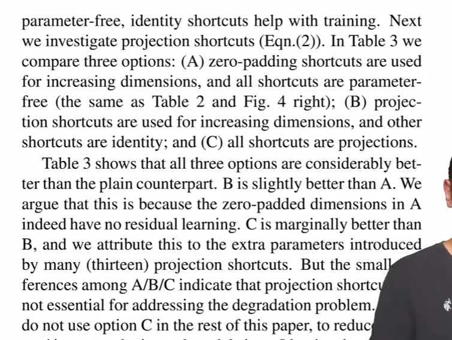
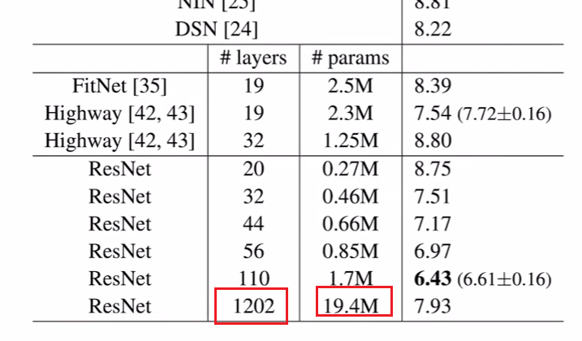

# 如何读论文（三步）

## 论文结构

## 如何读论文

1，如果论文都是从头读到尾的话，时间上可能来不及，而且适合自己的文章可能只有一小部分；最好找到适合自己的文章，然后精度

2，推荐花最多三遍读一篇文章：

- 第一遍：关注标题，摘要，读完摘要直接跳到结论；
  1. 标题是什么，与我是否相关；
  2. 然后看下摘要，摘要就是比较简单的介绍一下论文；
  3. 结论通常和摘要是一样的，但是可能把摘要中提出的一两个问题用实际的结论 实际的数字来给读者证明一下；
  4. 读完这三个部分一般就知道论文在讲什么
  5. 读完以上三个部分后，可以去瞄一眼method exp的图和表，看看它们是在干什么。
  6. 读到这里，大概就知道论文的 方法 质量 怎么样，是否适合自己，到这就知道自己要不要继续（精）读下去了！

- 第二遍：如果第一遍感觉文章质量不错，就走第二遍，对整个文章过一遍，知道每一块在干什么；
  1. 这次可以沿着标题一直往下读到最后；
  2. 这时不需要太注意细节（公式 证明 很细节的部分等），但是得知道很重要的图和表都在干什么事情；比如method里流程图是什么样子 算法的图长什么样子；exp中每张图的x轴 y轴在干什么 每个点是什么意思；作者提出的方法和别人的方法是怎么对比的，之间差距有多大；
  3. 这时候其实可能没太懂搞懂本论文在干什么，但是没关系，可以做个标记留到之后；在这一遍对整个论文都有一个大概的了解；
  4. 可以把一些相关的文献圈出来，比如 xxx提出了什么问题，在xxx的方法上改进的；
  5. 可以读到这到此为止了，这遍结束后就知道自己要不要往下精读；可能就到此为止了，因为知道 要解决什么问题 结果怎么样 大概用了什么方法；如果觉得不需要了解那么深，那么本文读到这就行了，不需要完全搞懂论文；
  6. 如果觉得本文太难了，读不懂，可以去读他们之前引用的那些文章，可能门槛更低一点；读完他们再回来读这篇文章

- 第三遍：如果还是想完全搞懂论文，那么就要走第三遍，第三遍是最后一遍也是最详细的一遍：
  1. 需要知道每句话 每段在做什么；我们可以在读这篇文章的时候，在脑子里不断重复实现这篇文章
  2. 文章中说用XXX方法来解决这个问题，读者就可以想，如果是我来做这个的话应该怎么办；如果做实验的话，实验是XXX做的，我们可以说如果换我来会怎么做，能不能做的更好；
  3. 作者说有些地方没有往下走的，留到以后做；读者可以想 如果我来做的话，是不是可以往前走呢。
  4. 这遍最关键的是知道每句话在干什么，并且大脑里面可以脑补出他整个过程，就好像是自己做过一遍的样子。
  5. 看完这一遍后，就对整个论文的细节都比较了解了；关上文章可以想到很多细节，那么之后基于本文做研究 或者 提到本文的时候，都可以说出很多细节。

## 总结

1，以上就是读论文的三个阶段：

1. 第一遍花时间最少 做海选；
2. 第二遍对相关论文做一步精选；
3. 最后一遍就是重点研读的论文

2，接下来会通过实例来读一篇论文，假设自己回到十年前第一次看到这篇文章。

# 重读深度学习奠基作之一-AlexNet

## 前言

1，可以随时停下来不往下读，如果读完三遍说明这篇文章对自己很重要。

2，读的时候假设自己在九年前。

3，再把自己放在今天，看看哪些过时了，哪些精髓还是经典；再好的文章也是有时代局限性的。

## 第一遍

### 读标题

1，imagenet是一个非常大的经典数据集

2，deep convolutional neural network：九年前是比较冷门的词语，可能当时看到这个就不会继续读了，但是可能导师让读就继续读

### 看作者

1，一般会关注著名实验室和研究者，尤其是在九年前深度学习刚起步，圈子小；有些组很喜欢就往下看，有些组不喜欢就可以跳过：

### abs（摘要）

- 第一句话：干了什么事情

- 第二句话：实现了什么结果

  - top1 top5 error rate可以[参考](https://blog.csdn.net/qq_43365658/article/details/115533444)

  - “第一句话我做了啥，第二句话我结果很好”，是很少见的写法

- 第三句话：介绍了模型，尤其是模型的结构

- 第四句话：介绍自己使用的比较新的提高计算效率的方法。

- 第五句话：介绍了避免过拟合的方法

- 第六句话：再次介绍本模型的成效，这回是在ILSVRC2012上
  - 段首说的是ILSVRC2010，现在说2012，可能觉得有点重复和奇怪，这个后面再说
- 这句话可以看到，本文模型作为第一名的效率是远超第二名的。
  - 虽然不知道imagenet的绝对错误率是多少，但是一看比第二名好这么多，那么还是有阅读兴趣的

- 摘要说的就是：我们训练了一个很大的神经网络，比第二错误率好很多。
  - 这个不算很好的摘要，从论文角度讲；这有点像技术报告，但是最后一句确实看出效果很好。

### conclu（本处为讨论）

1，跳到最后看 结论，但是本文没有结论，只有一个讨论。

- 讨论：一般是吐吐槽，然后看未来要干什么
- 结论：结论很多时候是和摘要的一一对应。所以没有结论还是很少见的。

2，我们看看讨论在说什么：

- 文章：没有使用无监督的预训练
  - 网友：就相当于是没有用自编码神经网络来预训练吧

- AlexNet之前是倾向于使用无监督的学习，AlexNet后倾向于有监督的学习，最近几年bert（当然还有GAN）又把大家的注意力拉到无监督的学习。
  - 无监督学习：给我数据，但是不要告诉我标号，我真的可以从中间理解
  - AlexNet之前深度学习做无监督的学习，是因为有监督的学习效果和SVM差不多；AlexNet后，有监督无监督都可以用深度学习来完成。

- 文章：如果我们有足够的资源，把网络变得很大，那么没有标号的数据也没有关系。

- 文章：后续我们想在video上做做
  - 老师：人在图片和nlp上走了很远，但是video的计算成本比图片高太多
  - 网友：Video的存储和读取速度之间的tradeoff也是个大问题，反正一脑壳包
  - 网友：yolo也是对视频的某一帧图片而不是对整个视频

### 看图

第一遍里面，还会去看一些重要的图和公式！

1，先看结果图片：

- 左边可以看到，在一些比较难分类的图片上，效果还是比较好的；虽然grill，cherry，等没有做到top1correct，但是不少还是做到了top5correct。

- 右边可以看到，指定图片后，在最后一层的参数和指定图片差不多的情况下，那些参数对应的图片和给定图片都是一个物体。也就是说，本模型会把相似的图片识别为一类，效果好。

- 网友：一般embedding都是用生成模型学的比较好

2，在往前看图标，这个表表示的是本文的结果和别人的结果的对比，本模型（CNN）是远远更好：

- 网友：Top-1 = （正确标记 与 模型输出的最佳标记不同的样本数）/ 总样本数

3，再往前看图：

- 计算机视觉常常会看到这个图，刚涉及这个领域的话可能不知道这个图是干什么。

- 我：这个图应该就是卷积层提取的特征，有边缘特征，有颜色特征，等等。

4，在往上看图，九年前看这个图是很新的，可能看不懂，留到后面再看：

- 网友：上半部分一样，因为显卡不够，所以切成两部分放在不同的显卡里训练

### 第一遍的读后感

1，读完后感觉，这片文章的模型很好，是用神经网络做的；但是具体为什么好，具体怎么做的，因为背景知识不够，所以第一遍你可以放弃

2，然后决定说要不要往下读，九年前读它的话，我们可能不会往下读，因为可能我们的研究与这块没关系，即使本文的效果很好；但如果是cv的研究者，可能还是会往下读，因为这块文章的模型的工作做的很好并赢了比赛。

## 第二遍

### 前言

1，第二遍会通读本文，但是如果碰到不懂的地方，会留下来给第三遍；第二遍主要是知道很多细节在干什么，了解作者是怎么想的，作者是怎么表述东西的，作者的观点和角度是什么。

2，这篇文章很古老也是开山大作，所以文章提的很多细节从现在的角度看是多余的，属于过度engineering；因为本文在后续经过无数学者看每个参数，被研究的比较透彻；当然在否定旧细节的同时，如今也给AlexNet引入了新的细节。

3，之前已经读过 abs和conclu，所以第二遍从intro往下读。

### 1Intro

- 一篇文章的第一段一般是在讲一个故事，就是：我们在做什么研究，哪个方向，这个方向有什么东西为什么重要

- 第一段文章：说要更大数据集 更好模型 避免过拟合，这是深度学习常见的思路，因为更强大的模型往往会过拟合。
  - 过拟合是神经网络的一个派别，之前人们倾向于说要 大模型+正则 来实现好效果且避免过拟合；但是如今大家可能觉得正则的重要性 不如 设计神经网络的结构。
  - 网友：理论比较难，没有数学 可解释性，炼丹

- 第二段文章：使用了CNN，CNN的效果很好
  - 老师：CNN做大不容易，而且容易训练不动，所以这块当时有争议

- 老师：这块的写法是有问题的，因为当时主流不用cnn，主流模型是用别的，所以半句话不提别的算法然后直接只提CNN是一个很窄的视角。所以自己写论文的时候，不要只说我这个领域的这个小方向大概怎么样，还要提到别的方向怎么样，做到稍微公平一点的介绍。

- 第三段文章：CNN很好但是计算很难，但是本文用了GPu了算力增加了；而且图片的数据集够大，我们确实能训练比较大的CNN。
- 老师：所以前三段主要讲：我做了什么东西，现在为什么能做了。

- 第四段：讲我的paper的贡献。主要就是我训练了一个很大的模型，效果很好。

- 本文说我做了，而且创新很好，并且在第三章第四章讲了；只要有创新点，就相当于挖了坑，别人可以顺着做！如果是组合很多技术，可能就没什么意思了，太复杂没办法跟着做。

  - 只是结果很好，但是没有新东西，是不会成为奠基作的。

  - 网友：对的，太复杂就失去了拓展性

- 最后一段：因为GPU很弱，切开了网络，并应用在两个GPU上
  - 老师：切网络这块工作量可能占了80%，但是现在看这技术其实没什么用。

### 2dataset

本文第二章讲的是数据集。因为卖点是imagenet的结果，所以要讲一下数据集。

- 第一段第二段：解释了为什么摘要里报告了两个errorrate，因为2010比赛有测试集公布，但是2012年比赛没有测试集公布。

- 第三段很重要：别的数据集的分辨率可能是一样的，即裁剪好的，但是imagenet是没有裁剪的，所以本文就对每个图片做了裁剪；除了裁剪外没做的别的图片预处理。
  - 网友：reshape显然不行
  - 网友：reshape，保持高宽比，缺的地方加灰条，不保持高宽比，直接256*256填满

- 本文可能有历史局限性，就报告了我是怎么做的，但是没说哪些重要 哪些不重要，没有把亮点写出来；但是寻找亮点是很重要的工作，之后有无数的人去做这个事。

- 老师：我现在不知道sift是怎么抽取特征的，但是我知道alexnet是怎么抽的 图片是怎么一步步被处理的，所以不需要太多专业知识。简单有效的东西是能持久的。
  - 网友：这么想想真的惨 之前学了几十年的东西几个月就被干掉了 属实降维打击

### 3Archi

讲模型的架构是本文的主要贡献之一，另外的贡献是第四章讲怎么避免过拟合。

- 没有相关基础的话，看之前的figure2结构是很难看懂的。
- 先往下看看文字是怎么讲的。

- 老师：饱和和非饱和这里可能看不懂，标记下 打个问号先，第二遍看不懂没事。
  - 网友：饱和应该指的是x趋于正负无穷时激活函数的导数为0

- 看图：作者用了relu后，训练的很快，效果比tanh好很多；但是为什么好，给了refrence为[20]的论文。
  - 网友：哈哈是的，这两个线看起来居然像是作者手画的。
  - 这个论文可以放到第三遍的时候去读。

- 作者试过不同的激活函数，效果也都不错

- 大家现在用relu的原因往往很简单：就是这个函数很简单，都不需要记tanh和sigmoid是什么！虽然用别的激活函数也可以的。

- 第二遍可以不看它，因为读不懂，这是很工程细节；如果是机器学习的论文，读的时候可以忽略掉，除非之后要复现才可以再来看；毕竟这不是方法上的东西。
- 当然可以读一下，就是这个方法怎么做到切切切；后面会讲怎么且的，但是第二遍是可以忽略不记的。

- 看符号好像很复杂，但是第二遍可以忽略
  - 现在回头看这个东西，其实它不是很必要，后续没有多少人用到过它；而且现在我们有更好的normalization技术，所以第三遍没有读它也没关系。

- 当年读到这，可能都不知道pool是什么
- 这里说的就是对传统的pooliing做了一个改动，改动不大，但是效果很好。

- 这里讲了整体系统架构，比如几个卷积层，几个全连接层。。。

- 这里最后一句，讲了输入的图片是原始图片；本方法和别的预先抽feature的方法还是不一样的；这个地方还是没有highlight自己的特点，就是没说我们和别人不一样不需要预处理图片，所以本文就是一个技术报告；技术报告就讲了我做了什么，也不讲和别人的区别，也不讲我们的东西为什么是这样的，为什么重要；但是只要工作重要，技术报告也能称为奠基作。

- 本图是做神经网络的时候，经常把图截屏给大家看的网络架构，但是这个图是overengineer，过度扣细节了，很多东西可能不好看懂。

- 框框是每一层数据的大小，进来的时候是一张图片`223*224*3`的大小（RGB的通道数是3）。

- 网友：上面的只画半个应该是表示和下面的没什么区别吧
- 网友：卷积就是特征提取器

- 这里为了使用两块GPU，把网络切开了，上半部有一块GPU0，下半部有一块GPU1。除了第二个层后，其他的卷积层都是各搞各的，只有第二个层是拿到了双方的数据。
- 可以看到数据的高宽不断变小，深度不断变大；这体现了：随着网络的增加，空间信息会被慢慢压缩；压到最后是`13*13`，即我们认为这`13*13`的像素每个可以代表前面一大块的像素；然后我们再把通道数慢慢增加，每个通道可以当做是去看一种特定的一些模式，数据的深度为192可以理解为本模型可以识别图片中的192种不同的模式，即每个通道去识别一个猫腿 或者 边之类的；所以是在慢慢地压缩空间信息，但是深度代表的语音信息在增加。
- 到最后卷积完后，进入全连接层；全连接层的输入时每个GPU第五个卷积的输出合并起来，合并成一个大的；全连接虽然还是各搞各的，但是在最后进入softmax前会表示成一个4096的向量。
  - 我们第一遍就说过，如果长为4096的向量其实很能抓住语义信息，如果两个图片的4096向量很相近的话，这两个图片可能是同一个物体的图片。
  - 所以深度学习，就是：一张图片来（人能看懂的像素），通过模型，最后把它压缩成长为4096的向量，变成了一个机器能读懂的东西；所以整个机器学习的过程可以看做知识的压缩的过程，这是神经网络的精髓！

- 网友问：连续两个全连接的意义是什么？
- alax小哥，切cpu认为自己是创新，但是其实没有通用性；比如如果三个四个cpu呢？比如只有一个cpu其实也能训练（caffe）？
  - 相当长时间里，大家要做多gpu训练，也不会这么切模型。
  - bert出来后，发现模型训练不动，又开始考虑切模型；cv用的不多，nlp用的多。

- 可以认为整个第三章的主要的贡献就是这个图。

### 4 reduce overfit

- 过拟合比如：给你一些题，你把题背下来，但是考试根本考不好。

 

- 第一段：现有常用的过拟合方法是 人工把图片变大来减少过拟合；作者接着说自己提出的两个不同的数据增强（即扩充数据集 数据集越多越难过拟合）的方法
- 第一段：作者说数据增强是用CPU做的，GPU来训练模型；这可能是因为当时作者的GPU性能不好，cpu性能好，但是发展到现在，GPU效率远高于CPU，所以仍然用CPU做数据增强的话，那么数据增强这块可能是个性能瓶颈；现在数据增强可能要搬到GPU上，或者用很好的C++来实现
  - 网友：典型的生产者-消费者模式；数据增强可以利用CPU的多核多线程进行
- 第二段：
  - 第一种方法：我从256X256里随机扣一块 224X224的大小，这样数据集的数目变成原来的2048（32*32）倍
    - 老师：但是其实不能说数据集就变成2048倍，因为2048里每个图片都长得差不多；我们以后不能这么算。
- 第一种方案相当于是空间上的扣

- 第二种方案就是把RGB的channel即颜色通道上做一些改变；这里用的是PCA的方法
  - 第二遍不知道PCA是什么的话，可以选择性的忽略掉；但是要知道它是在通道上做的一些变换，他的颜色会有不一样，所以每次图片和原始图片是有不一样性在里面的。

- 第一段：第二种避免过拟合的方式是使用dropout。模型融合在当时和如今打比赛都常见，但是计算成本很高；当时觉得dropout可以随机删除节点，就类似成了很多个模型的融合；但是现在发现dropout在线性模型上等价于L2正则，所以一般现在把dropout就看做正则化的方式。
  - 网友：Dropout就是每个epoch都随机remove一部分节点
- 第二段：dropout应用于全连接层，减少了过拟合，增大了训练耗时。

- 关于alexnet的全连接层：

  - alaexnet用了三个全连接，最后一层也是有的，因为要输出；中间用了两个很大的4096全连接，是他的一大瓶颈，这是当时设计的缺陷，导致整个模型很大，根本放不进GPU中，

  - 全连接太大的话，还需要用dropout来避免过拟合
  - 现在CNN的设计通常不会有这么大的全连接，所以dropout不是很必要；而且GPU的内存没那么吃紧了，所以导致模型设计里可以加很多新的东西。
  - 但反过来讲，dropout在全连接上还是很有用的，在RNN上或者attentiuon上，dropout用的很多。

### 5Detail of Learning

- 如今SGD（随机梯度下降）是深度学习最常用的算法，但是当时大家不这么认为，而是觉得SGD难调参；大家当时更喜欢更稳定的算法，比如L-BFGS或者甚至GD；但是后面大家发现SGD里的噪音对模型的泛化是有好处的，所以现在深度学习就用SGD；本文后SGD称为深度学习的宠儿。
  - 我问：SGD不是不如minibatch吗？
    - 我答：这里说的SGD就指定了batchsize，可能这里的SGD就是minibatch吧。[参考](https://www.jianshu.com/p/01b68b7311d7?utm_campaign=maleskine&utm_content=note&utm_medium=seo_notes&utm_source=recommendation)

- weight decay：其实就是L2正则项；但是说成weight decay其实就是把它当做算法的一部分。
- 2010年左右出现了很多的SGD优化算法，但是现在看一个简单的momentum可能就比较好了。

- 这里说可以把2 4 5层初始化成1；但是这比较奇怪，因为偏移本质上来说，如果数据比较平衡的话，应该要初始化为0的，但是这里作者发现初始化为1效果也不错；但是大家觉得全部初始化为0效果也不差，所以这个偏差初始化为1的技术后面用的比较少了。
  - 网友：蚌埠住了，这里是真的玄学了
  - 网友：感觉现在神经网络模型好多都是在盲人摸象……

- 每一层的学习率都是相同的；这里当errorrate停止优化的话，就手动让学习率变为原来的1/10，这是对应于计算成本比较大，研究人员时间比较充裕的情况；不过现在大家发现不用这么麻烦，现在流行在若干epoch后，让学习率随着epoch下降。
  - alexnet后，很多研究者都会手动下降十倍；但是现在我们觉得手动下降十倍，不够平滑，时机不好把握，可以用更平滑的方式 即让学习率随着epoch下降。

- 学习率一开始不能太大，因为容易爆炸；也不能太小，不然学的很慢。现在流行的做法是，让学习率从0开始，先慢慢上升，再慢慢（以cos方式）下降。
- 红色图是现在常用的学习率衰减的方式，蓝色折现是alexnet手动调整学习率衰减的方式。

- alexnet的计算开销很大
- 现在图片的计算开销相对小了，但是文本领域计算开销还是很大，在几百几千块卡的情况下还是得跑几天。
  - 老师：一般半天是比较能接收的，比如早上训练晚上能看到结果；或者下班前训练，第二天看到结果。

### 6result

- 实验很重要，但是没有太多东西，主要还是讲之前讲过的这个表格，说自己的算法比别人好很多。

- 实验这块现在看都是很多标准的东西了，就不重复细节了。我们读论文的时候，实验部分相对来说不是那么重要的，我们关心的是实验的效果。但是具体实验是怎么做的话，除非是这个领域的专家扫一眼可以看懂；如果是刚来这个领域的话不用太关心这些细节，除非要重复他的实验；只有要重复他的实验 审论文 我是这块专家的时候 才会去看下这块的实验。

- 这里说得imagenet用了8.9million的图片和1万个分类，但是人们提到imagenet总是觉得是120万张图片，但其实imagenet有更完整的数据集，而且上面的模型质量更好，所以这块老师也不是很能理解
  - 高赞网友：完整的数据，大部分人都没有能够训练的计算资源。
  - 网友：哎 评论区都没懂沐神的疑惑，沐神不是在凡尔赛，而是疑惑的是这个全数据集训练出来的模型效果更好，权重是可以直接拿来用的，个人感觉是可能是因为大家都没这么用

- 这里因为imagenet只在2010年公布了测试集，所以这里top5test的1cnn和1cnn*都是空着的

- 这里很好的处理就是，这里明显地区分开了val和test。

- 这里发现 第一个GPU的kernals中学到的，很多时和颜色无关；第二个GPU的kernels中是颜色有关的；但是这个发现其实后面没什么用，因为后面大家都用一个GPU，而且深度学习这里面很多都是随机的。

- 虽然现在还是不知道具体每个权重学了什么，但是一些神经元学到的东西还是有对应性的，比如底层的神经元学的是一些比较局部的信息，比如 纹理，方向；偏顶层的神经元学的就是全局一点的信息，比如 这是一个人的头，一个人的手 等等
- 其实神经网络现在大家还是不知道它在学什么；相对于其他机器学习模型，神经网络的可解释性比较差；
  - 网友：CNN基于纹理；
    - 网友：是在imagenet上直接训练的cnn偏向于纹理

## 第三遍

- 继续读？
  - 接下来可以选择继续读，如果不是很懂得话，可以看下他们引用的那些文章，然后再回过头看这些技术是怎么用的。
  - 当然哦我们也可以不继续读，我们知道这文章大概在讲什么东西了，除非我确实想在这块做研究，想了解每个细节的话，我们读到这个地方也就差不多了。
  - 所以就不讲第三遍了，因为文章里提的很多很麻烦或者不懂的点，从现在角度讲已经不需要知道了；而且像比如 卷积是怎么工作的？池化层是怎么工作的？也不需要去看原文，去网上随便找一下，就可以明白了；读alaxnet这种经典文章可能不需要第三遍，但是如果读最新的文章的话，我们是要读第三遍的，把细节讲清楚，不然搜的话还真不一定能得到结果。
    - 老师：对于研究者来说，读论文比博客学的更细节。

# 撑起计算机视觉半边天的-ResNet

## 前言

本文发表于2015年，如果现在还用深度卷积网络的话，有一般可能性在用ResNet或者它的变种

- 网友：另一半用transformer

还是和之前一样的读法，假设自己回到过去，第一次看到这篇文章。当然我们也会回到现在，看看论文里的哪些结论现在是不是已经过时了，亦或是还成立。

## 第一遍

### 标题

- 分为两个关键词 深度残差学习 和 图像识别

### 作者

- 都是大佬
- 微软亚研院是为数不多可以花大钱做纯研究的公司机构
- 邮箱v开头的就是实习生

### abs

- 第一句：提出了一个问题，深度神经网络很难训练

- 第二句：提出了一个方法框架，让学习深度神经网络，比以往更简单

- 第一段的剩余句们：可能看不太懂，但是能知道有关键词residual；经过很多实验，resnet的深度很大（152层）的情况下复杂度还更低，而且在imagenet2015年的竞赛上赢了；而且本文还利用1000层的网络 分析了cifar10。
  - 任何能赢得冠军或者亚军的文章都值得大家关注，特别是那些提出了不一样的架构or方法的文章。
  - 网友总结出名配方：打榜+取名字+发论文
- cifar10是很小的数据集，但是在cv领域是很常见的数据集，训练了100-1000层的网络是很夸张的。

- 第一句：对cv来说，深度很重要
- 剩余句：把cnn的主干网络换成残差网络，本文模型赢下了coco数据集的检测，并在一系列任务上都取得了好结果。
  - coco是物体检测领域最大且最有名的数据集。
  - 网友：就是替换了网络，就获得巨大成功
- 本段还是说本模型很好。
- 我：感觉abs就是说自己的效果有多好，和之前效果的对比。

### conclu

本来要看结论，但是本文没有结论；因为本位发表在cvpr上，cvpr要求论文的正文不能超过8页；这篇文章的结果是比较多的，因为要放上我的imagenet的实验，和coco目标检测的结果，所以导致作者没有空间去放下结论的部分。

- 这个还是比较奇怪的写法，结论还是要有的，没有结论会很奇怪。

没有结论，那就直接看正文的图或公式

### 图or公式

- 论文的第一张图出现在论文的右上角，这是cv的惯例，一般会在第一页放上一张比较好看的图；不管是我对问题的描述，亦或是我的主要结果，越好看越好
  - 所以看cv的文章的话，第一眼可以去看下他的图，看看画的什么。
  - 有意思的是，如果是看计算机图形学的文章，可能会把一张图放在标题的上面；因为对图形学来说视觉更重要。

- 可以看图，发现无论是testerror 还是 trainingerror，在训练层数较深的时候，都不太训练的动，即过拟合和训练误差不能达到很好的效果；所以本文摘要的第一句话就说，训练很深的神经网络是很难的事情，本文关心的就是怎么让更深的神经网络更容易训练。
  - 所以本图是表示观察到的现象，他要解决的问题。

- 第二张图是讲本算法架构的实现。
- 待会讲方法论的时候再看这个图

- 整个架构的图，一般我们会把网络的架构画出来；可以选择去看一眼，如果对这个架构相关了解比较少的话，如果对架构比较熟的话可以之后看本图。

- 再往下是一些图表，这个图和第一张图是有呼应的；可以看到加了resnet后，训练进度和测试精度都提升了。

- 网友：应该是lr降低了，可以发现两张图error下降对应的横轴位置差不多
  - 网友：就是挑了学习率，那时候还是用sgd优化器比较多，对学习率还比较敏感

- 这个表是对图的信息的总结；一般来说图是直观的展示，但是表可以把数据详细的写出来。同样一个知识我们用两种不同的东西（图和表）来表达，各有各的用处。
  - 图的信息比较多
  - 表的数字比较重要，特别是后面的研究者要引用文章的话，要对比的话，他们可以使用这些数字

- 再往下也是数据展示，对比了不同模型的错误率；体现了resnet深度越深错误率越低，体现了resnet有助于深度网络的学习。

- 网友：top5的意思是，挑选模型置信度最高的五个类别，只要答案在这五个类中，就认为正确。

这就是本文的很简单的介绍，接下来会完整过一遍本文。

## 第二遍

### intro

- 第一段，说模型的深度对于cv很重要
- 不同的层会得到不同的level的特征：比如低级的一些视觉特征，和高级的语义的视觉特征。

- 第二段：提出一个问题，把网络做很深就可以得到更佳的网络吗？如果那么简单，做很深就好，但是没那么简单的。
- 模型深度很深的时候会出现：梯度爆炸 or 梯度消失。要解决这个问题：
  - 可以在初始化时，不要把权重初始化得太大，或太小。
  - 加入BN
- 使用上面两种方法后可以使损失收敛，也就是可以训练；虽然能够收敛，但是发现深度变深的时候，精度会变差。
  - 这个现象在第一张图可以看出，就是层数变多后，精度反而下降了。
    - 我：增加深度是为了提高精度，如今精度下降，反而是有违初衷；在当时来看，可能就得找到一个平衡点，让模型不要太深也不要太浅。

- 误差增大不是因为过拟合，因为训练误差也增加了。
  - 过拟合：训练误差变得很低，但是测试误差变得很高。

- 看出：虽然网络是收敛的，但是似乎没有训练到一个比较好的结果。

- 深入讲了下，加了更多层后，精度会变差的原因：按理来说，深度增加后精度不该变差，因为比如在20层的基础上加10层，那么10层可以11映射，把前20层的结果映射出来；但是这看上去比较优的解，SGD找不到！

- 本文就是自己显式的构造一个identity mapping，使得深的网络不会变得比浅的网络更差。
  - 我：残差的residual，应该就是30层-原本的20层==10层，这10层就是有残余的感觉，我猜这就是叫残差网络的原因。
- 本段就是详细解释了一下，resnet在干什么事情：
  - 新加的层不要直接学hx（hx是想学的东西），而是应该学hx-x
    - 网友：感觉和决策树里面的残差和boosting有点异曲同工之妙
  - x是浅的网络已经学到的东西
  - 新建的层就不要学 已经学到的x，而是去学“学到的东西和真是的东西的残差（hx-x）”
  - 所以整个系统的输出是 ”系统的原本输出+x“

- 假设红色部分学的是fx，那么加上浅的网络学的输出x，就作为整个系统的输出。
  - 那么损失函数的优化目标，就不再是原始的hx，而是hx-x

- 本段说白了就是resnet的核心思想。

- 再来看resnet示意图在干什么

- 浅的网络输出的是x，打钩的两层是新加的东西的情况下：
  - 经过两个weightlayer后的输出是fx，
  - 最后整个系统的输出是 relu(fx+x)

- 本系统和之前的唯一的区别就是加了一个shortcut
  - 相当于你的输出不再是你自己的输出，而是你的输出加上了你的输入。
  - 网友：F(x)就定义成H(x)-x了

- 本图就叫residual

- 接下来说为什么在做residual这个事情
- 核心是fx+x；神经网络要实现的话，可以通过一个shortcut connection来实现
  - 数学上的实现就是加一下
  - 这个东西不是很新，可以看参考文献是很早就提出了shortcut connection

- 可以看到加 shortcut connection不会增加模型复杂度（因为没有需要学的参数），或让计算变高（因为就是一个加法）；而且整个网络是可以被训练的，就是和之前的东西没有改变，只是在实现中稍微加了一点点东西。

- 以上两端主要讲得就是他提出的方法，以及到底residual到底在干什么事。

- 本段主要讲了模型和原始模型的对比，体现了模型越深精度越高

- 讲了一下cifar数据集上甚至可以训练到1000层
- 还讲了imagenet上是怎么拿到第一名的

所以导论可以认为是abs的增强版本，在结果上说的更多一点：

- 然后主要解释了residual在干什么东西
- 我解决了什么问题
- 我的一些猜想
- 我的整个东西的设计，给大家一个简单地思想。

读到这里我们大概知道了他的核心设计，甚至可以不用往下读的，就知道核心思想是residual connection，用了它效果很好。

如果不是做这块的话，就可以停在这了。这也是老师觉得intro写的比较好的，比较标准的地方，**即intro是abs的一个扩充的版本，也是比较完整地对整个工作的描述**。

### 2related work

- residual在计算机视觉里是怎么做这件事的。
  - 但是其实residual在机器学习或者统计学里用的更多，线性模型最早的解法就是靠不断residual来迭代的；机器学习里有名的gradientboosting其实就是不断地通过残差来学习一个网络，把一些弱的分类器把它叠加起来变成一个强的分类器，这在20年前是很火的
  - 但是在这，没有去回顾residual的之前的用法，也能理解，这是cv的论文，所以没有太考虑到机器学习干的事情。

- shortconnectiuon在之前用的比较多，比如highwaynetwork
  - 之前的工作相对复杂一点，他那个connection比较fancy
  - residual这里的connection就是一个简单地加法

**看到这里就知道**：

- resnet不是第一个提出residual或shrotcut连接的文章；很多时候看经典文章，它里面的技术不一定是原创的，比如alextnet里面的dropout
- 但是一篇文章之所以称为经典，不一定是因为它原创性的提出了什么东西，他可能是说我把之前的一些东西很巧妙的放在一起，能解决现在一个大家关心的问题，就一样可以出圈！
- 以上对于研究者来说也是一个**好事情**，因为对于研究者来说，任何的想法可能前面那么多聪明的人已经写过了；但是没关系！就可以在文字上写清楚，比如前面XXX做过XXX，现在我们和他们有什么不一样，比如：
  - 用同样的东西解决了新的问题
  - 新的问题在考虑上总会有点细微的差别
- 也有可能几十年前的文章提出的思想，就几个应用，真的没找到，这样可以写文章时说“to our best knowledge”，感觉是自己原创的，这样一般reviewer就算发现老文章有类似idea也会善意提醒
  - 但是抄袭：一个最近的工作和他长得差不多，也没应用它，而且写的时候大概率看过它，这就是有问题的

- 初级研究者可能想：什么都做过了，那我没什么可做的
  - 但也不是的，因为看深度学习的经典文章，往前走20年，那些idea基本都被用过了；只是现在问题还是同一个问题，但是数据量更大且计算能力更强，也是新的挑战旧的技术，但是有新的应用新的意义也是很重要的。

### 3 deep residual learning

3.1残差学习 

3.2通过捷径连接实现恒等映射 

3.3 网络结构 

> 老师没讲，我理解：以上abs和intro讲过，或者没必要第二遍来读，就略了

但是3.3还是要看一下residual network，如下。

- 这里看残差连接如何处理输入和输出的形状是不等的情况，这里提出两个方案：
  - 在输入和输出上分别添加额外的0，使得两个形状可以对应起来
  - 投影
    - 之前有说全连接怎么做投影，但是说到卷积层的话，是通过一个`1*1`的卷积层；这个卷积层的特点是在空间维度上不做改变，但是在通道维度做改变，所以选取`1*1`的卷积使得输出通道数是输入通道的两倍，这样就可以把残差连接的输入和输出对比上了。
    - 另外，我们知道在resnet中，如果把输出通道数翻倍，那么输入的高和宽通常都会被减半，所以在做`1*1`卷积的时候，同样可以用一个步幅为2，这样做出来后在高宽和通道上都能匹配上。

- 先把图片resize，然后在切出`224*224`，还使用了文献[21]提到的颜色增强
  - 在alexnet中是pca做颜色增强，这里就比较简单了，就是RGB上把亮度 饱和度 等等调一调

- 用了BN
- 本文说初始化权重和[13]的方式一样
  - 这样不好，因为读者可能没读过13文献；自己写论文的时候，尽量让读者没看过参考文献也知道作者在干什么；让读者点开文献再阅读是不方便的。
  - 作者这里这么写，是因为文献13是作者自己写的

- 这里说在errorrate比较平稳的时候，让学习率除以10，这和alexnet类似，得要人守着
  - 现在基本不人工这么做了。

- 这里说的是训练了`60*10^4`次迭代；但是其实这么说不好，因为iteration是和minibatichsize相关，如果minibatchsize变了，那么iteration也要变；所以现在一般用epoch，即扫了多少遍的数据！

- 这里weight decay 0.0001 和 momentum 0.9是标准的，大家一般就用这个数据
- 本文没有用dropout，因为本文没有全连接层了，所以dropouit在这没太多用。

- 在测试的时候，用了标准的10-crop test，意思是：给一张测试图片，我会根据测试图片，或随机 或 按照一定规则的 去采样十个图片出来，然后在每个子图上做预测，最后把这个结果做平均。
  - 好处：训练的时候是随机拿图片出来，那么测试的时候也大概模拟这个东西；另外做10次预测的话，也可以降低一些方差了。

- 测试的时候做的工作蛮多的，又做了不同的crop，又做了不同的分辨率；在刷榜的时候满常见的，但是实际应用做的比较少，因为测试太贵了。
  - 一般来说不会为了一点点精度，把自己线上的性能搞得很糟糕，因为是要掏钱的

以上就是整个模型这块的实现部分。

### 4 exp

实验包含：我怎么评估imagenet，以及我的各个不同版本的resnet是怎么设计的。

- 第一段：imagenet是怎么回事，这是很标准的东西，就再不细说了

- 第一段：对于无残差的网络，分析的是18层和34层；18层加架构的网络还有图片。
- 第二段：有一些结果对比

- 现在来看resnet相关文章常应用的图表
- 中括号右边的`X3`等，表示残差块重复几次；有意思的是这些重复次数都是作者调出来的，并没有解释为什么采用这些数字。
  - 但其实重复几次的超参数，可以使用网络架构的自动选取，是可以调的
    - 我：应该这里的自动选取，用的就是inception

- 接下来还有50 101 152层的模块，一会儿再讲，因为他一个残差块中是有三个层，而不是之前的两个层；之后碰到的时候再回来讲他。

- FLOPs是可以算出来的，有固定公式，可以看到：
  - 18层 到 34层的时候，flops变为两倍
  - 但是34层 到 50层的时候，flops没怎么变；这是因为50层的时候做了一些特殊的架构，让它没有翻倍；50层之后，当然还是翻倍的关系了。
    - 我：我猜老师这里说的“做的架构”，应该就是每个残差块变成三层
    - 老师：这里特殊的架构，之后再讲

- 这个图其实之前讲过，再来重新看一下。细线表示的是train错误率，粗线表示的是val错误率

- 左图一开始这里很有趣，trianerror比valerror高，这不常见，这是因为：
  - 训练的时候用了大量的数据增强，使得训练误差时相对比较大的；测试的时候没有做数据增强，噪音比较低；所以一开始valerror相比较是比较低的

- 左图线条的第一个骤降，是学习率的下降，学习率一般这里是乘了0.1；因为原本学习率比较平稳了，降低学习率后，可以进一步减少errorrate
  - 这里errorrate是跳了两次，相当于降了两次学习率
  - 之所以大家不喜欢用乘0.1的方式，就是因为在什么地方跳是很尴尬的；很多人说在稍微前一点的地方 errorrate已经平了，那么你为什么不在前面这跳？实际上不应该跳太早，因为跳太早的话后续收敛会无力，因为很多时候其实模型是有微调但是宏观图看不出来，所以稍微多训练一下到后面跳会比较好。
    - 晚一点跳的话，一开始方向找的比较准的话，其实对后期是比较好的；就跟练内功一样，先积累积累再突破

- 这个图主要说明的是，左边是没有残差连接的，右边是有残差连接的。对比左右有无残差连接的话就有以下结论：
  - 34层深度更深，效果比18层的好
  - 右边有残差连接的34层模型的效果 比左边没有残差连接的34层的效果好很多。
  - 有残差连接的话，收敛会快很多，可以看到图中线条下降的比较快。

- 最后看这个表，看绝对数值，有残差就会比没残差的效果好很多

讲到这里到就可以跳过一大段实验过程。通常来说，虽然实验结果都在图和表里面，但是文字上也会重新解释一遍，生怕读者看不懂；当然如果读者能看懂图和表的话，也可以大量地跳过文字。

- 这里比较了，输入输出形状不一样时，然后怎么做残差连接的不同方案：
  - 补0
  - 投影
  - 所有的connection都投影（即使输入输出形状一样也会投影）

- 表3这，就展示了三种处理输入输出形状不一致的方案。
  - top1err好的，一般top5err就比较好，所以这两个指标看谁都行。

- 可以看到resnetABC表示了三种方案
  - 补0的性能最低
  - 只针对输入输出维度不一样的时候做投影的话，性能第二
  - 针对所有连接都做投影，性能最好
- 作者不推荐使用第三种方式，因为虽然结果好一点，但是投影很消耗计算量；相比来说，方案B就很好，因为可能150层只需要做4次投影，性能和计算成本综合下来是最划得来的。
  - 所以现在用的resnet，当输入输出的维度不一样时，会用`1*1`的卷积做一次投影。

- 这里讲了怎么构建更深的resnet，因为resnet可以做到50甚至1000层
- 第一段：做到50层或者50层以上的时候，回应如bottleneck的设计

- 为了了解bottleneck，回头看图。左边是之前的residual设计，右边是添加了bottleneck的residual设计
- 当模型很深的时候，模型可以学到更多的模式，那么kernal数会更多即远远不止64个kernal（通道）；那么就可以让通道数变得更大，让通道数从64变为256；但是这个通道数乘以4，那么计算复杂度是平方关系就需要乘以4^2即16，那么就划不来了，计算成本太高。
  - 问：这里为什么计算复杂度是平方的关系
    - 解答怎么知道cnn中参数的个数，[文章](https://blog.csdn.net/weixin_44925794/article/details/117257159)
    - 解答为什么bottleneck有效，[文章](https://blog.csdn.net/DeepLearning_/article/details/120045546)
- 解决方案：
  1. 虽然输入的是256通道，但是通过`1*1`的卷积，把输入投影回64位
  2. 再做`3*3`的通道数不变的卷积；等价于说左图第二层和右图第二层的操作是一样的。
  3. 再把64通道投影回256；因为输入通道数是256，所以要投影回去把输出通道数匹配上。
- 作者：虽然256通道数是64通道的4倍，但是256通道使用了bottleneck，所以两个算法复杂度是差不多的。

- 如今再回到表1，这样就可以看懂为什么一个residual中是两个`1*1`夹着一个`n*n`

- 34层到50层，residual的重复是一样的，只要是单个residual加入了bottleneck的设计。
  - 由于bottleneck的设计，flops数即计算复杂度，对于34层和50层是差不多的。

- 50层到101层，可以看出主要是表格粗行的第三行 从6变成23
- 101层到152层，可以看出是表格粗行的第二行和第三行变了
  - 具体为什么这么设计，老师推测是作者在做实验的时候调了一下参数，最后调了一个还不错的结果。
  - 现在大家计算资源够了，会探索它的结构；现在resnet的改版会在类似 重复几次 这种超参数上调的更好一点。

- 现在我们基本就讲了resnet整个的架构是什么样子。我们重复下结论：在深度越深，那么发现错误率会依次下降。
- 这里下图3.57比上图4.49数据低这么多的原因，就是因为 下图这作者做了大量的random crop，也做了大量的融合，所以会导致效果好一点。

- 这里模型的效率已经很高了，比其他模型低1点多个点；本身就3.57，很难再低了，因为imagenet本身就有不少错误标记的图片（估计至少有1%）

> 如上就是在imagenet上的结果，以及resnet的各个版本分别长什么样子。

- 之前还说了，本模型还在cifar上做了实验，cifar是很小很经典的cv分类数据集。

- cifar上面的resnet，和imagenet上面的resnet是不一样的；因为cifar本身就很小，是32x32的图片；imagenet的图片基本在300x300往上，所以在设计上会有一点点不同。
  - 主要还是cifar上的resnet会更简单一点

- 看cifar上设计的模型，最后设计了一个1202层的模型；但是因为输入很小，所以参数也不算大为19.4M。
  - 我：参考神经网络全连接层，参数在节点的连线上；只要输入小，那么节点也会少点，那么参数也就自然少一点。

- 发现cifar到110的时候都还是往下降，但是到1202层的时候，错误率还是提高了；但是其实也还好，错误率提高的很少，可以看到有一点点的overfitting但不严重

- 下面的cifar上的resnet的图，和之前的imagenet上的resnet的图讲的是一个道理：
  - 如果不加residual，那么56层会比20层的精度差一点
  - 加了之后发现56层精度更好了（和之前imagenet上的效果一样）

- 残差连接干的事情：
  - 在后面的层，即新加上的层，如果不能让模型变得更好地话，那么因为残差连接的存在，新加的层应该是不会学到任何东西
  - 这导致了：可能训练了1000层的resnet，但是就前100层有用，后面900层就基本上没什么东西可学

- 图中专注看100层的位置，可以看到：
  - 上图没有加残差，代价还是比较大的
  - 下图加了残差，代价小；因为输出在没输入的情况下约为0
  - 老师：这个结论就暂且看一看吧，因为：
    - 虽然没有加残差 和 加了残差，在训练的时候用的是同样的超参数；但是这是两个完全不一样的模型，加那么一点点的残差其实对整个模型的改动是很大的；
    - 所以导致使用同样的超参数，老师觉得在没有加residual的时候收敛是不对的（见上图最后std反而变大）；所以导致上面的模型是没有收敛好即没有训练好的状态
    - 因为模型其实没有训练好，所以比较两个模型其实比较难

- 之前说过本文没有结论，因为在结论的位置放了一个目标检测的结果，说resnet在目标检测数据集上结果很好
- 这里最后一句说，细节在2页的appendix中
  - 老师：本文已经很牛了，其实这一段没必要，可以单独写篇文章；一篇文章没必要放太多的结果，导致大家读着比较难；这些结果其实是锦上添花的效果；不写的话应用也不太可能变低，也不太可能被cvpr拒绝
  - 老师：作者可能觉得目标检测数据集这块的内容没有太多新的东西，主要是吧cnn的主干模型换成resnet，剩下的都是一些实验；所以如果写的是新的论文，中的概率可能不高，就干脆放这和大家一并说了算了；这就也有道理。

- 本表就是resnet在目标检测数据集的结果
  - mAP就是目标检测中，锚框的精度的东西；`@`后表示的是不同的阈值
  - 可以看到结果从21增加到27

## 第三遍

本文读得比较顺，没必要读第三遍，原因：

- 文章内容比较简单，比resnet简单
- **作者写文章的文笔很好**，可以学习！
  - 因为就算是简单的东西，写出来别人也不一定看得懂

从五年后的角度读本文。

- 优点：它的主要贡献是把residual connection用过来。

- 缺点：

  - 作者给了一些直观上的解释：使得一个更复杂的模型能够，如果新加的很多层效果不好的话，可以fallback为一个简单模型，使得模型不要过度复杂化。这是一个直观上的解释，并没有做任何的分析；作者当然有一些实验，但是就像之前说的，baseline模型可能根本没有训练好，这个实验就不是那么可信。

  - 没有从方法论上具体解释，没有从数学上来讲一下这是为什么，因为这个文章没什么公式。现在cv领域的论文虽然没有公式是正产的；但是如果在alenet的年代，不写点公式发nips是很难的。

事后大家再来看本文，其实不是很买原作者的帐，因为本来原作者没有讲太多的东西。

后面大家理解为什么resnet训练的快，主要是因为梯度上保持的好：

- gx是原始的小网络，在原始网络的基础上再加上一些层的话得到f(gx)；对新网络的结果求导的话，就可以根据矩阵求导的链式法则得到**红色的式子**，是一个累乘的关系；所以层加的越多，那么求梯度时的乘法（矩阵乘法）也就越多；因为梯度是比较小的，在0左右做高斯分布，所以层越多 乘的越多，最后的结果越小，导致网络深的时候梯度比较小（梯度消失）；虽然有batchnormalization可以让梯度相对恢复，但是层数深了后还是会梯度相对较小。
- 如果加了resnet，输出变为**蓝色式子**的求导；`+`右边的浅层网络的求导相对会比较大，所以维持了一定的梯度；所以`+`左边很小没关系，因为`+`右边能训练的动。
- 这就是从误差反传的角度看为什么训练的快。

梯度保持的好也能进一步解释，为什么和不加resnet比训练效果好：

- 因为不加的话，会训练不动，收敛在errorrate比较高的位置（红框所示）；
  - 老师：收敛是没有意义的；SGD所谓的收敛就是train不动了。
- 模型做深了的时候，用简单的机器学习根本跑不动，不会得到很好的结果，所以只看收敛意义不大；但是现在加了残差连接，梯度比较大，没那么容易收敛，就导致能一直往前训练

李沐写过文章，人生就和SGD一样，得一直跑得动，因为跑不动了梯度没了，就在一个地方带呆着了；只要保证梯度一直够大，因为SGD有噪音，那么总会慢慢收敛的，最后的结果会比较好。

还有一个点是作者说没有做特别的正则化，效果也很好；即overfitting有一点但是不大，这个问题是open question，还没明确的解答。大家会有一些想法：

- 虽然层数很深 参数很多，但是模型是resnet，导致内在的模型复杂度不高，因为加了残差连接后导致模型复杂度降低；即加了模型后比没加模型前，复杂度大大降低了；一旦模型复杂度降低，那么过拟合就没那么严重。
- 所谓模型复杂度降低不是说不能表示别的东西了，是说能方便的找到一个不那么复杂的模型去拟合我们的数据；就类似作者说的，不加残差连接的时候，类似可以学出一个identity mapping的东西，即后面的层都不要；但是这个是实际上做不到的，因为没有引导整个网络这么走的话，那么这个理论上的结果根本就过不去，所以一定得手动的把结果加进去，使得模型更容易训练出来
  - 更容易的训练出一个简单的模型来拟合数据的情况下，等价于把模型复杂度降低了

机器学习里的residual用法之一是 gradient boosting；gradient boosting是在标号上做residual，但是resnet是在feature上做residual；就不展开说了，有兴趣可以研究下。

基本看到这文章就是用简单的模型和方法来解决问题。虽然如今年看他的motivation可能讲的不够深刻，但是不掩盖这是经典文章；不能说一篇文章的实验可以起飞，同时还可以给理论的分析，这是不可能的，有一点做好就可以了：

- 要不理论做好一点，不做实验没事
- 要不实验起飞，理论不太清晰没关系

只要有一个亮点，就会有无数人跟着做事。这就是挖坑，给大家留点饭吃，不可能一个人都吃了，也吃不太下。

# 近三年学术界地震-Transformer

## 前言

本文是投票读论文获得票数最高的论文。 

开创了继 mlp cnn rnn后的第四大类模型。斯坦福联合100+作者写了200页的综述，将transformer模型和之后的一些变种，甚至提议将这类模型称为基础模型，可见对整个领域的影响力之大。

## 第一遍

### 标题

- 这个标题成为了一个梗：XXX is  all you need，很多人类似取名字。

