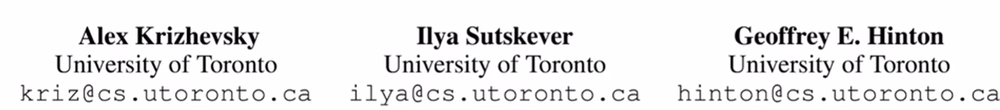

# 如何读论文（三步）

## 论文结构

## 如何读论文

1，如果论文都是从头读到尾的话，时间上可能来不及，而且适合自己的文章可能只有一小部分；最好找到适合自己的文章，然后精度

2，推荐花最多三遍读一篇文章：

- 第一遍：关注标题，摘要，读完摘要直接跳到结论；
  1. 标题是什么，与我是否相关；
  2. 然后看下摘要，摘要就是比较简单的介绍一下论文；
  3. 结论通常和摘要是一样的，但是可能把摘要中提出的一两个问题用实际的结论 实际的数字来给读者证明一下；
  4. 读完这三个部分一般就知道论文在讲什么
  5. 读完以上三个部分后，可以去瞄一眼method exp的图和表，看看它们是在干什么。
  6. 读到这里，大概就知道论文的 方法 质量 怎么样，是否适合自己，到这就知道自己要不要继续（精）读下去了！

- 第二遍：如果第一遍感觉文章质量不错，就走第二遍，对整个文章过一遍，知道每一块在干什么；
  1. 这次可以沿着标题一直往下读到最后；
  2. 这时不需要太注意细节（公式 证明 很细节的部分等），但是得知道很重要的图和表都在干什么事情；比如method里流程图是什么样子 算法的图长什么样子；exp中每张图的x轴 y轴在干什么 每个点是什么意思；作者提出的方法和别人的方法是怎么对比的，之间差距有多大；
  3. 这时候其实可能没太懂搞懂本论文在干什么，但是没关系，可以做个标记留到之后；在这一遍对整个论文都有一个大概的了解；
  4. 可以把一些相关的文献圈出来，比如 xxx提出了什么问题，在xxx的方法上改进的；
  5. 可以读到这到此为止了，这遍结束后就知道自己要不要往下精读；可能就到此为止了，因为知道 要解决什么问题 结果怎么样 大概用了什么方法；如果觉得不需要了解那么深，那么本文读到这就行了，不需要完全搞懂论文；
  6. 如果觉得本文太难了，读不懂，可以去读他们之前引用的那些文章，可能门槛更低一点；读完他们再回来读这篇文章

- 第三遍：如果还是想完全搞懂论文，那么就要走第三遍，第三遍是最后一遍也是最详细的一遍：
  1. 需要知道每句话 每段在做什么；我们可以在读这篇文章的时候，在脑子里不断重复实现这篇文章
  2. 文章中说用XXX方法来解决这个问题，读者就可以想，如果是我来做这个的话应该怎么办；如果做实验的话，实验是XXX做的，我们可以说如果换我来会怎么做，能不能做的更好；
  3. 作者说有些地方没有往下走的，留到以后做；读者可以想 如果我来做的话，是不是可以往前走呢。
  4. 这遍最关键的是知道每句话在干什么，并且大脑里面可以脑补出他整个过程，就好像是自己做过一遍的样子。
  5. 看完这一遍后，就对整个论文的细节都比较了解了；关上文章可以想到很多细节，那么之后基于本文做研究 或者 提到本文的时候，都可以说出很多细节。

## 总结

1，以上就是读论文的三个阶段：

1. 第一遍花时间最少 做海选；
2. 第二遍对相关论文做一步精选；
3. 最后一遍就是重点研读的论文

2，接下来会通过实例来读一篇论文，假设自己回到十年前第一次看到这篇文章。

# 重读深度学习奠基作之一-AlexNet

## 前言

1，可以随时停下来不往下读，如果读完三遍说明这篇文章对自己很重要。

2，读的时候假设自己在九年前。

3，再把自己放在今天，看看哪些过时了，哪些精髓还是经典；再好的文章也是有时代局限性的。

## 第一遍

### 读标题

1，imagenet是一个非常大的经典数据集

2，deep convolutional neural network：九年前是比较冷门的词语，可能当时看到这个就不会继续读了，但是可能导师让读就继续读

### 看作者

1，一般会关注著名实验室和研究者，尤其是在九年前深度学习刚起步，圈子小；有些组很喜欢就往下看，有些组不喜欢就可以跳过：

### abs（摘要）

- 第一句话：干了什么事情

- 第二句话：实现了什么结果

  - top1 top5 error rate可以[参考](https://blog.csdn.net/qq_43365658/article/details/115533444)

  - “第一句话我做了啥，第二句话我结果很好”，是很少见的写法

- 第三句话：介绍了模型，尤其是模型的结构

- 第四句话：介绍自己使用的比较新的提高计算效率的方法。

- 第五句话：介绍了避免过拟合的方法

- 第六句话：再次介绍本模型的成效，这回是在ILSVRC2012上
  - 段首说的是ILSVRC2010，现在说2012，可能觉得有点重复和奇怪，这个后面再说
- 这句话可以看到，本文模型作为第一名的效率是远超第二名的。
  - 虽然不知道imagenet的绝对错误率是多少，但是一看比第二名好这么多，那么还是有阅读兴趣的

- 摘要说的就是：我们训练了一个很大的神经网络，比第二错误率好很多。
  - 这个不算很好的摘要，从论文角度讲；这有点像技术报告，但是最后一句确实看出效果很好。

### conclu（本处为讨论）

1，跳到最后看 结论，但是本文没有结论，只有一个讨论。

- 讨论：一般是吐吐槽，然后看未来要干什么
- 结论：结论很多时候是和摘要的一一对应。所以没有结论还是很少见的。

2，我们看看讨论在说什么：

- 文章：没有使用无监督的预训练
  - 网友：就相当于是没有用自编码神经网络来预训练吧

- AlexNet之前是倾向于使用无监督的学习，AlexNet后倾向于有监督的学习，最近几年bert（当然还有GAN）又把大家的注意力拉到无监督的学习。
  - 无监督学习：给我数据，但是不要告诉我标号，我真的可以从中间理解
  - AlexNet之前深度学习做无监督的学习，是因为有监督的学习效果和SVM差不多；AlexNet后，有监督无监督都可以用深度学习来完成。

- 文章：如果我们有足够的资源，把网络变得很大，那么没有标号的数据也没有关系。

- 文章：后续我们想在video上做做
  - 老师：人在图片和nlp上走了很远，但是video的计算成本比图片高太多
  - 网友：Video的存储和读取速度之间的tradeoff也是个大问题，反正一脑壳包
  - 网友：yolo也是对视频的某一帧图片而不是对整个视频

### 看图

第一遍里面，还会去看一些重要的图和公式！

1，先看结果图片：

- 左边可以看到，在一些比较难分类的图片上，效果还是比较好的；虽然grill，cherry，等没有做到top1correct，但是不少还是做到了top5correct。

- 右边可以看到，指定图片后，在最后一层的参数和指定图片差不多的情况下，那些参数对应的图片和给定图片都是一个物体。也就是说，本模型会把相似的图片识别为一类，效果好。

- 网友：一般embedding都是用生成模型学的比较好

2，在往前看图标，这个表表示的是本文的结果和别人的结果的对比，本模型（CNN）是远远更好：

- 网友：Top-1 = （正确标记 与 模型输出的最佳标记不同的样本数）/ 总样本数

3，再往前看图：

- 计算机视觉常常会看到这个图，刚涉及这个领域的话可能不知道这个图是干什么。

- 我：这个图应该就是卷积层提取的特征，有边缘特征，有颜色特征，等等。

4，在往上看图，九年前看这个图是很新的，可能看不懂，留到后面再看：

- 网友：上半部分一样，因为显卡不够，所以切成两部分放在不同的显卡里训练

### 第一遍的读后感

1，读完后感觉，这片文章的模型很好，是用神经网络做的；但是具体为什么好，具体怎么做的，因为背景知识不够，所以第一遍你可以放弃

2，然后决定说要不要往下读，九年前读它的话，我们可能不会往下读，因为可能我们的研究与这块没关系，即使本文的效果很好；但如果是cv的研究者，可能还是会往下读，因为这块文章的模型的工作做的很好并赢了比赛。

## 第二遍

### 前言

1，第二遍会通读本文，但是如果碰到不懂的地方，会留下来给第三遍；第二遍主要是知道很多细节在干什么，了解作者是怎么想的，作者是怎么表述东西的，作者的观点和角度是什么。

2，这篇文章很古老也是开山大作，所以文章提的很多细节从现在的角度看是多余的，属于过度engineering；因为本文在后续经过无数学者看每个参数，被研究的比较透彻；当然在否定旧细节的同时，如今也给AlexNet引入了新的细节。

3，之前已经读过 abs和conclu，所以第二遍从intro往下读。

### 1Intro

- 一篇文章的第一段一般是在讲一个故事，就是：我们在做什么研究，哪个方向，这个方向有什么东西为什么重要

- 第一段文章：说要更大数据集 更好模型 避免过拟合，这是深度学习常见的思路，因为更强大的模型往往会过拟合。
  - 过拟合是神经网络的一个派别，之前人们倾向于说要 大模型+正则 来实现好效果且避免过拟合；但是如今大家可能觉得正则的重要性 不如 设计神经网络的结构。
  - 网友：理论比较难，没有数学 可解释性，炼丹

- 第二段文章：使用了CNN，CNN的效果很好
  - 老师：CNN做大不容易，而且容易训练不动，所以这块当时有争议

- 老师：这块的写法是有问题的，因为当时主流不用cnn，主流模型是用别的，所以半句话不提别的算法然后直接只提CNN是一个很窄的视角。所以自己写论文的时候，不要只说我这个领域的这个小方向大概怎么样，还要提到别的方向怎么样，做到稍微公平一点的介绍。

- 第三段文章：CNN很好但是计算很难，但是本文用了GPu了算力增加了；而且图片的数据集够大，我们确实能训练比较大的CNN。
- 老师：所以前三段主要讲：我做了什么东西，现在为什么能做了。

- 第四段：讲我的paper的贡献。主要就是我训练了一个很大的模型，效果很好。

- 本文说我做了，而且创新很好，并且在第三章第四章讲了；只要有创新点，就相当于挖了坑，别人可以顺着做！如果是组合很多技术，可能就没什么意思了，太复杂没办法跟着做。

  - 只是结果很好，但是没有新东西，是不会成为奠基作的。

  - 网友：对的，太复杂就失去了拓展性

- 最后一段：因为GPU很弱，切开了网络，并应用在两个GPU上
  - 老师：切网络这块工作量可能占了80%，但是现在看这技术其实没什么用。

### 2dataset

本文第二章讲的是数据集。因为卖点是imagenet的结果，所以要讲一下数据集。

- 第一段第二段：解释了为什么摘要里报告了两个errorrate，因为2010比赛有测试集公布，但是2012年比赛没有测试集公布。

- 第三段很重要：别的数据集的分辨率可能是一样的，即裁剪好的，但是imagenet是没有裁剪的，所以本文就对每个图片做了裁剪；除了裁剪外没做的别的图片预处理。
  - 网友：reshape显然不行
  - 网友：reshape，保持高宽比，缺的地方加灰条，不保持高宽比，直接256*256填满

- 本文可能有历史局限性，就报告了我是怎么做的，但是没说哪些重要 哪些不重要，没有把亮点写出来；但是寻找亮点是很重要的工作，之后有无数的人去做这个事。

- 老师：我现在不知道sift是怎么抽取特征的，但是我知道alexnet是怎么抽的 图片是怎么一步步被处理的，所以不需要太多专业知识。简单有效的东西是能持久的。
  - 网友：这么想想真的惨 之前学了几十年的东西几个月就被干掉了 属实降维打击

### 3Archi

讲模型的架构是本文的主要贡献之一，另外的贡献是第四章讲怎么避免过拟合。

- 没有相关基础的话，看之前的figure2结构是很难看懂的。
- 先往下看看文字是怎么讲的。

- 老师：饱和和非饱和这里可能看不懂，标记下 打个问号先，第二遍看不懂没事。
  - 网友：饱和应该指的是x趋于正负无穷时激活函数的导数为0

- 看图：作者用了relu后，训练的很快，效果比tanh好很多；但是为什么好，给了refrence为[20]的论文。
  - 网友：哈哈是的，这两个线看起来居然像是作者手画的。
  - 这个论文可以放到第三遍的时候去读。

- 作者试过不同的激活函数，效果也都不错

- 大家现在用relu的原因往往很简单：就是这个函数很简单，都不需要记tanh和sigmoid是什么！虽然用别的激活函数也可以的。

- 第二遍可以不看它，因为读不懂，这是很工程细节；如果是机器学习的论文，读的时候可以忽略掉，除非之后要复现才可以再来看；毕竟这不是方法上的东西。
- 当然可以读一下，就是这个方法怎么做到切切切；后面会讲怎么且的，但是第二遍是可以忽略不记的。

https://www.bilibili.com/video/BV1hq4y157t1/?spm_id_from=pageDriver&vd_source=8be62db2c8e19174231a64770292e191

19.13

