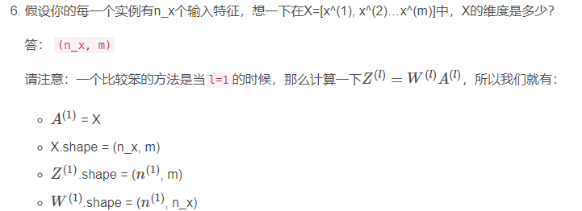
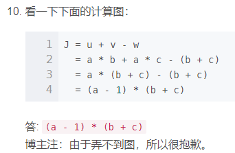

## 前言

主要记录错题，和编程困难的作业。

## 【中英】【吴恩达课后测验】Course 1 - [神经网络](https://so.csdn.net/so/search?q=神经网络&spm=1001.2101.3001.7020)和深度学习 - 第二周测验

2，下面哪一个是Logistic损失？

- 点击[这里](https://en.wikipedia.org/wiki/Cross_entropy#Cross-entropy_error_function_and_logistic_regression).

请注意：我们使用交叉熵损失函数。

5，看一下下面的这两个随机数组“a”和“b”：

```
a = np.random.randn(4, 3) # a.shape = (4, 3)
b = np.random.randn(3, 2) # b.shape = (3, 2)
c = a * b
```

请问数组`c`的维度是多少？

答：运算符 “*” 说明了按元素乘法来相乘，但是元素乘法需要两个矩阵之间的维数相同，所以这将报错，无法计算。

- 我：这才想起来，python中，矩阵点乘要用np.dot。使用`*`是让矩阵对应位置元素相乘。

6，



- 我：机器学习中，一般一列的各个元素都是各个特征的输入值，不同列代表不同数据样本。

8，看一下下面的这个代码片段：

```

# a.shape = (3,4)


# b.shape = (4,1)

for i in range(3):
  for j in range(4):
    c[i][j] = a[i][j] + b[j]
```

请问要怎么把它们向量化？

答：`c = a + b.T`

- 我：我虽然写出来了，但是要注意python中转置的方式是`.T`。（数学符号中是右上角加上T）

10，矩阵基本计算法则：



## 向量化

1，向量范数就是在这个向量空间中向量的大小：https://blog.csdn.net/nymph_h/article/details/95068873


