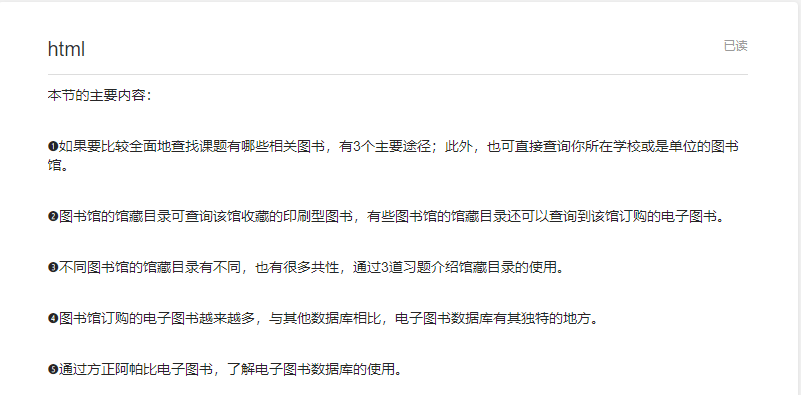
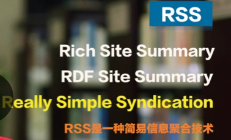

# 信息素养

## 信息素养与科研

一同学认为信息素养是（我认可）：

- 从各种渠道获取信息的能力
- 根据获取信息进行提炼的能力


美国一老师定义信息素养：


- 对信息的反思性发现
  - 当有信息需求时能意识到
  - 找到信息
  - 筛选信息
- 理解信息的产生及对其评价
  - 认识信息源的产生原理与过程
  - 掌握信息源评价方法
- 利用信息创造新知识
  - 将信息融入已有的知识结构
  - 产生新知识
  - 解决实际问题
- 遵守社会公德的前提下加入学习交流社区
  - 合理合法使用信息
  - 分享研究成功与知识
  - 不传播虚假信息


---

新课题怎么研究？：

- 师兄师姐和老师论文
- 大牛组研究的跟踪
- 相关文献引用了哪些文献，再去看被引用的文献 


研究时遇见瓶颈怎么办：

- 读大牛在研究什么
- 和老师聊聊


选择适合自己的期刊：

- 自己看的上的，看得上自己的研究的


## 认知文献信息检索

### 文献信息的分类


### 认识文献数据库和检索系统


记录文档是所有文档，很难找到自己需要的部分，于是索引文档应运而生。索引文档依靠字段进行索引。


### 做研究一定要文献数据库？


### 如何避免文献调研中的常见错误

 

## 查找文献的方法

### 文献从何找起

- 完全不了解课题，通过以下来初步得认识课题：
  - 百科全书
  - 专业的字典和手册

- 对课题有模糊认识，通过以下来了解课题的基础和历史：
  - 图书
  - 期刊论文中的综述型论文
  - 学位论文的文献综述部分
- 如果要追踪课题最新最前沿的进展
  - 期刊论文
  - 会议论文
  - 学位论文


查找文献的原则：先电子后印刷。

- 电子型文件使用方便，在哪都可以看。
- 科研中，期刊是最常用的文献类型，很多期刊的电子版比印刷版更新要快。


### 查找图书引言




### 查找课题图书的三个途径

图书对某个知识比较**系统全面**的讲解，但是内容不是很新。


常见图书来源

- 中国，美国的国家图书馆
- 校图书馆会偏向于本校研究方向收集文献

著名的联合图书馆

- worldcat：全球性
- calis：中国高校图书馆目录


也可以去如亚马逊等书店，查找书，但是书评不一定客观。想要客观的书评可以参考各个期刊，一般都会有书评专栏。


### 关于馆藏目录

搜索馆藏目录步骤：


馆藏目录的检索字段主要有：

- 题名

  - 定义：

    

  - 题名常见的输入方式有三种

    - 前方一致

      

    - 包含

      

    - 精确匹配

      

- 著者

  - 定义

    

  - 常见输入方式

    - 姓在前，名在后

      

    - 包含

      

  - 馆藏目录输入方式

    

- ISBN号

  - 定义

    

- 主题词

  - 定义：主题词:图书馆员按照文献的研究内容，依据主题词表给出的规范词。

  - 主题词来源：

    国内图书馆,中文图书的主题词主要来自《中国分类主题词表》,英文图书的主题词主要来自《美国国会图书馆主题词表》。

- 索书号

  - 定义：索书号:表明文献在书架上排列位置的号码，通常由分类号和书次号两部分组成。

  - 分类号的分类法：

    - 国内图书馆使用最广泛的分类法是中国图书馆分类法》,简称中图法。

    - 大类显示：

      

- 关键词

  - 定义：关键词:指在馆藏目录的所有可检索字段中检索
    - 有些图书馆的馆藏目录把“关键词”称为“全面检索”或“全部字段”。
    - 搜特定书名的时候，检索字段一般为书名或者作者；搜某类书籍时，检索字段一般为“关键词”。


### 馆藏目录的使用

一般馆藏目录有快速搜索，和高级搜索两种搜索模式。如果要像搜乔布斯的传记，则需要高级检索；如果搜某作者写的书，直接快速搜索即可。

很多高校图书馆的馆藏目录只能找到某本书，但是无法检索该书中的某篇文章。


### 关于电子图书

中国国家数字图书馆使用

- [读者门户](http://read.nlc.cn/user/index)实名注册
- 办理图书卡


### 电子图书的使用

**ie浏览器**访问http://www.nlc.cn/


滑到最下面，选择自己想要的资源库


以阿帕比库为例


注意，使用apabi库的话，要用apabi阅读软件。


## 查找文献和论文国内篇

```


本节的主要内容：

期刊论文和会议论文是科研人员最常用的文献类型，本节介绍中文期刊论文和会议论文的查找。

●  介绍和比对了常用的三大中文检索平台的内容。

●  以中国知网为例，介绍了中文检索平台的快速检索、高级检索、专业检索、句子检索、来源文献检索、检索结果的阅读、检索结果的导出等功能。

●  通过如下7个检索实例，介绍检索式的确定与调整：
1） 雾霾防治
2）城市改造中的旧城区问题
3）霉菌与甲醛的相互作用
4）信息素养的定义
5）《通信学报》2016年的论文
6） 屠呦呦教授的期刊论文
7）《中国空军》第一篇文章的标题

●  介绍其他查找中文期刊论文和会议论文的途径。
```

### 查找期刊和会议论文-国内

三大主要数据库介绍：

- 数据库内容重复比较多，但是版本和全文可读性不一样。所以尽量都检索。


访问网址

```
中国知网:http://www.cnki.net/
万方数据知识服务台:http://www.wanfangdata.com.cn/
维普期刊资源整合平台:http://lib.cqvip.com/
```


知网只可以用北邮平台，万方+维普的论文通过国家图书馆可以免费下载阅读。


###  顺藤摸瓜找论文

先用知网

- 普通检索可以对一个关键元素进行检索；且已经勾选了默认的文献来源；
- 想要更多关键元素，还可以用高级检索


比如用高级检索功能，搜索“题名”带“微服务”的硕士论文


找到论文后，可以用知网的一些筛选功能来帮助找到最有用的论文

- 按照“被引用次数”排序会容易筛选出关注度比较高的论文。


也可以用高级检索功能多关键元素搜索功能

- 最后一个搜索栏右边的+可以添加搜索元素。


顺藤摸瓜关注以下要点

- **引用了谁**
- **被谁引用**
- 同行关注文献
- 内容相似文献


**老版知网**的话，感觉用起来更直观


搜索栏中字段讲解

- 精确：搜索的是词组作为一个不可分的整体；模糊：输入的词可以被拆开。

  

  


检索的时候要考虑检索词的同义词，不同检索关键词之间的关系是“与”还是“或”

- 检索字段选择`篇名`，`关键词`会提升检索结果的相关性，但是可能会漏掉一些相关文献。

- 检索字段选择`主题`，`摘要`，`全文`，检索结果会增加；检索结果全面性增加，相关性降低。


#### 专业检索+句子检索实操

首先是专业检索：

点击高级检索后，可以看到“专业检索”的检索栏，有特有的检索公式来处理复杂检索。


- 上图表示在文献主题中同时出现上面三个词。

论文按照相关性排序，发现标题中最常出现的词语


修改检索式子如下

- 意思：文献标题中同时出现tl中的字段，且文献的主题中出现su中字段任意一个或多个。 


 检索结果太少，修改为


现在试试句子检索：

旧版，点击高级检索后，还能看到“句子检索”的栏，在这检索内容包含某个句子的文献


检索文献可以导出


### 如果只需要检索某种类型的文献

比如检索屠呦呦+期刊


检索出来后，可以按时间排序，查找论文先后


### 查找中文学术论文的其他途径

其他库，个人感觉理工科用处不大了。


## 外国论文


### 查找期刊和会议论文-国外

数据库分两种

- 文摘数据库
- 全文数据库


全文数据库收录的文章综述远小于文摘数据库，所以一般可以先用文摘数据库找到对应的文献，再去全文数据库查看全文。

而且很多文摘数据库的文摘附带了全文文献的链接。


### 关于web of science核心合集

其为文摘型数据库，包含十个数据库如下


三个文献概念：

- 参考文献（引文）

  

- 来源文献，

  引用了参考文献的论文，叫做被引参考文献的来源文献

  

  一篇论文有很多来源文献的话（被很多论文引用），那一定是相关领域的重要文献。

- 相关文献 

  引用了相同参考文献的，不同来源文献，互相称为相关文献。

  

   

webofscience核心合集的特点是引文索引，所以可以方便的看到一篇论文的“参考文献”“来源文献”“相关文献”


webofscience（大多数外文数据库）的检索规则

- 检索词使用英文（即使文章是中文或者法文）,不区分大小写

- 可使用逻辑运算符，优先顺序是:括号，NOT AND OR，

  

- 英文有截词符

  

  

  


- 性命是姓氏+名的每个词的首字母，比如 zhang yunkai，就搜zhang yk。


### pm2.5高级检索实例

- 同义词组内部的同义词用or连接；不同同义词组之间用and连接。
- ts（主题）换成ti（标题）可以提高检索结果的相关性。


- 检索时可以学习到一些新的同义词，在检索结果太少的时候可以加入到检索式中。
- 查看检索结果时会看到一些无关信息，用not去排除无关信息


### 检索结果的分析

webofscience可以对检索的结果进行分析，得到比如：

- 自己的检索结果主要发表在哪些出版物上。


webofscience可以做期刊和杂志跟踪，引用追踪。


很多摘要数据库都有类似的结果分析功能。

- 比如mathscinet


### 概述全文数据库

- 专业学会的数据库。比如asme

  

  

  

  

  

- 出版商的数据库。比如：elsevier science direct

  

  


- 集成商的数据库。比如Proquest和EBscohost

  

  


### 核心期刊和高水平国际会议

核心期刊定义：核心期刊最初是指刊登与某一学科或专业有关的论文较多的那些期刊。现在指运用文献计量学的方法筛选出来的各学科的高质量期刊。


中文核心期刊目录：


外文核心期刊目录：


scie等核心期刊的查询网址：http://lip-science.thomsonreuters.com/mjl/

查找ei的来源期刊的网址：https://www.elsevier.com/solutions/engineering-villagelcontent


高水平国际会议：

清华有个标准。


## 文献使用

### 文献信息源的综合利用


### 文献调研的常见误区和基本原则


清华博士文献综述与选题报告：
博士生入学后应在导师的指导下，查阅文献资料，了解学科现状和动向，尽早确定课题方向，在通过资格考试后，进行论文选题报告。选题报告应包含课题背景、问题的提出、选题意义、国内外研究现状、主要研究内容、工作特色及难点、预期成果及可能的创新点等，参考文献一般应不少于70篇，原则上外文文献应不少于30篇。自选题报告通过至申请答辩的时间一般不少于一年。


文献调研的常见误区：


- googlescholar:文献的搜索结果不稳定。


- 有人只用Elsevier ScienceDirect或者CNKI，虽然体量庞大，但是不同数据库有自己的收录标准，导致本质上不同库就有区别。


- 通过“馆藏目录”，“中文电子图书数据库”，“中国期刊全文数据库”对文献进行调研可以帮人了解到国内对于某一课题的研究进展，但没办法了解国际上的最新进展。


文献调研的基本原则：

- 全面性原则

  - 文献调研不做到全面，容易造成时间，人力，物力的浪费；不然可能研究了半天国外已经成熟的东西。

- 时效性原则

  

- 可靠性原则

  

- 经济性原则

  

  要提高信息素养才能实现经济性原则

  - 加深对文献信息源的认识，节省在信息源选择上的时间
  - 提高检索的能力，学会使用高级检索和专家检索，节省时间
  - 大学图书馆+国家图书馆：节省金钱


### 不能放弃检索多种类型文献

检索专利：


万方

webofscience


以国家知识产权局为例

- 注册

- 使用常规检索

  


检索学位论文：


和各学位授予机构的图书馆


“科技报告”也有用


- 比较出名的科技报告数据库

  NTIS

  

  


干货网址：


### 图书馆的资源发现系统

很多图书馆都有资源发现系统，各种实体书，期刊，论文等不同类型的文献都一站式找到


一切都是为了保证四性


### 获得全文和文献的阅读

有的时候只能搜到摘要，读原文要去指定链接，那么可以：

1. 记下文献的名字，去能找到全文的地方查找

2. 文献互助：甚至可以直接联系作者要原文。

   


文献阅读技巧

1. 文献阅读一旦开始读就不要停，每天都要读，只要慢慢坚持，能力就能提高。

2. 先读摘要再读全文

   

3. 记笔记

   - pdf的笔记和高亮功能（推荐）
   - 论文打印为纸质，笔记
   - 个人文献管理软件


本节大纲


## 需要掌握的数据和事实检索

### 认识概念，了解定义，读懂术语/缩略语

百科：

- Baidu百科，维基百科；内容所有人可以编辑，不一定权威

- 百科全书网（推荐）

  

  - 数据来源于正式的出版物，可信度高
  - 数据来自不同出版物，可以同时比较来自不同出版物的信息。

- 大英百科全书

  

- 中国大百科全书

  

  


了解概念的手段的总结


### 掌握事实

大英百科（所有条目由专家编著），期刊论文，第一手资料（如诺贝尔奖官网看诺贝尔手稿）》百度或维基百科

- 印刷版百科全书，年鉴：不能揭示近期的事实。


### 查找性能指标、理化常数和器件参数等

- 图书馆馆藏目录中搜寻“XXX数据手册”，一般可以得到信息。
  - 有的手册的题名中没有“手册”两字

- knovel 中也有各种工程技术类手册


## 继续学习利用参考工具

### 检索标准工具


检索要求比较复杂的话，用专业检索，因为只搜“口罩+雾霾”可能搜不到


互联网上一些标准检索工具


其他国家标准可以到相关国家部委的网站检索


标准编号：


- 强制性标准数据库中国搜不到的话，可以试试相关部委的工作网站。


### 查阅法律文件与司法案例/裁判文书

了解中国法律法规以数据库：

https://flk.npc.gov.cn/


### 获取统计数据


- 年鉴年份是年鉴出版的年份，一般比目标数据的年份晚一年。比如1980年生育率，就得查1981年出版的年鉴。


年鉴+知网小tip：


条目检索实例：


### 查找人物传记


## 开放获取资源与搜索引擎

### 信息访问的权限


### 开放获取资源

arXiv免费的预印本数据库中有计算机科学的文章，很多学着都在关注这个数据库。


接下来介绍一些典型实例


至于专利，美国，日本，中国等国家的专利在网上都是免费试用。英国中国等国家，规定公共资金支持的研究要在出版的12个月内对公众开放。

各国政府网站上有各种数据

- 比如国家统计局


教育部科技发展中心支持成立的“科技发展在线”，开放知识

- 但是因为没有同行评审，开放的资源的质量是一个问题


开放资源获取的一站式平台：


尾言：


### 一般搜索引擎

进入百度首页，选择高级搜索。


实例：


使用谷歌搜索的例子

https://grsbupt.yuketang.cn/pro/lms/84eubUpk3W6/8822721/graph/13287400


### 学术搜索引擎：简介

常用网址


不稳定的话，可以从下面的导航网址进入


包含了很广的文献资源，免费的收费的都有。


### 如何使用google scholar

高级搜索如图

- 推荐学习谷歌搜索的检索式


可以绑定自己的图书馆，方便阅读原文


有论文名的话，直接在谷歌学术搜索论文名一般都以找到。


检索式实例：


### 科学评价与合理使用网络资源

百度或者维基百科的内容人人可编辑，绝对不可以作为学术论文依据。可以在概念初步学习时参考百科。


## 学术交流与学术规范

### 引言


### 学术信息交流模式

正式vs非正式


科研社交网络：


- 


### 出版or出局

一高质量论文>多低质量论文


### 学术期刊与同行评审

peer review


### 选择交流平台-投稿


寻找合适期刊：去数据库搜索自己论文的关键词，看哪个期刊发表的最多，自己就去哪发表。


习题：


### 学术规范


注意论文的规范引用！


课后题：


### 常见的参考文献引用格式

芝加哥手册：


第二部分最重要


APA格式：

主要以社会学用为主


引用格式不用记，用的时候查，而且文献管理软件可以极大提高文献引用的效率。


课后题：


## 知识管理，工具换代

### 有效管理个人文献信息

个人文献指自己保存的文献，不单是自己创作的。


一些常用个人文献管理软件


### 建立个人文献数据库

略，要用的时候细学。


### 向数据库中添加记录


- 1手工费时

- 2便捷，前提内外部数据库之间有接口

  ​	

  

- 3用的最多

  

  

  

  

- 45有些文献管理软件不支持


### 编辑/整理记录，添加附件与笔记，记录的导入/导出与共享

记录修改


记录管理


查找全文


笔记


从一个管理软件导入/导出到另一个管理软件


### 利用个人文献数据库


- 检索个人文献数据库

  - 和检索商业文献数据库一样

- 生成引文

  


### 更多使用方法与更多管理内容

略

### 通过邮箱或RSS Feed订阅与追踪最新信息


### 邮箱订阅（Email Alerts）

订阅检索式的最新内容：

- 邮箱之间用分号+空格隔开


课后题：


### RSS订阅



- 时效，页面清爽无广告，个性化内容


软件：

推荐使用”一览“


课后题：


### 利用云笔记随时记录、收集、分享信息

略

我用markdown+github了


课后题：


### 使用思维导图整理大脑中发散性的信息


推荐软件：

- mind manager
  - 我看功能确实不错

不过我之前线上，一般使用processon做思维导图


课后题


### 通过文本分析和可视化软件创建知识图谱

推荐软件：

- histcite

  - 导入不成功的话，可能是路径中有中文字符
  - 导入的时候，文本里的webofscience要改成webofknowledge

- citespace

  


课后题：


